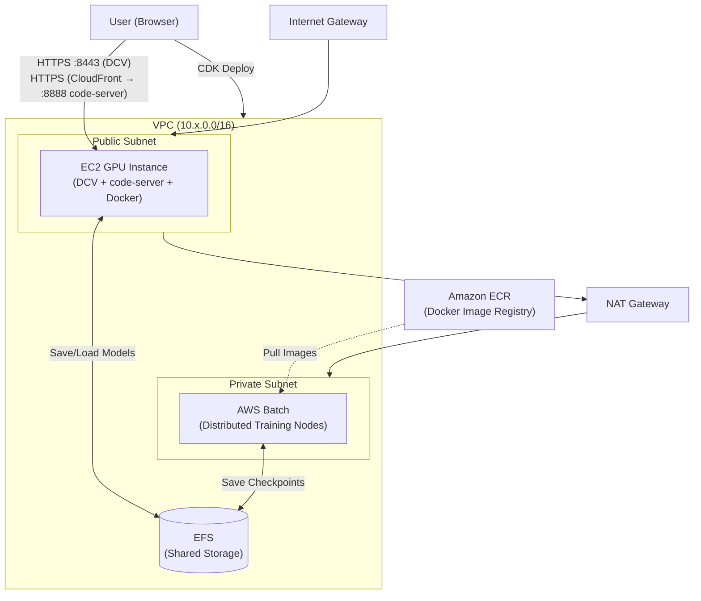

# 1. Cloud Infrastructure Setup and Verification

Automatically provision a GPU-based development environment for NVIDIA Isaac Lab using AWS CDK. All resources—VPC, EC2 GPU instances (DCV), AWS Batch, EFS, ECR—are created with a single command.

### Prerequisites

* Accept the [NVIDIA Omniverse License Agreement](https://docs.omniverse.nvidia.com/isaacsim/latest/common/NVIDIA_Omniverse_License_Agreement.html)
* AWS account — Recommended region: `us-east-1`
* Verify GPU instance service quotas — AWS Console → [Service Quotas](https://console.aws.amazon.com/servicequotas/) → EC2 → `Running On-Demand G and VT instances` should be at least as many vCPUs as needed (g6e.4xlarge = 16 vCPU)

---

### 1.1 CloudShell Environment Setup (~5 minutes)

1. Log in to the [AWS Console](https://console.aws.amazon.com).
2. Set the region in the top-right to **US East (N. Virginia) `us-east-1`**.
3. Click the `>_` icon at the top to launch CloudShell.
4. Run the following command:

```bash
git clone --depth 1 https://github.com/hi-space/aws-physical-ai-recipes.git ~/aws-physical-ai-recipes
source ~/aws-physical-ai-recipes/e2e-workshop/infra/isaaclab/scripts/setup-cloudshell.sh
```

<figure><figcaption></figcaption></figure>

This script automatically:
- Clones the repository (or runs `git pull` if it exists)
- Installs Node.js 18+ (the CloudShell default may be outdated)
- Installs npm dependencies for the CDK project (`aws-cdk-lib`, etc.)
- Verifies AWS CDK CLI functionality


On reconnection, simply re-run the `source` command:

```bash
source ~/aws-physical-ai-recipes/e2e-workshop/infra/isaaclab/scripts/setup-cloudshell.sh
```


---

### 1.2 Infrastructure Deployment (~30–60 minutes)

Deploy using your **name** and **VPC number** provided by your administrator.

```bash
nohup npx cdk deploy \
  -c userId=<your-name> \
  -c vpcCidr=10.<number>.0.0/16 \
  -c isaacSimVersion=5.1.0 \
  -c region=us-east-1 \
  --require-approval never > deploy.log 2>&1 &
```

Example (alice, number 1):

```bash
nohup npx cdk deploy \
  -c userId=alice \
  -c vpcCidr=10.1.0.0/16 \
  -c isaacSimVersion=5.1.0 \
  -c region=us-east-1 \
  --require-approval never > deploy.log 2>&1 &
```


CloudShell sessions terminate after 20 minutes of inactivity. Running with `nohup &` allows deployment to continue even if the session disconnects. **Include the `&` at the end of the command** to run in the background.


<details>

<summary>Infrastructure created by CDK</summary>



**AWS Services Overview:**

| Service | Analogy |
|---------|---------|
| VPC | Your own isolated private network (a building) |
| Public Subnet | Externally accessible area (lobby) — where DCV instances live |
| Private Subnet | Blocked from outside, internal only (server room) — where Batch nodes live |
| NAT Gateway | One-way exit from Private Subnet to the internet |
| EFS | Network shared disk used by both EC2 and Batch |
| ECR | Docker image registry (Private Docker Hub) |
| Security Group | Virtual firewall — rules define allowed ports and IP ranges |

**EC2 Instance**

* The GPU instance (g6e.4xlarge) automatically installs:
  * Ubuntu Desktop (GNOME)
  * NICE DCV (remote desktop)
  * Docker + NVIDIA Container Toolkit
  * code-server (VSCode)
  * NVIDIA Isaac Lab
* The following assets automatically download to EFS:
  * `agent_72000.pt` — Pre-trained checkpoint for Module 4 RL evaluation
  * `GR00T-N1.6-3B/` — Model weights for VLA inference (used in Module 5)
* GR00T Docker image building and inference server setup are not automated; you'll do these manually in Module 5

**Security Configuration**

* **Secrets Manager**: Auto-generates DCV/code-server passwords
* **IAM Roles**: For EC2 (S3, ECR, EFS, SSM access) and Batch
* **Lambda**: Auto-discovers AZ with GPU capacity

</details>

**Monitor deployment progress:**

```bash
tail -f deploy.log
# or AWS Console → CloudFormation → Stack: IsaacLab-Stable-<your-name>
```

<details>

<summary>Troubleshooting: "No default subnet" error during deployment</summary>

If deployment fails with the following error, a specific AZ is missing its Default Subnet:

```
Received response status [FAILED] from custom resource.
Message returned: An error occurred (InvalidInput) when calling the RunInstances operation:
No default subnet for availability zone: 'us-east-1b'
```

This occurs because the AZ selector Lambda calls `RunInstances` without specifying a subnet. It can happen in two cases:

1. The account has no Default VPC at all (all AZs fail)
2. Default VPC exists but a specific AZ is missing its Default Subnet (e.g., a newly added AZ, or someone deleted the subnet)

**Check current state:**

```bash
# Check if Default VPC exists
aws ec2 describe-vpcs --filters "Name=isDefault,Values=true" \
  --region us-east-1 --query 'Vpcs[].VpcId' --output text

# All AZs in the region
aws ec2 describe-availability-zones --region us-east-1 \
  --query 'AvailabilityZones[].ZoneName' --output text

# AZs that have a Default Subnet (compare with above)
aws ec2 describe-subnets --filters "Name=default-for-az,Values=true" \
  --region us-east-1 --query 'Subnets[].AvailabilityZone' --output text
```

**Solution:**

```bash
# If no Default VPC: create one (also creates Default Subnets in all AZs)
aws ec2 create-default-vpc --region us-east-1

# If only specific AZs are missing Default Subnets:
aws ec2 create-default-subnet --availability-zone us-east-1b

# Or specify AZ directly (skips Lambda probe entirely)
nohup npx cdk deploy \
  -c userId=<your-name> -c vpcCidr=<your-cidr> \
  -c preferredAZ=0 \
  --require-approval never > deploy.log 2>&1 &
```

`preferredAZ=0` selects the first AZ in the region. You can also pass an AZ name directly (e.g., `preferredAZ=us-east-1a`).

</details>

---

### 1.3 Deployment Complete and Access Information

After approximately 40 minutes, when provisioning completes (look for `Outputs:` in the log), verify access information:

```bash
cat deploy.log | grep -E 'DcvUrl|CodeServerUrl|SecretArn'
```

**Retrieve DCV password:**

```bash
aws secretsmanager get-secret-value \
  --secret-id $(cat deploy.log | grep SecretArn | awk -F= '{print $2}' | tr -d ' ') \
  --region us-east-1 \
  --query SecretString --output text | python3 -c "import sys,json; print(json.load(sys.stdin)['password'])"
```

Alternatively, search for **CloudFormation** in the AWS Console search bar. Select the CloudFormation stack, then select the **Outputs** tab and copy the **DcvUrl** key.

<figure><figcaption></figcaption></figure>

* **InstanceId**: Instance ID
* **DcvUrl**: DCV access URL (`https://<Public-IP>:8443`)

<details>

<summary>Deployment Parameters Summary</summary>

| Parameter                  | Description                                    | Default              | Example            |
|--------------------------- |------------------------------------------------|----------------------|--------------------|
| `userId`                   | User identifier (lowercase letters, numbers, hyphens) | `''`                 | `alice`, `team-1`  |
| `vpcCidr`                  | VPC network CIDR (unique per participant)      | `10.0.0.0/16`        | `10.1.0.0/16`      |
| `isaacSimVersion`          | Override Isaac Sim version                     | `''` (profile default) | `5.1.0`            |
| `region`                   | AWS region                                     | CDK_DEFAULT_REGION   | `us-east-1`        |
| `versionProfile`           | Software profile                               | `stable`             | `stable`, `latest` |
| `inferenceInstanceType`    | DCV instance type (manual override)            | `''` (auto-select)   | `g6e.4xlarge`      |
| `preferredAZ`              | AZ selection (`auto`: auto-discover GPU capacity) | `auto`               | `auto`, `0`–`5`    |
| `allowedCidr`              | DCV security group inbound source CIDR         | `0.0.0.0/0`          | `203.0.113.0/24`   |
| `enableCloudWatch`         | Install CloudWatch Agent                       | `false`              | `true`, `false`    |
| `enableCodeServer`         | Install code-server (VSCode)                   | `true`               | `true`, `false`    |

</details>

***

### 1.4 Connecting to DCV

1. Open **DcvUrl** in your browser (e.g., `https://1.2.3.4:8443`)
2. On the certificate warning → "Advanced" → "Proceed"

<figure><figcaption></figcaption></figure>

Navigating to the `DcvUrl` address brings up the DCV login screen, as shown above.

> [Amazon DCV (Desktop Cloud Visualization)](https://docs.aws.amazon.com/dcv/latest/adminguide/what-is-dcv.html) is a high-performance remote display protocol provided by AWS. When used with Amazon EC2, it lets you run graphics-intensive applications remotely on Amazon EC2 instances. We use it to render complex robot simulations and physics engines in real time.

You can find the login credentials in [AWS Secrets Manager](https://docs.aws.amazon.com/secretsmanager/latest/userguide/intro.html) in the AWS Console.

<figure><figcaption></figcaption></figure>

Select **AWS Secrets Manager** - **InstanceCredentials-\*** - **Retrieve Secret** to view the **username** and **password**.

Logging in to the DCV session with these credentials opens the Amazon DCV remote display running on the Amazon EC2 DCV instance.

***

### 1.5 Verify Environment Setup

```bash
# Check GPU driver
nvidia-smi

# Check Docker images (containers don't exist until explicitly run)
docker images | grep isaaclab

# Check EFS mount
df -h | grep efs

# Check code-server status
systemctl status code-server

# Check GR00T model weights (efs-mount.sh auto-downloads to EFS)
ls /home/ubuntu/environment/efs/GR00T-N1.6-3B
```

**Expected results:**

* `nvidia-smi` → GPU info (L40S or L4)
* `docker images | grep isaaclab` → `isaaclab-batch:latest` image exists
* `df -h | grep efs` → EFS mount point shown
* `code-server` → `active (running)`
* `ls /home/ubuntu/environment/efs/GR00T-N1.6-3B` → Model file list (if missing, manually download before using Module 5)

**If issues occur, check UserData logs:**

```bash
sudo tail -100 /var/log/cloud-init-output.log
```

<figure><figcaption></figcaption></figure>

The instance is created with a Deep Learning AMI, so CUDA, NVIDIA Driver, PyTorch, and other basic training environment settings are pre-configured.

---

### 1.6 code-server (VSCode) Access

Access VSCode in your browser through code-server to edit code and use the terminal.

* Open **CodeServerUrl** in your browser (CloudFront URL from CDK Output, e.g., `https://dXXXXXXXXXXXX.cloudfront.net`)
* Password: Same as DCV (uses the same Secrets Manager secret)

<figure><figcaption></figcaption></figure>

