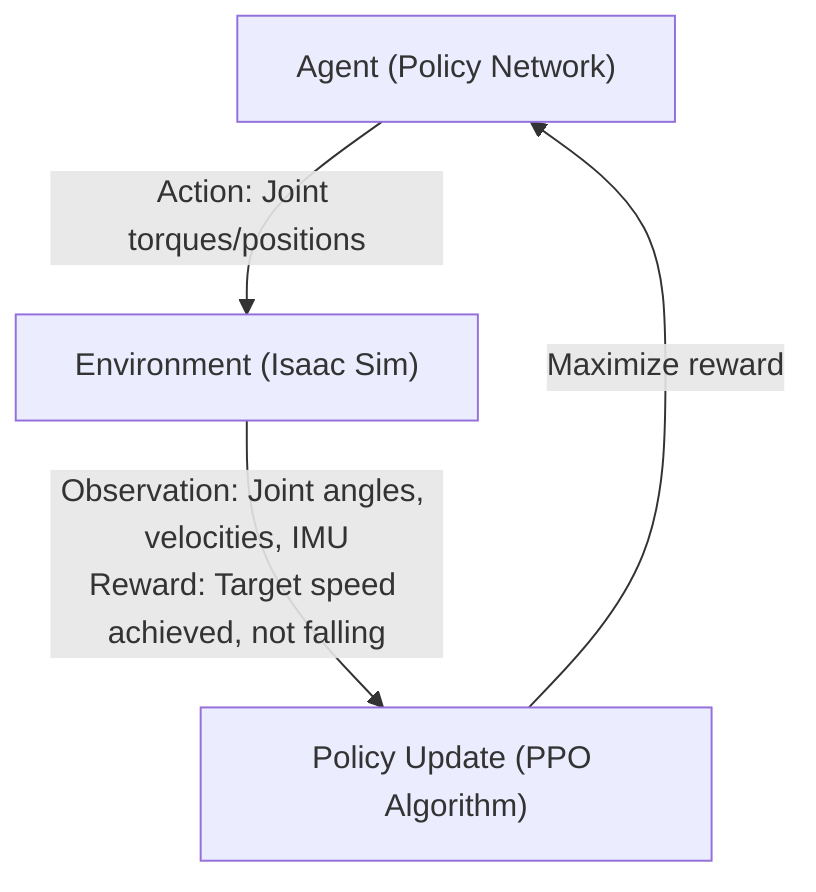

# 2. Isaac Lab Reinforcement Learning Training

[NVIDIA Isaac Lab](https://isaac-sim.github.io/IsaacLab/main/index.html) is a robot learning framework running on Isaac Sim. In a GPU-accelerated physics simulation environment, simultaneously simulate thousands of robots and learn robot control policies through reinforcement learning (RL).

---

### 2.1 Core Concept: Learning Robot Control with RL

Reinforcement learning is a method where an agent (robot) learns a behavior policy that maximizes rewards by interacting with an environment.



* **Observation**: Current robot state (joint angles, angular velocities, body orientation, contact information, etc.)
* **Action**: Command issued to the robot (target position or torque for each joint)
* **Reward**: Scalar signal indicating how well the task was performed (e.g., +reward for approaching target speed, large -reward for falling)
* **Policy**: Neural network performing Observation → Action mapping. The final product of training.

---

### 2.2 Isaac Lab Software Stack

| Layer | Component | Role |
|-------|-----------|------|
| 5 | RL Algorithm (skrl / RSL-RL) | Training algorithms like PPO, SAC |
| 4 | Isaac Lab (Task / Environment) | Define robots and environments, reward functions, observation configuration |
| 3 | Isaac Sim (Omniverse) | USD-based scene rendering, sensor simulation |
| 2 | PhysX 5 (GPU-accelerated) | Physics simulation (collisions, joints, friction) |
| 1 | CUDA / GPU Driver | Hardware acceleration |

Isaac Lab can **parallelize thousands of environments on a single GPU** thanks to PhysX 5's GPU pipeline. Since each environment simulates independently, a single GPU can simultaneously train 2,048–4,096 robots.

---

### 2.3 Review the Dockerfile

Check the files and Dockerfile for running IsaacLab.

```bash
cat ~/environment/IsaacLab/Dockerfile
```

The Dockerfile includes:

* Download NVIDIA Isaac Sim 5.1.0 image
* Add IsaacLab workspace
* Scripts needed to run Isaac Lab RL jobs in multi-node and multi-GPU environments (`distributed_run.bash`)

<figure><figcaption></figcaption></figure>

---

### 2.4 Run a Container

Run the Isaac Sim Docker container from the DCV or code-server terminal.

If no container is auto-started, run it manually:

```bash
cd ~/environment/IsaacLab && xhost +
```

Check the image name with `docker images | grep isaaclab`, then replace the image name in the command below and run:

```bash
docker run \
  --shm-size=60g \
  --name isaac-lab \
  --entrypoint bash \
  -it \
  --gpus all \
  --rm \
  --network=host \
  -e "ACCEPT_EULA=Y" \
  -e "PRIVACY_CONSENT=Y" \
  -e DISPLAY \
  isaaclab-batch-[custom name]:latest
```

<details>

<summary>Attach to an already-running container</summary>

If the container is already running, you can attach to it without starting a new one. If not running, skip this section.

```bash
# Check running containers
docker ps

# Attach to container
docker exec -it isaac-lab bash
```

</details>

<details>

<summary>Key Docker Options Explained</summary>

| Option | Description |
| --- | --- |
| `--shm-size=60g` | Shared memory size. Isaac Sim uses `/dev/shm` for large tensor transfers between GPU and CPU. The default (64MB) is insufficient and causes OOM. |
| `--gpus all` | Allow container access to all NVIDIA GPUs on the host (requires NVIDIA Container Toolkit) |
| `--network=host` | Share host network to enable DCV display connection and TensorBoard access |
| `-e DISPLAY` | Pass X11 display to container for GUI rendering |
| `--rm` | Auto-delete container on exit (saves disk space) |

</details>

---

### 2.5 Run Training

Once the container is running, execute training from the container prompt using the following commands.

```shellscript
# Running in GUI mode — visually observe simulation on DCV screen
cd /workspace/IsaacLab && \
/isaac-sim/python.sh -m torch.distributed.run \
  --nnodes=1 \
  --nproc_per_node=1 \
  scripts/reinforcement_learning/skrl/train.py \
  --task=Isaac-Velocity-Rough-H1-v0
```

```shellscript
# Headless mode — training only, no rendering, much faster (recommended for workshop)
cd /workspace/IsaacLab && \
./isaaclab.sh -p scripts/reinforcement_learning/skrl/train.py \
  --task Isaac-Velocity-Rough-H1-v0 \
  --num_envs 2048 \
  --headless
```

**Key parameters:**

| Parameter | Description |
| --- | --- |
| `--task Isaac-Velocity-Rough-H1-v0` | Task for Unitree H1 humanoid robot to walk at target velocity on rough terrain |
| `--num_envs 2048` | Number of environments (robots) to simulate simultaneously. More environments (if GPU memory allows) speed up training. |
| `--headless` | Disable GUI rendering to concentrate compute resources on training |

**Understanding task name structure:**

Each part of `Isaac-Velocity-Rough-H1-v0` means:

* `Isaac` — Environment from Isaac Lab framework
* `Velocity` — Velocity tracking task. Robot must follow specified linear/angular velocity commands.
* `Rough` — Rough terrain (irregular surface with height variations). `Flat` is flat ground.
* `H1` — [Unitree H1](https://www.unitree.com/h1) humanoid robot (180cm, 47kg, 19 DOF)
* `v0` — Environment version

**Training Algorithm — PPO (Proximal Policy Optimization):**

This workshop uses the [skrl](https://skrl.readthedocs.io/) library's PPO implementation. PPO is the most widely used reinforcement learning algorithm for robot control, offering stable policy updates with good sample efficiency, making it ideal for simulation-based training.

* Use the [skrl](https://skrl.readthedocs.io/) RL library for training ([scripts/reinforcement_learning/skrl/train.py](https://github.com/isaac-sim/IsaacLab/blob/main/scripts/reinforcement_learning/skrl/train.py))
* Available tasks ([task list](https://isaac-sim.github.io/IsaacLab/main/source/overview/environments.html))

Checkpoints and logs generated during training are saved to `/workspace/IsaacLab/logs/skrl/h1_rough/` inside the container.

> Even if a **"Isaac Sim" is not responding** warning appears, click **Wait** and let it load. The Isaac Sim GUI loads and training starts in less than 5 minutes.

<figure><figcaption></figcaption></figure>

---

### 2.6 TensorBoard Monitoring

Monitor training progress using TensorBoard during training.

```shellscript
# Launch TensorBoard (in a new terminal)
docker exec -it isaac-lab \
  /isaac-sim/python.sh -m tensorboard.main \
  --logdir /workspace/IsaacLab/logs/skrl/h1_rough/ \
  --bind_all
```

Access TensorBoard in your DCV browser at `http://localhost:6006`.

<figure><figcaption></figcaption></figure>

* **mean_episode_length**: Average length of each episode across all agents. This defines the number of iterations before the environment resets. Ideally, by the end of training, episode length should reach its maximum value.
* **mean_reward**: Indicates how training is performing at each iteration.


A real humanoid policy learns complex bipedal locomotion tasks using this environment over 72,000+ epochs and 3 hours. You don't need to wait for training to complete—proceed to the next step.


***

### References




