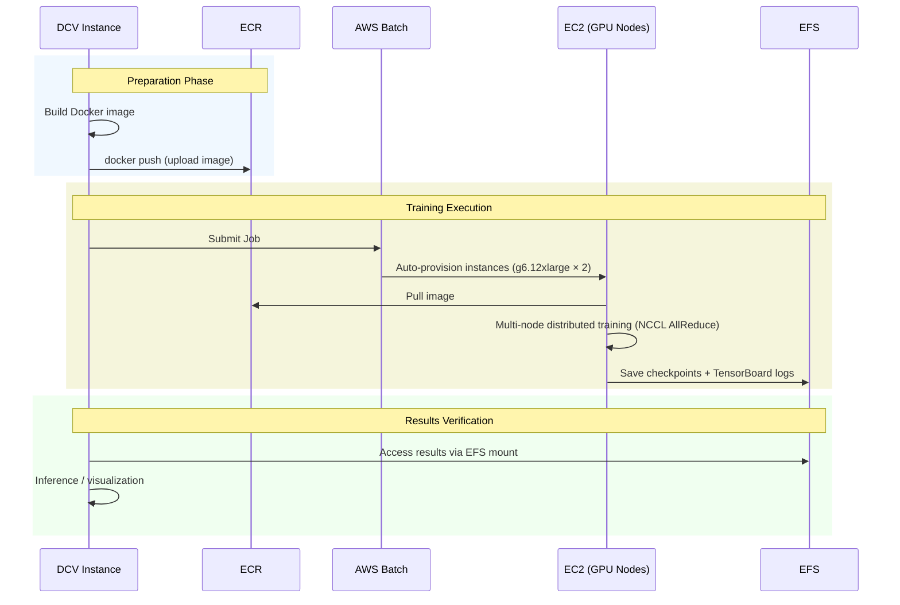
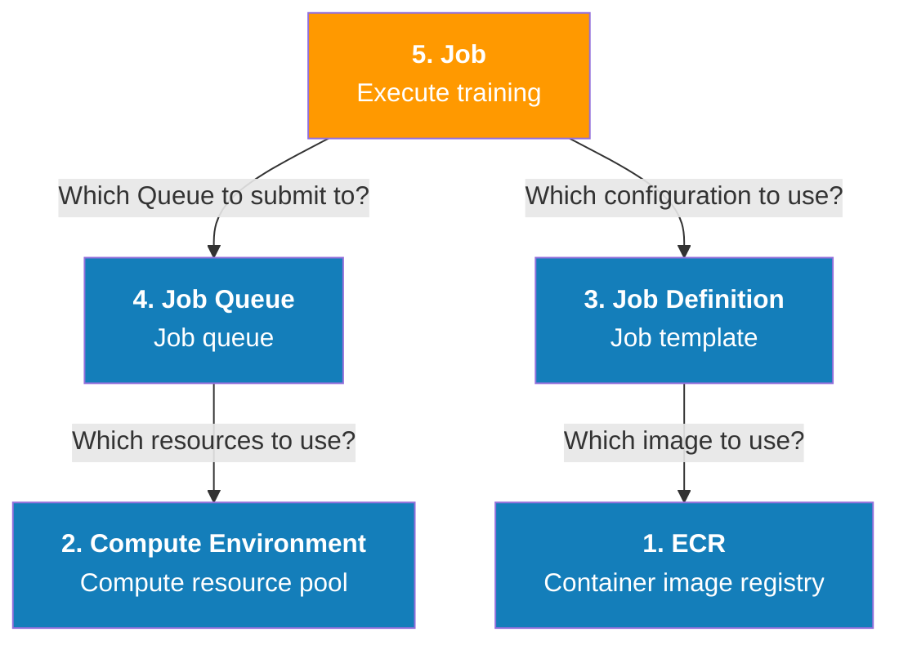
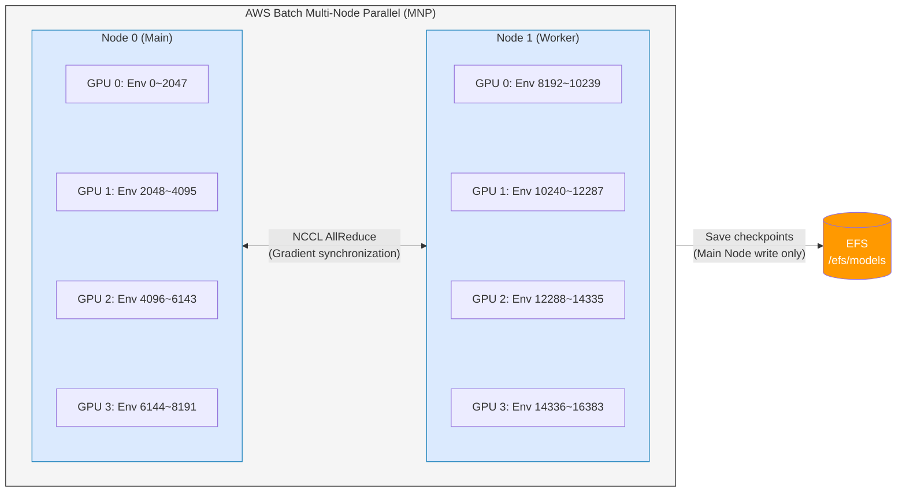
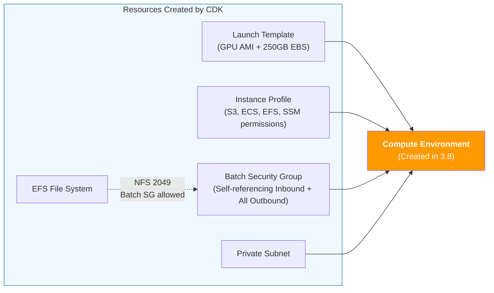
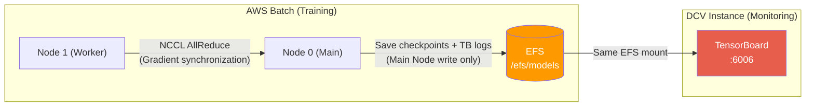

# 3. Large-scale Training with AWS Batch

AWS Batch automatically provisions computing resources and optimizes workload distribution based on the scale of your workload. It enables you to execute training jobs of any scale.

To accelerate training, we run Isaac Lab RL on two nodes equipped with 4 GPUs each.

## 3.1 End-to-end Pipeline Flow

The diagram below shows the complete workflow performed in this chapter. Docker images are uploaded to ECR, AWS Batch retrieves the images and executes multi-node training, and training results are stored in EFS for immediate verification on the DCV instance.



## 3.2 AWS Batch Component Relationships

AWS Batch consists of four core components that must be created **in bottom-to-top order**, as each component references lower-level components.



> **Why this separation?**
> - **Compute Environment**: Infrastructure administrators define "which hardware to use" once, then multiple teams reuse it
> - **Job Definition**: Store "how to execute which task" as a template. Identical tasks can be executed repeatedly with only parameter changes
> - **Job Queue**: Schedule multiple jobs based on priority. Control important jobs to execute first
> - **Job**: Actual execution. Combines the above 3 to perform "execute now"

---

## 3.3 Why Distributed Training is Necessary

Training an H1 robot with 2048 parallel environments on a single GPU requires approximately 3 hours for 72,000 iterations. However, with more complex tasks or larger environment counts, a single node's GPU memory and computation capacity reach their limits.

**Benefits of distributed training:**
* **GPU memory expansion** — Distribute environments across multiple GPUs to run more environments simultaneously (e.g., 2 nodes × 4 GPUs = 8 GPUs, 16,384 environments)
* **Reduced training time** — Collect more experience data simultaneously, reducing time per iteration
* **Larger batch size** — In PPO algorithms, larger batch sizes stabilize policy updates

## 3.4 Distributed Training Architecture

**How training speed improves:**
The key to distributed training is "parallelizing experience collection." Each GPU independently performs physics simulation, so experience data collected per iteration increases proportionally to the number of GPUs. In PPO algorithms, with larger batch sizes, policy updates are more stable, reducing the total number of iterations needed to reach equivalent performance.



**NCCL (NVIDIA Collective Communications Library):**
Handles GPU tensor communication between nodes. Each GPU independently performs simulation and forward passes, then uses NCCL's AllReduce operation to aggregate gradients. RL policy networks are only a few MB in size, so AllReduce overhead is only milliseconds on 40 Gbps networks. In contrast, physics simulation dominates iteration time, making network communication costs relatively negligible. The `NCCL_SOCKET_IFNAME=eth0` environment variable specifies the network interface for inter-node communication.

> **Distinguishing NCCL and EFS roles**
>
> | Component | Role | Communication | Frequency |
> | --- | --- | --- | --- |
> | **NCCL AllReduce** | Synchronize gradients between nodes | EC2 network (eth0, ~40 Gbps) | Every iteration |
> | **EFS** | Store checkpoints and TensorBoard logs | NFS protocol (TCP 2049) | Once every hundreds or thousands of iterations |
>
> EFS does not participate in training synchronization. EFS's role is to permanently store training outputs and enable access from DCV instances.

**PyTorch Distributed (`torch.distributed.run`):**
Isaac Lab's `distributed_run.bash` script internally uses `torchrun` to spawn as many processes as GPUs on each node. It automatically configures the main node address and each node's role using `AWS_BATCH_JOB_MAIN_NODE_INDEX` and `AWS_BATCH_JOB_NODE_INDEX` environment variables provided by AWS Batch MNP.

***

## 3.5 ECR - Docker Image Registry

Push the Dockerfile configured for training to [ECR (Elastic Container Registry)](https://docs.aws.amazon.com/en_us/AmazonECR/latest/userguide/what-is-ecr.html). This enables multiple nodes to retrieve identical container images from a central repository when executing AWS Batch jobs, ensuring consistent training environments.

In the AWS Console, go to AWS ECR, select **`isaaclab-batch`** - **View push commands** to see the commands for pushing to ECR.

<figure><figcaption></figcaption></figure>

In the instance terminal, enter commands like those below to authenticate Docker with the ECR registry. The command below is an example; you should copy and enter the command shown in the console.

```bash
# Retrieve authentication token and authenticate Docker client with ECR registry
aws ecr get-login-password --region us-east-1 | docker login --username AWS --password-stdin <AWS Account ID>.dkr.ecr.us-east-1.amazonaws.com

# Build Docker image (skip this step if image is already built)
docker build -t isaaclab-batch .

# After build completes, tag the image
docker tag isaaclab-batch:latest <AWS Account ID>.dkr.ecr.us-east-1.amazonaws.com/isaaclab-batch:latest 

# Push this image to ECR repository
docker push <AWS Account ID>.dkr.ecr.us-east-1.amazonaws.com/isaaclab-batch:latest
```

When successfully pushed to ECR, you will see a screen like the following:

<figure><figcaption></figcaption></figure>

***

## 3.6 Verify Batch Resources Created by CDK

When deploying the CDK stack, resources referenced by Batch Compute Environment are automatically created. The diagram below shows how the 5 resources created by CDK are assembled into Compute Environment.



In the AWS CloudFormation console, open the **Outputs** tab of the deployed stack to see the following values:

| Output Key | Description |
| --- | --- |
| `BatchLaunchTemplateId` | Batch EC2 Launch Template ID |
| `BatchInstanceProfileArn` | Batch EC2 Instance Profile ARN |
| `BatchSecurityGroupId` | Batch dedicated Security Group ID |
| `PrivateSubnetId` | Private Subnet ID where Batch nodes are placed |
| `EfsFileSystemId` | EFS File System ID for storing training results |

### Launch Template Configuration

The Launch Template created by CDK defines only the following two items:

| Item | Value | Description |
| --- | --- | --- |
| AMI | ECS Optimized GPU AMI (Amazon Linux 2) | AWS-managed AMI with NVIDIA GPU drivers, ECS Agent, and Docker pre-installed |
| EBS | 250GB gp3, encrypted, delete on termination | Sufficient disk space for Isaac Sim container image (~50GB) and temporary data during training |

UserData, IAM, Security Group, Subnet, and other settings are not included in the Launch Template but are specified separately during Compute Environment creation.

### Batch Security Group Rules

| Direction | Protocol | Source/Destination | Purpose |
| --- | --- | --- | --- |
| Inbound | All (self-reference) | Batch SG itself | NCCL communication between nodes, PyTorch distributed rendezvous |
| Outbound | All | 0.0.0.0/0 | ECR image pull, internet access via NAT |

Additionally, an NFS (TCP 2049) ingress rule with Batch SG as source is automatically added to the EFS Security Group, enabling Batch nodes to access EFS.

<details>
<summary><mark style="color:orange;">ℹ️ [CLI Prerequisites]</mark> Get CDK Output Values</summary>

Sections 3.7~3.10 can be performed using either the console or CLI. To use CLI, first set CDK Stack Output values as variables.

```bash
# CDK Stack name (change to the name used during deployment)
STACK_NAME="IsaacLabStack"

# Extract required values from CloudFormation Output
LAUNCH_TEMPLATE_ID=$(aws cloudformation describe-stacks --stack-name $STACK_NAME \
  --query "Stacks[0].Outputs[?OutputKey=='BatchLaunchTemplateId'].OutputValue" --output text)
INSTANCE_PROFILE_ARN=$(aws cloudformation describe-stacks --stack-name $STACK_NAME \
  --query "Stacks[0].Outputs[?OutputKey=='BatchInstanceProfileArn'].OutputValue" --output text)
SECURITY_GROUP_ID=$(aws cloudformation describe-stacks --stack-name $STACK_NAME \
  --query "Stacks[0].Outputs[?OutputKey=='BatchSecurityGroupId'].OutputValue" --output text)
SUBNET_ID=$(aws cloudformation describe-stacks --stack-name $STACK_NAME \
  --query "Stacks[0].Outputs[?OutputKey=='PrivateSubnetId'].OutputValue" --output text)
EFS_ID=$(aws cloudformation describe-stacks --stack-name $STACK_NAME \
  --query "Stacks[0].Outputs[?OutputKey=='EfsFileSystemId'].OutputValue" --output text)

# ECR image URI
AWS_ACCOUNT_ID=$(aws sts get-caller-identity --query Account --output text)
AWS_REGION=$(aws configure get region)
IMAGE_URI="${AWS_ACCOUNT_ID}.dkr.ecr.${AWS_REGION}.amazonaws.com/isaaclab-batch:latest"
```

</details>

***

## 3.7 Verify GPU Instance Service Quotas

Before creating Compute Environment, verify that the vCPU quota for the GPU instances you plan to use is sufficient. If the quota is insufficient, Job remains in `RUNNABLE` state indefinitely, and instances are not provisioned without error messages.

### 3.7.1 Check Current Quota

In the AWS Console, navigate to **Service Quotas** > **AWS services** > **Amazon Elastic Compute Cloud (Amazon EC2)**.

Search for `Running On-Demand G and VT instances` to check the vCPU limit for G-series instances.

| Check Item | Required Value (this workshop) | Description |
| --- | --- | --- |
| Running On-Demand G and VT instances | **96 vCPU or more** | g6.12xlarge (48 vCPU) × 2 nodes = 96 vCPU required |


New AWS accounts typically have default quotas set to **0~4 vCPU**, preventing immediate use of GPU instances. Request an increase before the workshop.


<details>
<summary><mark style="color:orange;">ℹ️ [CLI Alternative]</mark> Check Current Quota with AWS CLI</summary>

```bash
# Check G/VT instance vCPU quota (--region required)
aws service-quotas get-service-quota \
  --service-code ec2 \
  --quota-code L-DB2E81BA \
  --region us-east-1 \
  --query "Quota.{Name:QuotaName, Value:Value}" --output table
```

Output example:
```
-------------------------------------------------
|             GetServiceQuota                   |
+--------------------------------------+-------+
|  Name                                | Value |
+--------------------------------------+-------+
|  Running On-Demand G and VT instances|  96.0 |
+--------------------------------------+-------+
```

</details>

### 3.7.2 Request Quota Increase

If quota is insufficient, request an increase using the following method:

1. Select the quota in Service Quotas console
2. Click **Request increase at account level**
3. Enter desired vCPU count (e.g., 10 people × g6.4xlarge 16 vCPU = 160)
4. Submit request


Quota increase requests are typically approved within a few hours to 1 business day. It is recommended to request at least 1~2 days before the workshop starts.


<details>
<summary><mark style="color:orange;">ℹ️ [CLI Alternative]</mark> Perform Same Task with AWS CLI</summary>

```bash
# Request quota increase (768 vCPU)
aws service-quotas request-service-quota-increase \
  --service-code ec2 \
  --quota-code L-DB2E81BA \
  --region us-east-1 \
  --desired-value 768
```

</details>

***

## 3.8 Create Compute Environment

AWS Batch's Compute Environment is a collection of computing resources where jobs run. When jobs are submitted, Batch automatically provisions necessary EC2 instances and releases resources after job completion to optimize costs.

AWS Batch supports two types of compute environments:

* **Managed**: AWS automatically manages instance provisioning, scaling, and termination. Used in this workshop
* **Unmanaged**: Customers directly manage EC2 instances. Used when special AMI or configuration is required

<figure><figcaption></figcaption></figure>

1. Select **AWS Batch** in AWS Console
2. Select **Environment** in the left navigation pane, then select **Create environment** - **Compute environment** in the upper right
3. Select **Amazon Elastic Compute Cloud (EC2)** in compute environment configuration

| Setting | Value | Reason |
| --- | --- | --- |
| Orchestration type | `Managed` | AWS automatically manages instance lifecycle (creation/scaling/termination), minimizing operational burden |
| Name | `IsaacLabComputeResource` | Compute environment identifier |
| Instance role | CDK Stack Output `BatchInstanceProfileArn` value | Instance Profile created by CDK. Includes S3 read, ECS container service, full EFS access, and SSM permissions |

### 3.8.1 Instance Configuration

Specify GPU instance types and Launch Template suitable for distributed training.

<figure><figcaption></figcaption></figure>

| Setting | Value | Reason |
| --- | --- | --- |
| Allowed instance types | `g6.12xlarge` | Equipped with 4 NVIDIA L4 GPUs, 48 vCPU, 192GB RAM. Provides necessary GPU count and sufficient CPU/memory for multi-GPU distributed training while maintaining cost efficiency |
| Launch templates | CDK Stack Output `BatchLaunchTemplateId` value | Template created by CDK. Configures ECS Optimized AMI (includes NVIDIA drivers) and 250GB gp3 encrypted EBS volume |

### 3.8.2 Network Configuration

Configure network to enable Batch nodes to access EFS and allow NCCL communication between nodes.

<figure><figcaption></figcaption></figure>

| Setting | Value | Reason |
| --- | --- | --- |
| VPC ID | VPC created by CDK (Name tag: `{prefix}-VPC`) | Must be in same network as DCV instance and EFS to enable EFS access |
| Subnets | CDK Stack Output `PrivateSubnetId` value | Placed in Private Subnet to prevent direct internet access. ECR image pull performed through NAT Gateway |
| Security groups | CDK Stack Output `BatchSecurityGroupId` value | Batch-dedicated SG. Configured with self-referencing inbound rules (NCCL communication) and EFS NFS (2049) access rules |

Click **Create compute environment** to complete creation.

<details>
<summary><mark style="color:orange;">ℹ️ [CLI Alternative]</mark> Perform Same Task with AWS CLI</summary>

```bash
aws batch create-compute-environment \
  --compute-environment-name IsaacLabComputeResource \
  --type MANAGED \
  --compute-resources '{
    "type": "EC2",
    "allocationStrategy": "BEST_FIT_PROGRESSIVE",
    "minvCpus": 0,
    "maxvCpus": 256,
    "instanceTypes": ["g6.12xlarge"],
    "subnets": ["'"$SUBNET_ID"'"],
    "securityGroupIds": ["'"$SECURITY_GROUP_ID"'"],
    "instanceRole": "'"$INSTANCE_PROFILE_ARN"'",
    "launchTemplate": {
      "launchTemplateId": "'"$LAUNCH_TEMPLATE_ID"'"
    }
  }'

# Verify until VALID status
aws batch describe-compute-environments \
  --compute-environments IsaacLabComputeResource \
  --query "computeEnvironments[0].status" --output text
```

</details>

***

## 3.9 Create Job Definition

Job Definition is a pre-defined template for job execution specifications. It consolidates which Docker image to use, how much CPU/GPU/memory to allocate, and which commands to execute in one place. Once created, identical settings can be executed repeatedly, or different tasks can be trained by only changing environment variables.

1. Select **Job definitions** - Click **Create** button
2. **Configure Job and orchestration type**

<figure><figcaption></figcaption></figure>

| Setting | Value | Reason |
| --- | --- | --- |
| Orchestration type | EC2 | Directly use GPU instances. Fargate does not support GPUs |
| Job type | `multi-node parallel` | MNP (Multi-Node Parallel) mode required to perform distributed training across multiple nodes. Choose `single` for single node |

3. **Configure Job definition**

<figure><figcaption></figcaption></figure>

| Setting | Value | Reason |
| --- | --- | --- |
| Name | `IsaacLabJobDefinition` | Job Definition identifier |
| Execution timeout | `3600` (seconds = 1 hour) | In the workshop, 100 iterations take approximately 12 minutes. 1 hour provides sufficient margin while preventing infinite execution |
| Number of nodes | `2` | 2 nodes × 4 GPUs = 8 total GPUs. Demonstrates distributed training benefits while maintaining appropriate resource costs |
| Instance type | `g6.12xlarge` | Same as allowed instance in Compute Environment. Identical hardware across nodes equalizes training speed |


The default value for Number of nodes is 1. You must select the existing value and overwrite it with `2`.


### 3.9.1 Storage

Connect EFS volume to permanently store and share training outputs (checkpoints, logs) in multi-node environments. Container data is lost upon termination, so without EFS mounting, training results are lost.

<figure><figcaption></figcaption></figure>

| Setting | Value | Reason |
| --- | --- | --- |
| Volumes - Name | `efs` | Volume name referenced in Mount points. Can be specified arbitrarily but should clearly express purpose |
| Volumes - Filesystem ID | `fs-xxxxxxxx` | EFS file system ID created by CDK (verify in EFS console). Shares same EFS with DCV instance, enabling immediate use of training results in inference |
| Volumes - Root directory | `/` | Mount EFS root. Paths below can be freely organized inside container |

### 3.9.2 Container Properties

Define resource allocation and execution commands for containers running on each node. GPU-based physics simulation consumes significant CPU, memory, and GPU, so sufficient allocation matching instance specifications is required.

Navigate to Amazon ECR console and copy the URI of the `isaaclab-batch` repository. Return to job definition and paste the copied URI into Image under Node ranges.

<figure><figcaption></figcaption></figure>

| Setting | Value | Reason |
| --- | --- | --- |
| Image | isaaclab-batch ECR image URI | Paste URI copied from ECR console. Contains Isaac Sim + Isaac Lab + training scripts |
| vCPUs | `16` | CPU count to allocate to container from 48 vCPU of g6.12xlarge per node. Used for physics simulation data preprocessing and environment reset |
| Memory | `60000` (MB ≈ 60GB) | Ensure sufficient memory for shared memory for GPU tensor sharing and PyTorch DataLoader buffers |
| GPU | `4` | Allocate all 4 L4 GPUs equipped on g6.12xlarge. Each GPU independently simulates environments |
| Command | `["./distributed_run.bash"]` | Distributed training entry point for Isaac Lab. Internally calls `torchrun` to spawn processes matching GPU count |

### 3.9.3 Command

**Command** is what the container performs when the Job runs. For multi-node distributed learning to save trained models (.pt files) and TensorBoard logs shared on EFS, set Command as follows. Since skrl records TensorBoard event files (`events.out.tfevents.*`) alongside checkpoints in the same directory, this configuration alone enables both training metric monitoring and inference directly from DCV instance.

<figure><figcaption></figcaption></figure>

```bash
[ 
  "/bin/bash", 
  "-c", 
  "mkdir -p /efs/models && mkdir -p /workspace/IsaacLab/logs && ln -sf /efs/models /workspace/IsaacLab/logs/skrl && cd /workspace/IsaacLab && ./distributed_run.bash" 
]
```

| Order | Command | Purpose |
| --- | --- | --- |
| 1 | `mkdir -p /efs/models` | Create model storage directory on EFS |
| 2 | `mkdir -p /workspace/IsaacLab/logs` | Create log directory inside container |
| 3 | `ln -sf /efs/models .../logs/skrl` | Symlink skrl's output path to EFS. Both checkpoints (.pt) and TensorBoard event files are saved to EFS |
| 4 | `./distributed_run.bash` | Execute distributed training script |

### 3.9.4 Environment Variables

Expand **Additional configuration** and select **Add environment variable** under Environment variables, then add values from the table below.

<figure><figcaption></figcaption></figure>

| Environment variable | Value                      | Description                                                                                                                                    |
| -------------------- | -------------------------- | ---------------------------------------------------------------------------------------------------------------------------------------------- |
| TASK                 | Isaac-Velocity-Rough-H1-v0 | Isaac Lab task to train. H1 robot rough terrain locomotion training                                                                                                                |
| NCCL_SOCKET_IFNAME | eth0                       | Network interface for NCCL to use for inter-node GPU tensor communication. eth0 is the ENI automatically configured by Batch MNP                                                                                                  |
| ACCEPT_EULA         | Y                          | [NVIDIA Omniverse License Agreement ](https://docs.omniverse.nvidia.com/isaacsim/latest/common/NVIDIA_Omniverse_License_Agreement.html)license acceptance |
| PRIVACY_CONSENT     | Y                          | Data collection consent ([Omniverse Data Collection & Use FAQ](https://docs.omniverse.nvidia.com/utilities/latest/common/data-collection.html))              |
| PROC_PER_NODE      | 4                          | Processes per node = GPU count. g6.12xlarge has 4 L4 GPUs. Each process occupies one GPU and independently simulates environments                                                                                                                               |
| MAX_ITERATIONS      | 100                        | Training iteration count. Set to 100 in workshop to shorten time. Production training requires 72,000+ iterations                                                                                


Be careful not to include trailing spaces in environment variable values. If spaces are included, training scripts will not correctly recognize parameters.


### 3.9.5 Linux Parameters

Docker container Linux kernel-level settings. GPU-based physics simulation exchanges large amounts of data between processes via shared memory (`/dev/shm`), insufficient with Docker's default (64MB).

<figure><figcaption></figcaption></figure>

| Setting | Value | Reason |
| --- | --- | --- |
| Shared memory size | `60000` (MB ≈ 60GB) | Isaac Sim passes large physics simulation data between GPU and CPU via `/dev/shm`. 64MB default causes OOM. Also used for PyTorch DataLoader multi-process communication |

### 3.9.6 Mount Points Configuration

Specify which path inside the container to connect the EFS volume defined above. This configuration allows `/efs` path inside the container to read and write to the EFS file system.

<figure><figcaption></figcaption></figure>

| Setting | Value | Reason |
| --- | --- | --- |
| Source volume | `efs` | Reference the EFS volume name defined above |
| Container path | `/efs` | Path to access EFS from inside container. Must match the path in Command where checkpoints are saved as `/efs/models` |

Click **Next** then **Create job definition** to complete creation.

<details>
<summary><mark style="color:orange;">ℹ️ [CLI Alternative]</mark> Perform Same Task with AWS CLI</summary>

```bash
aws batch register-job-definition \
  --job-definition-name IsaacLabJobDefinition \
  --type multinode \
  --timeout '{"attemptDurationSeconds": 3600}' \
  --node-properties '{
    "numNodes": 2,
    "mainNode": 0,
    "nodeRangeProperties": [{
      "targetNodes": "0:1",
      "container": {
        "image": "'"$IMAGE_URI"'",
        "resourceRequirements": [
          {"type": "VCPU", "value": "16"},
          {"type": "MEMORY", "value": "60000"},
          {"type": "GPU", "value": "4"}
        ],
        "command": [
          "/bin/bash", "-c",
          "mkdir -p /efs/models && mkdir -p /workspace/IsaacLab/logs && ln -sf /efs/models /workspace/IsaacLab/logs/skrl && cd /workspace/IsaacLab && ./distributed_run.bash"
        ],
        "environment": [
          {"name": "TASK", "value": "Isaac-Velocity-Rough-H1-v0"},
          {"name": "NCCL_SOCKET_IFNAME", "value": "eth0"},
          {"name": "ACCEPT_EULA", "value": "Y"},
          {"name": "PRIVACY_CONSENT", "value": "Y"},
          {"name": "PROC_PER_NODE", "value": "4"},
          {"name": "MAX_ITERATIONS", "value": "100"}
        ],
        "volumes": [{
          "name": "efs",
          "efsVolumeConfiguration": {
            "fileSystemId": "'"$EFS_ID"'",
            "rootDirectory": "/"
          }
        }],
        "mountPoints": [{
          "sourceVolume": "efs",
          "containerPath": "/efs"
        }],
        "linuxParameters": {
          "sharedMemorySize": 60000
        }
      }
    }]
  }'
```

</details>

***

## 3.10 Create Job Queue

After submitting a Job to Queue, it waits in queue until resources are available in the connected Compute Environment, then executes. Multiple queues can be created with different priority settings. For example, separating an urgent training queue (high priority) and experimental queue (low priority) ensures important jobs receive resources first.

1. Select **Job queues** - Select **Create**

| Setting | Value | Reason |
| --- | --- | --- |
| Orchestration type | EC2 | Use EC2-based for GPU usage. Must match Job Definition orchestration type |
| Name | `IsaacLabJobQueue` | Job Queue identifier |
| Connected compute environments | `IsaacLabComputeResource` | Connect Compute Environment created above. Jobs submitted to this queue use this environment's resources |

<figure><figcaption></figcaption></figure>

<details>
<summary><mark style="color:orange;">ℹ️ [CLI Alternative]</mark> Perform Same Task with AWS CLI</summary>

```bash
aws batch create-job-queue \
  --job-queue-name IsaacLabJobQueue \
  --priority 1 \
  --compute-environment-order '[{
    "computeEnvironment": "IsaacLabComputeResource",
    "order": 1
  }]'
```

</details>

***

## 3.11 Start Job

After creating the Job Queue, you can submit Jobs to the queue. Create multi-node and multi-GPU Jobs for Isaac Lab reinforcement learning and submit to the AWS Batch Job Queue.

### 3.11.1 Submit Job

1. Select **Jobs** in the left navigation pane of AWS Batch console.
2. Select **Submit new job**.
3. Enter the following values:

| Setting | Value | Reason |
| --- | --- | --- |
| Name | `IsaacLab-HumanoidJob` | Job name to execute. Used for identification in CloudWatch logs |
| Job definition | `IsaacLabJobDefinition` | Select Job Definition created above. References container image, resources, and environment variable settings |
| Job queue | `IsaacLabJobQueue` | Select Job Queue created above. Receives resource allocation from connected Compute Environment to execute |

4. Leave remaining values as default and select **Submit**.

<figure><figcaption></figcaption></figure>


You can override environment variables specified in Job Definition at runtime. For example, to train different tasks, change the `TASK` value in the **Node overrides** section.


### 3.11.2 Monitor Job Status

Jobs submitted go through the following statuses in order:

| Status | Description | Expected Time |
| --- | --- | --- |
| `SUBMITTED` | Job registered in Queue | Few seconds |
| `RUNNABLE` | Waiting for scheduling. Compute Environment provisioning EC2 instances | 3~10 minutes (varies by GPU instance availability) |
| `STARTING` | Deploying container to instance. Pulling image from ECR | 2~5 minutes (image size ~50GB) |
| `RUNNING` | Training executing | Approximately 12 minutes (100 iterations) |
| `SUCCEEDED` | Normal completion | — |


If Job remains in `RUNNABLE` status for more than 10 minutes, check the following:
- **Insufficient vCPU quota**: Re-verify that Service Quota checked in 3.7 is 96 or above
- **Instance availability**: g6.12xlarge capacity may be insufficient in that AZ. Retry after a while
- **Compute Environment status**: Verify CE is in `VALID` status


### 3.11.3 Check Execution Results

1. When Job status becomes **RUNNING**, select that Job and verify 2 EC2 nodes are allocated in the **Nodes** tab.

<figure><figcaption></figcaption></figure>

2. Click the **Log stream** link of each node to view training metrics in real-time in CloudWatch Logs. In the Main Node (#0) logs, you can see iteration progress and reward values.

<figure><figcaption></figcaption></figure>


When Job starts, completing 100 iterations on 8 GPUs across 2 nodes takes approximately 12 minutes.


<details>
<summary><mark style="color:orange;">ℹ️ [CLI Alternative]</mark> Perform Same Task with AWS CLI</summary>

```bash
# Submit Job
aws batch submit-job \
  --job-name IsaacLab-HumanoidJob \
  --job-definition IsaacLabJobDefinition \
  --job-queue IsaacLabJobQueue

# Check Job status (use jobId from submit-job response)
aws batch describe-jobs --jobs <jobId> \
  --query "jobs[0].{status:status, startedAt:startedAt, stoppedAt:stoppedAt}"
```

Train different tasks by redefining environment variables:

```bash
aws batch submit-job \
  --job-name IsaacLab-CustomJob \
  --job-definition IsaacLabJobDefinition \
  --job-queue IsaacLabJobQueue \
  --node-overrides '{
    "nodePropertyOverrides": [{
      "targetNodes": "0:1",
      "containerOverrides": {
        "environment": [
          {"name": "TASK", "value": "Isaac-Velocity-Flat-H1-v0"},
          {"name": "MAX_ITERATIONS", "value": "72000"}
        ]
      }
    }]
  }'
```

</details>

***

## 3.12 Monitor Training Metrics with TensorBoard

To verify training progress in real-time while AWS Batch Job executes, use TensorBoard. Skrl checkpoints and TensorBoard event files are recorded to EFS through the symbolic link configured in [3.9.3](#3.9.3-save-training-results-to-efs), so mounting the same EFS from DCV instance enables immediate monitoring without separate file copying.



### 3.12.1 Run TensorBoard

Execute the command below in the DCV instance terminal. If EFS is mounted, it reads logs recorded by Batch Job in real-time.

```bash
# Visualize training logs stored on EFS with TensorBoard
tensorboard --logdir /home/ubuntu/environment/efs/models --bind_all --port 6006
```

Access the dashboard from browser at `http://<DCV_PUBLIC_IP>:6006`.


TensorBoard automatically refreshes new data at default 30-second intervals. Add `--reload_interval=10` to change to 10-second intervals.


### 3.12.2 Key Monitoring Metrics

Isaac Lab's skrl agent records the following metrics to TensorBoard:

| Metric | Meaning | Check Point |
| --- | --- | --- |
| `Reward / Total reward (mean)` | Average episode reward | Should increase as training progresses |
| `Loss / Policy loss` | Policy network loss | Verify decreases stably |
| `Loss / Value loss` | Value network loss | Verify not diverging |
| `Policy / Standard deviation` | Exploration range of action | Should be large initially and gradually decrease for normal training |

### 3.12.3 Compare Multiple Experiments

When running multiple Batch Jobs with different tasks or hyperparameters, logs for each experiment are stored in EFS subdirectories. TensorBoard automatically detects all experiments under `--logdir` and enables comparison on a single dashboard.

```
/efs/models/
├── Isaac-Velocity-Rough-H1-v0/        ← Experiment 1
│   └── events.out.tfevents.*
├── Isaac-Velocity-Flat-H1-v0/         ← Experiment 2
│   └── events.out.tfevents.*
└── ...
```


Accessing TensorBoard requires TCP 6006 port inbound rule in DCV instance Security Group. In CDK deployment environment, add this rule to the Security Group for DCV.

