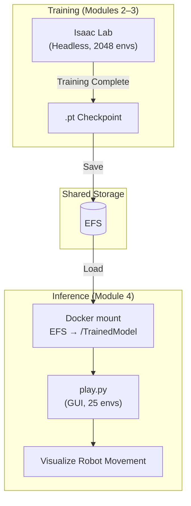

# 4. Load Trained Models in IsaacSim

Trained humanoid models are stored in [EFS (Elastic File System)](https://docs.aws.amazon.com/efs/latest/ug/whatisefs.html) folders. Mount this folder on the DCV EC2 instance to run the models in IsaacSim.

### 4.1 Difference Between Training and Inference

| Aspect | Training | Inference/Play |
| --- | --- | --- |
| Purpose | Optimize policy network weights | Execute robot movement with trained policy |
| Mode | Headless (fast, no rendering) | GUI (visualize results) |
| Number of Environments | 2048–16384 (maximize data collection) | 25–64 (visualization only) |
| GPU Usage | Physics simulation + neural network backprop | Physics simulation + neural network forward pass only |
| Output | `.pt` checkpoint file | Robot movement visible on simulation screen |

**Checkpoint file (`.pt`)**: A serialized file of a trained PyTorch model. Contains policy and value network parameters. During inference, only the policy network is loaded to perform Observation → Action mapping.



#### Checkpoint File Guide

Two checkpoint files are available for the workshop:

| Scenario | Checkpoint | Path |
| --- | --- | --- |
| Test inference without training | `agent_72000.pt` (pre-provided) | `/workspace/IsaacLab/TrainedModel/agent_72000.pt` |
| Verify results after batch training | `best_agent.pt` (self-trained) | `/workspace/IsaacLab/TrainedModel/models/h1_rough/{timestamp}_ppo_torch/checkpoints/best_agent.pt` |

* **agent_72000.pt**: Pre-trained checkpoint (72,000 iterations) downloaded from the workshop S3 bucket and auto-placed in EFS.
* **best_agent.pt**: Checkpoint generated when running AWS Batch distributed training in [Module 3](3.-isaaclab-rl-train-batch.md), saved at the point of highest performance during training.

---

### 4.2 Mount EFS

Access the Elastic File System console, select the filesystem named IsaacLab or IsaacLab*-EFS, and copy the file system ID.

<figure><figcaption></figcaption></figure>

Paste the copied file system ID into the `<File System ID>` placeholder below. Confirm your deployed region (us-east-1 or us-west-2) and set the correct region in the *.efs.region name. Run this on the **host** (not in Docker). After running, verify the mount with `df -h` or similar commands.

```bash
sudo mount -t nfs4 -o nfsvers=4.1,rsize=1048576,wsize=1048576,hard,timeo=600,retrans=2,noresvport <File System ID>.efs.us-east-1.amazonaws.com:/ /home/ubuntu/environment/efs
```

### 4.3 Run Docker Container

Run a Docker container with mounted EFS.

```bash
cd ~/environment/IsaacLab
xhost +
```

Set the correct image name (isaaclab-batch-xxx) when running Docker:
```bash
docker run --shm-size=60g --name isaac-lab \
    --entrypoint bash -it \
    --gpus all -e "ACCEPT_EULA=Y" --rm --network=host \
    -v /home/ubuntu/environment/efs:/workspace/IsaacLab/TrainedModel \
    -e DISPLAY \
    -e "PRIVACY_CONSENT=Y" \
    isaaclab-batch:latest
```

The `-v /home/ubuntu/environment/efs:/workspace/IsaacLab/TrainedModel` option mounts the host's EFS folder inside the container's `TrainedModel` folder.

The mounted EFS directory becomes available at `/workspace/IsaacLab/TrainedModel` inside the container.

```bash
cd /workspace/IsaacLab/TrainedModel
ls -lrt 
```

Navigate to the EFS directory to verify the trained models.

<figure><figcaption></figcaption></figure>

---

### 4.4 Run IsaacSim with Trained Models (Pre-trained Model Verification)

Run trained models stored in EFS in inference mode. `play.py` creates the same environment as `train.py`, but performs only forward passes with trained weights—no policy updates. Visually verify how the robot actually moves according to the learned policy.

**skrl 2.0.0 Compatibility Patch (Isaac Lab 2.x / Isaac Sim 5.1.0):**

skrl 2.0.0 changed its API, causing some `play.py` calls to break compatibility. This patch fixes two issues:
1. `set_running_mode` → `pass` (method removed in skrl 2.0)
2. `.act(obs, timestep, timesteps)` → `.act(obs, {}, timestep, timesteps)` (new signature requires empty state dict)

```shellscript
expand -t 4 /workspace/IsaacLab/scripts/reinforcement_learning/skrl/play.py | sed '/set_running_mode/c\        pass' | sed 's/\.act(obs, timestep=0, timesteps=0)/.act(obs, {}, timestep=0, timesteps=0)/' > /tmp/pf.py && cp /tmp/pf.py /workspace/IsaacLab/scripts/reinforcement_learning/skrl/play.py
```

```shellscript

cd /workspace/IsaacLab
./isaaclab.sh -p scripts/reinforcement_learning/skrl/play.py \
    --task=Isaac-Velocity-Rough-H1-v0 \
    --num_envs 25 \
    --checkpoint=/workspace/IsaacLab/TrainedModel/agent_72000.pt
```

**Inference parameters:**

| Parameter | Description |
| --- | --- |
| `--task=Isaac-Velocity-Rough-H1-v0` | Must match the training task for observation/action spaces to align |
| `--num_envs 25` | Use few environments for visualization only (saves GPU memory, easier to observe on screen) |
| `--checkpoint=...` | Path to model weights file. Trained policy network parameters are restored from this file |

<figure><figcaption></figcaption></figure>


**Version compatibility note:** Isaac Lab 2.3.2 + Isaac Sim 5.1.0 combination has RSL-RL dependency compatibility issues preventing the `h1_locomotion.py` demo from running. Use the skrl-based `play.py` instead.


```bash
cd /workspace/IsaacLab
/isaac-sim/python.sh scripts/demos/h1_locomotion.py
```

When the simulation environment fully loads, click the humanoid robot to select it, then use the following keys to control robot direction:

* ⬆️: Move forward
* ⬇️: Stop robot
* ⬅️: Move left
* ➡️: Move right

---

### 4.5 Run IsaacSim with Batch Training Results

Verify results from AWS Batch distributed training in [Module 3](3.-isaaclab-rl-train-batch.md). When the batch job completes, checkpoints are saved to `/efs/models` on EFS. Mount them in a Docker container and run inference.

```bash
cd /workspace/IsaacLab
./isaaclab.sh -p scripts/reinforcement_learning/skrl/play.py \
    --task=Isaac-Velocity-Rough-H1-v0 \
    --num_envs 25 \
    --checkpoint=/workspace/IsaacLab/TrainedModel/models/h1_rough/2026-02-10_14-59-27_ppo_torch/checkpoints/best_agent.pt
```

**Checkpoint path structure:**

```
/workspace/IsaacLab/TrainedModel/       ← EFS mount point
└── models/
    └── h1_rough/                       ← Task-specific directory
        └── <date>_<time>_ppo_torch/    ← Timestamp of training run
            └── checkpoints/
                ├── best_agent.pt       ← Highest reward during training
                └── agent_<N>.pt        ← Model at Nth iteration
```


`best_agent.pt` auto-saves at the point of highest average reward during training. The timestamp directory name varies with batch job execution time—use `ls` to find the actual path.


---

### 4.6 Archive Verified Checkpoints to S3

Upload verified checkpoints to S3 for long-term storage after confirming they work in IsaacSim. EFS is ideal for real-time sharing during training but costs ~13x more than S3 (`EFS ~$0.30/GB/month` vs `S3 Standard ~$0.023/GB/month`). Move validated models to S3 for cost efficiency.

**EFS vs S3 Role Separation:**

| Aspect | EFS | S3 |
| --- | --- | --- |
| Purpose | Real-time training save · multi-node sharing | Long-term verified model storage · version control |
| Access Method | POSIX filesystem (mount) | API / CLI (`aws s3`) |
| Cost | ~$0.30/GB/month | ~$0.023/GB/month |
| Best Timing | During training ~ inference verification | After verification complete |

#### Create S3 Bucket (First Time Only)

```bash
# Bucket name must be globally unique
aws s3 mb s3://isaac-lab-checkpoints-<ACCOUNT_ID> --region us-east-1
```

#### Upload Verified Checkpoint

```bash
# Upload single checkpoint
aws s3 cp /home/ubuntu/environment/efs/models/h1_rough/<timestamp>_ppo_torch/checkpoints/best_agent.pt \
  s3://isaac-lab-checkpoints-<ACCOUNT_ID>/h1_rough/best_agent.pt

# Upload entire run including TensorBoard logs
aws s3 sync /home/ubuntu/environment/efs/models/h1_rough/<timestamp>_ppo_torch \
  s3://isaac-lab-checkpoints-<ACCOUNT_ID>/h1_rough/<timestamp>_ppo_torch/
```

#### Download from S3 (Using on Different Instance)

```bash
# Restore from S3 to EFS
aws s3 cp s3://isaac-lab-checkpoints-<ACCOUNT_ID>/h1_rough/best_agent.pt \
  /home/ubuntu/environment/efs/models/best_agent.pt
```


After S3 upload confirmation, delete EFS checkpoints to reduce EFS costs. Keep 2–3 latest experiments on EFS for additional testing or comparison needs.

