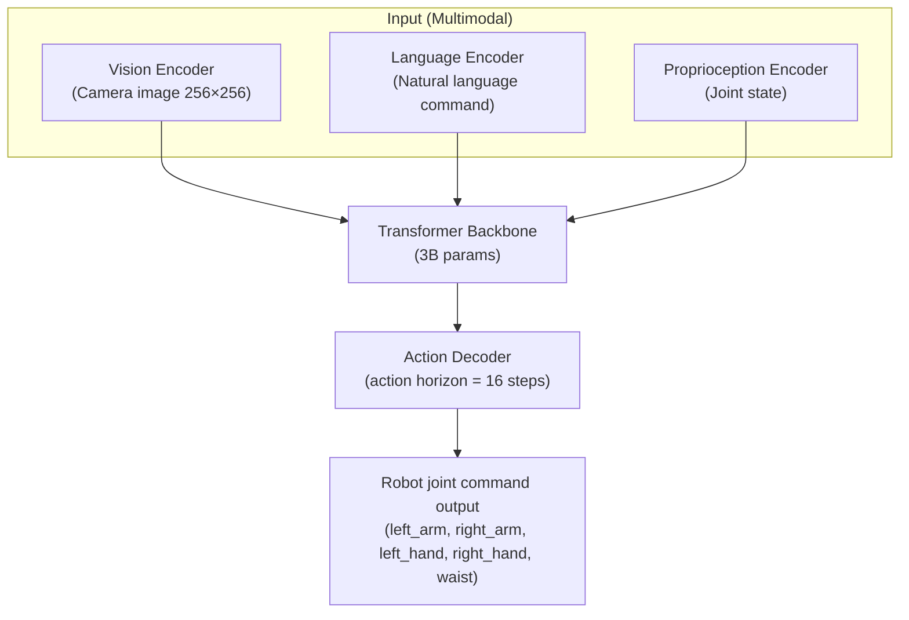
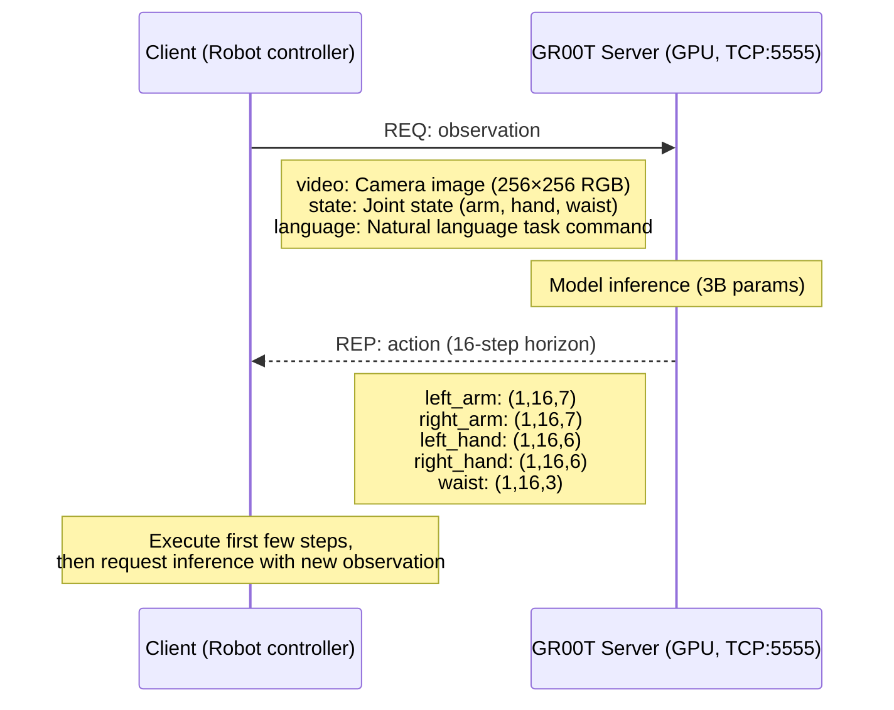
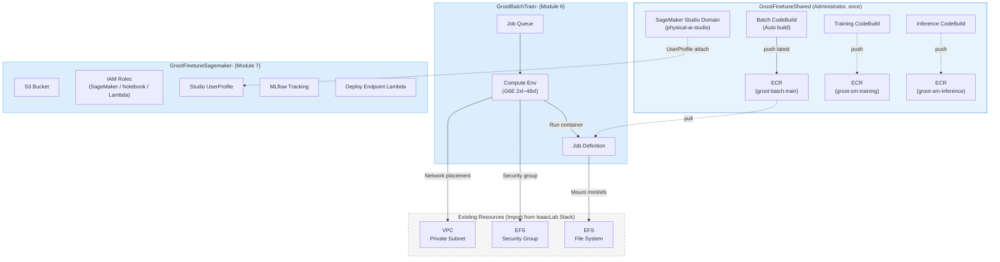
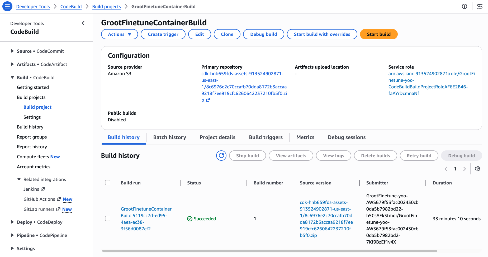
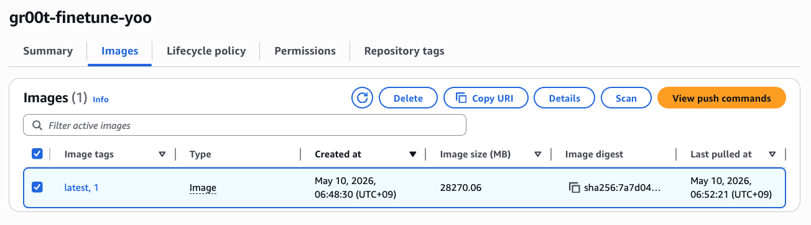
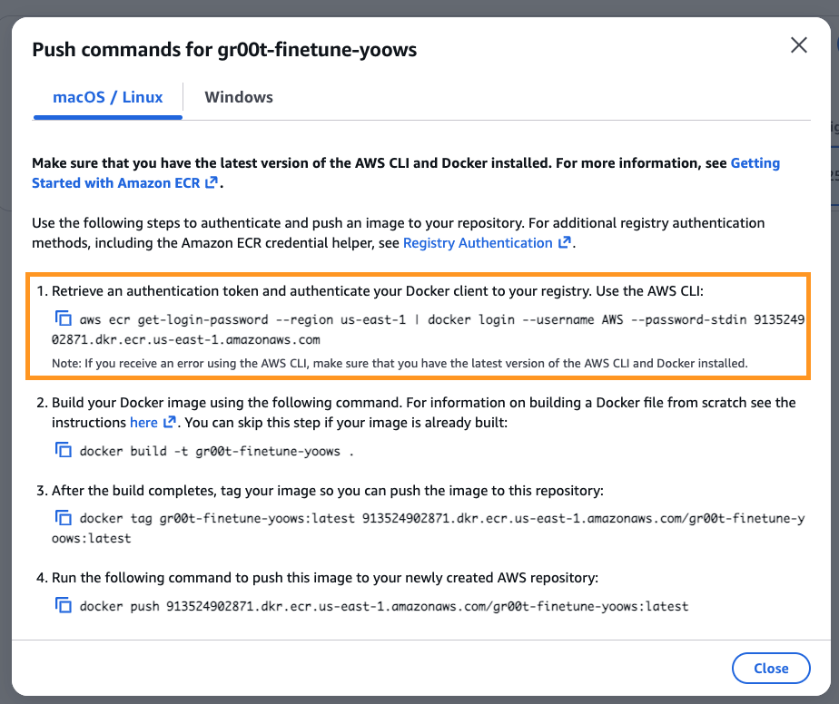
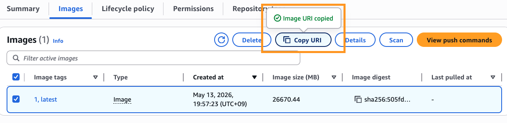

# 5. Deploying VLA Fine-tuning Infrastructure

## 5.1 GR00T N1 Overview

[NVIDIA GR00T N1](https://developer.nvidia.com/gr00t) is a **Vision-Language-Action (VLA) model** for general-purpose humanoid robots. Unlike reinforcement learning-based policies (PPO) from previous modules that are specialized controllers for specific tasks, GR00T N1 is a **Foundation Model** that accepts natural language commands and camera images as input and directly generates robot joint commands.

**GR00T N1 Architecture:**



**Inference Server Architecture (ZMQ REQ/REP):**



The model outputs **16-step future actions** (action horizon) from a single inference. The robot controller executes only the first few steps and then requests a new inference with updated observations using the receding horizon approach.

***

## 5.2 GR00T Fine-tuning CDK Deployment

Build container images for GR00T Fine-tuning and configure AWS Batch + SageMaker infrastructure in one deployment. This project manages all resources shared by [Module 6](6.-vla-train-batch.md) (AWS Batch training) and [Module 7](7.-vla-train-sagemaker.md) (SageMaker Pipeline).

### 5.2.0 Prerequisites

- [Modules 1](1.-isaaclab-infra-setup.md) through [2](2.-isaaclab-rl-train.md) completed (IsaacLab Stack deployed)
- AWS CLI installed and authenticated
- Node.js 18+ installed
- CDK CLI installed (`npm install -g aws-cdk`)
- (For N1.7 only) **HuggingFace Access Token** prepared ([obtain here](https://huggingface.co/settings/tokens))
    - License agreement for [nvidia/Cosmos-Reason2-2B](https://huggingface.co/nvidia/Cosmos-Reason2-2B) model (GR00T N1.7 backbone)

### 5.2.1 CDK Deployment (~5 minutes + Studio Domain creation ~10 minutes)

As in [Module 1](1.-isaaclab-infra-setup.md), run from **AWS CloudShell**. CloudShell has AWS credentials pre-injected and CDK CLI/Node.js pre-installed, allowing deployment without additional environment setup.

```bash
source ~/aws-physical-ai-recipes/e2e-workshop/infra/isaaclab/scripts/setup-cloudshell.sh

cd ~/aws-physical-ai-recipes/e2e-workshop/infra/groot
npm install
```

This project comprises three stacks:

- **`GrootFinetuneShared`** — Batch ECR + Batch CodeBuild + SageMaker training/inference ECR + SageMaker training/inference CodeBuild + Studio Domain. **Deploy once per account** (performed by administrator before workshop starts).
- **`GrootBatchTrain-<userId>`** — AWS Batch Compute Env / Queue / Job Definition. Used in Module 6. Deploy per user.
- **`GrootFinetuneSagemaker-<userId>`** — S3 artifact bucket, SageMaker/Notebook/Lambda IAM roles, MLflow tracking server, Studio UserProfile, Deploy endpoint Lambda. Used in Module 7. Deploy per user.

#### Shared Stack (Administrator, once)

Creates all ECR/CodeBuild for both Batch and SageMaker and automatically builds the Batch container image. Studio Domain creation takes approximately 10 minutes. If already deployed, the process is idempotent.

```bash
npm run deploy:shared > shared-deploy.log 2>&1 &
# Or for N1.7 deployment:
# npm run deploy:shared -- -c grootVersion=n1.7
```

#### Per-User Stacks (Users, simultaneous deployment in one command)

With `-c userId=<userId>`, both Batch and SageMaker per-user stacks are created simultaneously. On first run, the parent IsaacLab stack (`IsaacLab-Latest-<userId>` or `IsaacLab-Stable-<userId>`) is automatically queried and VPC/EFS/Subnet/AZ are cached in `cdk.context.json`:

```bash
npm run deploy -- -c userId=<userId> > deploy.log 2>&1 &
```

Two stacks are registered in CloudFormation: `GrootBatchTrain-<userId>` and `GrootFinetuneSagemaker-<userId>`. If no S3 bucket name is specified, the SageMaker stack automatically creates `groot-sm-artifacts-<userId>`.

| Parameter | Default | Description |
| --- | --- | --- |
| `grootVersion` | `n1.6` | GR00T model version (`n1.6` or `n1.7`). Only meaningful in Shared stack |
| `useStableGroot` | `true` | Whether to use validated release commits. Only meaningful in Shared stack |
| `bucketName` | `groot-sm-artifacts-<userId>` | SageMaker artifact bucket (per-user) |
| `mlflowSize` | `Small` | MLflow tracking server size |

The deployment entrypoint automatically queries the parent IsaacLab stack and stores VPC, EFS, Subnet, and AZ in `cdk.context.json`, so no separate preparatory steps are needed.

**Expected Output:**

```
 ✅  GrootFinetuneShared
Outputs:
GrootFinetuneShared.BatchEcrName = groot-batch-train
GrootFinetuneShared.SmTrainingEcrName = groot-sm-training
GrootFinetuneShared.SmInferenceEcrName = groot-sm-inference
GrootFinetuneShared.StudioDomainId = d-xxxxxxxxxxx
GrootFinetuneShared.StudioDomainUrl = https://us-east-1.console.aws.amazon.com/sagemaker/home?...
GrootFinetuneShared.SmTrainingBuildProjectName = groot-sm-training-build
GrootFinetuneShared.SmInferenceBuildProjectName = groot-sm-inference-build

 ✅  GrootBatchTrain-<userId>
Outputs:
GrootBatchTrain-<userId>.JobQueueName = groot-batch-train-<userId>-queue
GrootBatchTrain-<userId>.JobDefinitionName = groot-batch-train-<userId>-job-single

 ✅  GrootFinetuneSagemaker-<userId>
Outputs:
GrootFinetuneSagemaker-<userId>.BucketName = groot-sm-artifacts-<userId>
GrootFinetuneSagemaker-<userId>.SageMakerRoleArn = arn:aws:iam::123456789012:role/GR00TSageMakerRole-<userId>
GrootFinetuneSagemaker-<userId>.NotebookRoleArn = arn:aws:iam::123456789012:role/GR00TNotebookRole-<userId>
GrootFinetuneSagemaker-<userId>.MlflowTrackingServerName = groot-mlflow-<userId>
GrootFinetuneSagemaker-<userId>.StudioUserProfileName = <userId>
```

<details>
<summary>Manually specifying parameters (optional)</summary>

```bash
CDK_DEFAULT_REGION=us-east-1 npm run deploy -- \
  -c userId=<userId> \
  -c vpcId=<VpcId> \
  -c efsFileSystemId=<EfsFileSystemId> \
  -c efsSecurityGroupId=<EfsSecurityGroupId> \
  -c privateSubnetId=<PrivateSubnetId> \
  -c availabilityZone=us-east-1a
```

</details>

**Resources Created by CDK:**



### 5.2.2 Container Image Build Verification (~30 minutes)

Upon deployment of `GrootFinetuneShared`, CodeBuild for Batch (`groot-batch-train-build`) automatically builds the GR00T container image. Since the image is approximately 15GB, it takes 25-35 minutes. CodeBuild for SageMaker (`groot-sm-training-build`, `groot-sm-inference-build`) are registered as empty projects and triggered separately in Module 7.

<details>
<summary><strong>Manually rebuilding Batch CodeBuild (when changing versions)</strong></summary>

After changing `grootVersion` and redeploying (`npm run deploy:shared -- -c grootVersion=n1.7`), CodeBuild automatically retriggers. To manually rebuild only:

```bash
aws codebuild start-build \
    --region $REGION \
    --project-name groot-batch-train-build \
    --environment-variables-override "name=GROOT_VERSION,value=n1.6,type=PLAINTEXT"
```

</details>

<details>
<summary><strong>Checking build status via CLI</strong></summary>

```bash
aws codebuild list-builds-for-project \
  --project-name groot-batch-train-build \
  --region us-east-1 \
  --query "ids[0]" --output text | \
xargs -I{} aws codebuild batch-get-builds --ids {} \
  --region us-east-1 \
  --query "builds[0].{Status:buildStatus,Phase:currentPhase}" \
  --output table
```

</details>

Once the build completes, you can verify it in CodeBuild console as shown below.



After the build completes, connect to the **DCV instance** used in Module 4 and pull the image from ECR.



Access ECR in the console and run the ECR login command from **View push commands**.



```bash
# ECR login
#aws ecr get-login-password --region $REGION | \
#  docker login --username AWS --password-stdin $ACCOUNT_ID.dkr.ecr.$REGION.amazonaws.com
```

Copy the image's **Copy URI** and store it as `ECR_URI`, then pull the docker image.



```bash
# Pull GR00T image (~15GB, approximately 5 minutes)
ECR_URI=<copied URI>
docker pull $ECR_URI
```

Verify pull completion:

```bash
docker images
```


The inference test in section 5.3 below cannot proceed until CodeBuild build completes (~30 minutes).


***

## 5.3 Running Inference Server

Run the GR00T **base model** inference server with the image pulled from ECR. The instance does not auto-run GR00T inference, so clean up any previously launched containers that may occupy the GPU/5555 port.

```bash
# Clean up existing GR00T inference container (if present)
docker rm -f groot-inference 2>/dev/null
docker rm -f groot-policy-server 2>/dev/null
```

Load the N1.6 checkpoint already available on EFS directly. No HF_TOKEN required and no download wait time.

If running in a new terminal, the `ECR_URI` set in 5.2.2 may be empty. Running docker with an empty value will cause `-c 'cd ...'` to be misinterpreted as the `--cpu-shares` option, resulting in `invalid argument ... for "-c, --cpu-shares" flag` error. Always verify the value is printed first:

```bash
echo "ECR_URI=$ECR_URI"   # If empty, rerun the ECR_URI=<copied URI> step from 5.2.2

docker run -d --gpus all --name groot-policy-server \
  --shm-size=8g --network host \
  --entrypoint /bin/sh \
  -e PYTHONUNBUFFERED=1 \
  -v /home/ubuntu/environment/efs:/mnt/efs \
  "$ECR_URI" \
  -c 'cd /workspace/gr00t-repo && python3 -m gr00t.eval.run_gr00t_server \
    --model-path /mnt/efs/GR00T-N1.6-3B \
    --embodiment-tag GR1 \
    --host 0.0.0.0 \
    --port 5555'
```

**Key Parameters:**

| Parameter | Description |
| --- | --- |
| `--entrypoint /bin/sh` | Override image default ENTRYPOINT to run shell commands |
| `--model-path` | Path to model checkpoint on EFS |
| `--embodiment-tag` | Robot joint configuration identifier |
| `--shm-size=8g` | Expand shared memory (prevent DataLoader collisions) |
| `--network host` | Share host network (expose port 5555 directly) |
| `-v .../efs:/mnt/efs` | Mount EFS model weights into container |
| `--host 0.0.0.0` | Accept connections from all network interfaces |
| `--port 5555` | ZMQ REP socket port |
| `-e PYTHONUNBUFFERED=1` | Disable Python output buffering — logs appear immediately in `docker logs` |

<details>
<summary><strong>How to download and run GR00T N1.7 from HuggingFace</strong></summary>

Automatically download and run the latest N1.7 base model from HuggingFace.

```bash
HF_TOKEN=<your-huggingface-token>

docker run -d --gpus all --name groot-policy-server \
  --shm-size=8g --network host \
  --entrypoint /bin/sh \
  -e PYTHONUNBUFFERED=1 \
  -e HF_TOKEN=$HF_TOKEN \
  $ECR_URI \
  -c 'cd /workspace/gr00t-repo && python3 -m gr00t.eval.run_gr00t_server \
    --model-path nvidia/GR00T-N1.7-3B \
    --embodiment-tag OXE_DROID_RELATIVE_EEF_RELATIVE_JOINT \
    --host 0.0.0.0 \
    --port 5555'
```


**HF_TOKEN Required**: GR00T N1.7 uses [nvidia/Cosmos-Reason2-2B](https://huggingface.co/nvidia/Cosmos-Reason2-2B) as the backbone, which is a HuggingFace gated model. Agree to the license on the [model page](https://huggingface.co/nvidia/Cosmos-Reason2-2B) and obtain an [Access Token](https://huggingface.co/settings/tokens) for use.


</details>

### Verifying Server Readiness

Model loading takes approximately 1-2 minutes. Check for "Server ready" message in logs:

```bash
# View logs (Ctrl+C to exit, server continues running)
docker logs -f groot-policy-server
```

Expected output:

```
Starting GR00T inference server...
  Embodiment tag: EmbodimentTag.NEW_EMBODIMENT
  Model path: nvidia/GR00T-N1.7-3B
  Device: cuda
  Host: 0.0.0.0
  Port: 5555
Loading checkpoint shards: 100%|██████████| 3/3 [00:03<00:00,  1.01s/it]

✓ Server ready — listening on tcp://0.0.0.0:5555
```

```bash
# Verify port is listening
ss -tlnp | grep 5555
```

***

## 5.4 Inference Testing

Verify that Policy Server is operating correctly. Since all dependencies are included in the ECR image, **launch a test container with the same image** for validation.

### 5.4.1 Ping Test (Connectivity Check)

Simply verify that the server responds correctly.

```bash
# Run test container with ECR image (share host network)
docker run --rm --network=host $ECR_URI -c '                                    
python3 -c "                                                                    
import zmq, msgpack                                                             
ctx = zmq.Context()                                                             
sock = ctx.socket(zmq.REQ)                                                      
sock.connect(\"tcp://localhost:5555\")                                          
sock.send(msgpack.packb({\"endpoint\": \"ping\"}))                              
print(\"Server response:\", msgpack.unpackb(sock.recv(), raw=False))            
"'
```

**Expected Output:**

```
Server response: {'status': 'ok', 'message': 'Server is running'}
```

### 5.4.2 Testing with Official PolicyClient

Test using Isaac-GR00T's official client inside the ECR image.

```bash

docker run --rm --network=host $ECR_URI -c '                                    
python3 -c "                                                                    
from gr00t.policy.server_client import PolicyClient                             
policy = PolicyClient(host=\"localhost\", port=5555)                            
if policy.ping():                                                               
    print(\"GR00T server connection successful\")                               
else:                                                                           
    print(\"No server response\")                                               
"'
```

## 5.5 Overall Status Check (Quick Check)

```bash
echo "=== GPU ==="
nvidia-smi --query-gpu=name,memory.used,memory.total --format=csv

echo "=== Docker Images ==="
docker images | grep -E 'groot|isaac'

echo "=== Policy Server ==="
docker ps | grep groot-policy-server

echo "=== Port 5555 ==="
ss -tlnp | grep 5555
```

***

## References

* [NVIDIA Isaac-GR00T GitHub](https://github.com/NVIDIA/Isaac-GR00T)
* [GR00T N1.7 Model (HuggingFace)](https://huggingface.co/nvidia/GR00T-N1.7-3B)
* [Cosmos-Reason2-2B (backbone)](https://huggingface.co/nvidia/Cosmos-Reason2-2B)
