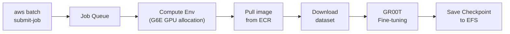
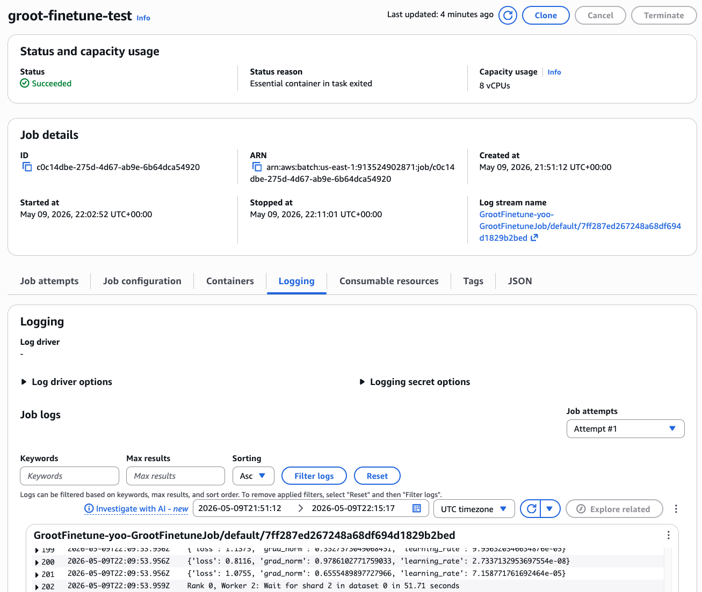
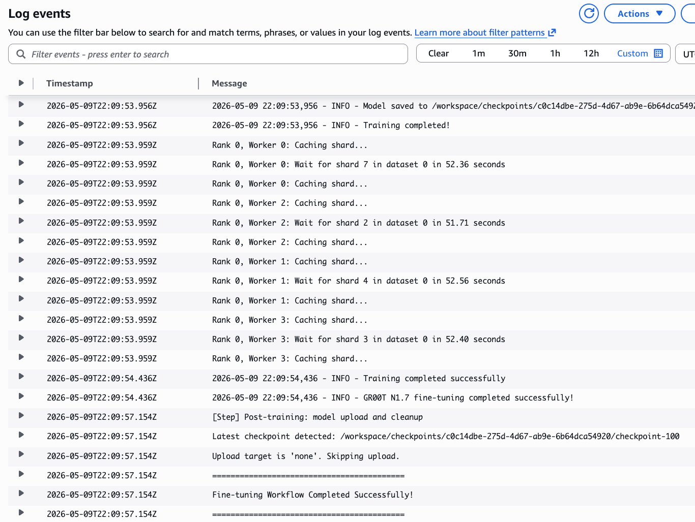
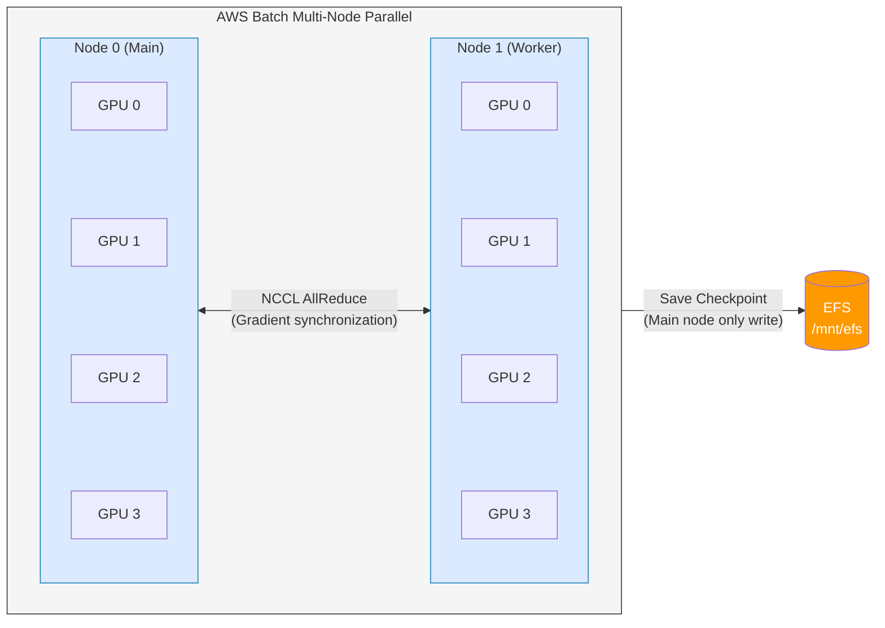

# 6. VLA Fine-tuning on AWS Batch

In this module, you will fine-tune the [NVIDIA GR00T N1](https://developer.nvidia.com/gr00t) VLA (Vision-Language-Action) model using AWS Batch. If you tested inference with the pretrained GR00T model in [Module 5](5.-train-infra-setup.md), this module focuses on fine-tuning the model for **custom robot datasets**.

This module uses the ECR image built by CodeBuild from the `infra/groot` CDK deployed in [Module 5.2](5.-train-infra-setup.md#5.2-gr00t-fine-tuning-cdk-deployment). The default is **N1.6**, and if you specified `-c grootVersion=n1.7` during CDK deployment, the N1.7 image is used.

Since this module shares the existing DCV instance and EFS, you can view training results directly from the DCV.

| Service | Simple Analogy |
|--------|-----------|
| [AWS Batch](https://docs.aws.amazon.com/batch/latest/userguide/what-is-batch.html) | Automatic job runner: submit a job and it automatically turns on a GPU server; when done, it shuts down |
| [Amazon ECR](https://docs.aws.amazon.com/AmazonECR/latest/userguide/what-is-ecr.html) | Private Docker Hub — container image repository |
| [AWS CodeBuild](https://docs.aws.amazon.com/codebuild/latest/userguide/welcome.html) | Cloud service that automatically builds Docker images |


[Module 5](5.-train-infra-setup.md) must have `infra/groot` CDK deployment and CodeBuild image build completed. If not yet deployed, proceed with [Module 5.2](5.-train-infra-setup.md#5.2-gr00t-fine-tuning-cdk-deployment) first.


---

## 6.1 Submitting Fine-tuning Job (~15 minutes)

Run a short test training with a sample dataset to verify the entire pipeline operates correctly.




**HF_TOKEN Required for N1.7:** GR00T N1.7 uses [nvidia/Cosmos-Reason2-2B](https://huggingface.co/nvidia/Cosmos-Reason2-2B) as backbone, which is a HuggingFace gated model. When deployed with N1.7, authentication is required during model initialization, so jobs submitted without `HF_TOKEN` fail immediately. Before submitting a job:
1. [Agree to model license](https://huggingface.co/nvidia/Cosmos-Reason2-2B) in your HuggingFace account
2. [Generate Access Token](https://huggingface.co/settings/tokens)

**For N1.6:** Training is possible without `HF_TOKEN`. However, if using HuggingFace datasets (`HF_DATASET_ID`), a token may be required.


### Submitting Test Job (100 steps, approximately 10-15 minutes):

**N1.6 (Default):**

```bash
aws batch submit-job \
  --job-name groot-batch-train-test \
  --job-queue groot-batch-train-<userId>-queue \
  --job-definition groot-batch-train-<userId>-job-single \
  --region us-east-1 \
  --container-overrides '{
    "environment": [
      {"name": "MAX_STEPS", "value": "100"},
      {"name": "SAVE_STEPS", "value": "50"},
      {"name": "RESUME", "value": "false"}
    ]
  }'
```

<details>
<summary><strong>Training with custom HuggingFace dataset</strong></summary>

When you specify `HF_DATASET_ID`, the container automatically downloads the dataset and starts training:

```bash
aws batch submit-job \
  --job-name groot-batch-train-custom \
  --job-queue groot-batch-train-<userId>-queue \
  --job-definition groot-batch-train-<userId>-job-single \
  --region us-east-1 \
  --container-overrides '{
    "environment": [
      {"name": "HF_TOKEN", "value": "<your-hf-token>"},
      {"name": "HF_DATASET_ID", "value": "LightwheelAI/leisaac-pick-orange"},
      {"name": "MAX_STEPS", "value": "6000"},
      {"name": "SAVE_STEPS", "value": "2000"}
    ]
  }'
```

</details>

<details>
<summary><strong>For N1.7 deployment (HF_TOKEN required)</strong></summary>

```bash
aws batch submit-job \
  --job-name groot-batch-train-test \
  --job-queue groot-batch-train-<userId>-queue \
  --job-definition groot-batch-train-<userId>-job-single \
  --region us-east-1 \
  --container-overrides '{
    "environment": [
      {"name": "HF_TOKEN", "value": "<your-hf-token>"},
      {"name": "MAX_STEPS", "value": "100"},
      {"name": "SAVE_STEPS", "value": "50"},
      {"name": "RESUME", "value": "false"}
    ]
  }'
```

</details>


`RESUME=false` starts training from the beginning when an existing checkpoint is present. To resume from a previous checkpoint, remove this value or set it to `true`. However, if `DATA_CONFIG` or `EMBODIMENT_TAG` differs from the previous training, a shape mismatch error may occur.


Expected output:

```json
{
    "jobArn": "arn:aws:batch:us-east-1:123456789012:job/xxxxxxxx-xxxx-xxxx-xxxx-xxxxxxxxxxxx",
    "jobName": "groot-batch-train-test",
    "jobId": "xxxxxxxx-xxxx-xxxx-xxxx-xxxxxxxxxxxx"
}
```

Note the returned `jobId`.

<details>
<summary>Example of full-scale training job submission (6000 steps, ~2 hours)</summary>

```bash
aws batch submit-job \
  --job-name groot-batch-train-full \
  --job-queue groot-batch-train-<userId>-queue \
  --job-definition groot-batch-train-<userId>-job-single \
  --region us-east-1 \
  --container-overrides '{
    "environment": [
      {"name": "MAX_STEPS", "value": "6000"},
      {"name": "SAVE_STEPS", "value": "2000"},
      {"name": "GLOBAL_BATCH_SIZE", "value": "32"}
    ]
  }'
```

For N1.7, add `{"name": "HF_TOKEN", "value": "<your-hf-token>"}` to the environment array.

</details>

<details>
<summary>Fast training with larger instances (GPU scaling)</summary>

Compute Environment supports g6e.2xlarge through g6e.48xlarge. Adding `resourceRequirements` to `--container-overrides` makes Batch automatically allocate an appropriate larger instance:

```bash
# 4 GPUs (g6e.12xlarge auto-selected) — 4x faster training on a single node
aws batch submit-job \
  --job-name groot-batch-train-fast \
  --job-queue groot-batch-train-<userId>-queue \
  --job-definition groot-batch-train-<userId>-job-single \
  --region us-east-1 \
  --container-overrides '{
    "resourceRequirements": [
      {"type": "GPU", "value": "4"},
      {"type": "VCPU", "value": "48"},
      {"type": "MEMORY", "value": "393216"}
    ],
    "environment": [
      {"name": "NUM_GPUS", "value": "4"},
      {"name": "MAX_STEPS", "value": "100"},
      {"name": "SAVE_STEPS", "value": "50"},
      {"name": "RESUME", "value": "false"}
    ]
  }'
```

| GPU Request | Selected Instance | vCPU / Memory Setting | Use Case |
|----------|-------------------|-------------------|------|
| 1 | g6e.2xlarge | 8 / 65536 | Basic testing (default) |
| 1 | g6e.4xlarge | 16 / 131072 | Large batch size, more DataLoader workers |
| 4 | g6e.12xlarge | 48 / 393216 | Fast training |
| 8 | g6e.48xlarge | 192 / 786432 | Maximum single-node performance |


The number of GPUs in `resourceRequirements` must match the `NUM_GPUS` value in `environment`. If you allocate GPUs without increasing `NUM_GPUS`, some GPUs remain idle.


</details>

<details>
<summary>Key training parameter explanations</summary>

| Parameter | Default | Description |
|----------|--------|------|
| `MAX_STEPS` | 6000 | Total training steps |
| `SAVE_STEPS` | 2000 | Checkpoint save interval |
| `GLOBAL_BATCH_SIZE` | 32 | Global batch size (BATCH_SIZE also usable as alias) |
| `LEARNING_RATE` | 1e-4 | Learning rate |
| `GRADIENT_ACCUMULATION_STEPS` | 1 | Gradient accumulation steps |
| `NUM_GPUS` | 1 | Number of GPUs |
| `TUNE_PROJECTOR` | true | Whether to train projector |
| `TUNE_DIFFUSION_MODEL` | true | Whether to train diffusion model |
| `TUNE_LLM` | false | Whether to train LLM layer |
| `TUNE_VISUAL` | false | Whether to train vision layer |
| `MODALITY_CONFIG_PATH` | /workspace/scripts/so101_modality_config.py | Modality config path |
| `EMBODIMENT_TAG` | new_embodiment | Robot embodiment tag |
| `HF_TOKEN` | (Required for N1.7) | HuggingFace Access Token (for gated model access with N1.7; not required for N1.6) |
| `HF_DATASET_ID` | (none) | HuggingFace dataset ID |

</details>

---

## 6.2 Training Monitoring

### Checking Job Status

```bash
JOB_ID=<jobId returned by submit-job>

aws batch describe-jobs \
  --jobs $JOB_ID \
  --region us-east-1 \
  --query "jobs[0].{Status:status,Reason:statusReason}" \
  --output table
```

Job transitions through the following states:


| State | Meaning | Expected Duration |
|------|------|-----------|
| SUBMITTED → RUNNABLE | Job registration and scheduling | Seconds |
| RUNNABLE → STARTING | GPU instance provisioning | 3-5 minutes |
| STARTING → RUNNING | Container image pull and start | 5-10 minutes (~15GB image) |
| RUNNING → SUCCEEDED | Training execution | 10-15 minutes (100 steps) |



### Checking CloudWatch Logs

```bash
aws logs tail /aws/batch/job \
  --region us-east-1 \
  --follow
```

Training starting normally outputs logs as shown below:

```
==========================================
Fine-tuning Workflow Starting
==========================================
...
EFS mount is accessible: /mnt/efs
Job output directory: /mnt/efs/gr00t/checkpoints/<JOB_ID>
Starting Python finetune script...
All required parameters validated successfully
Validating dataset...
Starting training...
Using 1 GPUs
Total parameters: 3,144,016,000
Trainable parameters: 1,620,515,968 (51.54%)
Current global step: 0
  0%|          | 0/100 [00:00<?, ?it/s]
```




If a job remains in RUNNABLE state for a long time, it may be due to insufficient G6E instance capacity in that AZ. Waiting usually resolves the issue.


---

## 6.3 Checking Checkpoints on DCV

After training completes, connect to the DCV instance to verify results. Since the Batch Job and DCV mount the same EFS, you can directly access training results.

The DCV connection URL can be found in the IsaacLab Stack's `DcvUrl` Output (e.g., `https://<IP>:8443`).

From DCV terminal:

```bash
# View checkpoint directories by job
ls -la /home/ubuntu/environment/efs/gr00t/checkpoints/

# View checkpoint contents for specific job (JOB_ID is the value returned from submit-job)
ls /home/ubuntu/environment/efs/gr00t/checkpoints/<JOB_ID>/checkpoint-*/
```

If training completed successfully, you will see a structure like this (each job creates its own directory):

```
/home/ubuntu/environment/efs/gr00t/checkpoints/<JOB_ID>/
├── checkpoint-50/
│   ├── config.json
│   ├── model.safetensors
│   └── training_args.bin
├── checkpoint-100/
│   ├── config.json
│   ├── model.safetensors
│   └── training_args.bin
```

---

## 6.4 Distributed Training with Multi-Node Multi-GPU

After confirming basic operation with a single GPU, you can improve training speed by using multiple nodes and GPUs. CDK creates two Job Definitions: one for single-node (`groot-batch-train-<userId>-job-single`) and one for multi-node (`groot-batch-train-<userId>-job-multinode`).

### Multi-Node Distributed Training Architecture



**Operation Flow:**
1. AWS Batch provisions 2 nodes and injects environment variables:
   - All nodes: `AWS_BATCH_JOB_NODE_INDEX` (0 or 1)
   - Worker nodes only: `AWS_BATCH_JOB_MAIN_NODE_PRIVATE_IPV4_ADDRESS` (main node IP)
2. Entrypoint script converts these to `MASTER_ADDR`, `NODE_RANK` (main node uses `hostname -i` for its own IP)
3. Run distributed training with `torchrun --nnodes=2 --nproc_per_node=4 --node-rank={0|1} --master-addr=...`

### Submitting Multi-GPU Job (2 nodes × 4 GPUs = 8 total GPUs)

The Multi-Node Job Definition created by CDK has default values (2 nodes × 4 GPUs, g6e.12xlarge), so you can submit it directly without additional resource override:

```bash
aws batch submit-job \
  --job-name groot-batch-train-distributed \
  --job-queue groot-batch-train-<userId>-queue \
  --job-definition groot-batch-train-<userId>-job-multinode \
  --region us-east-1
```

<details>
<summary><strong>Submitting with environment variable override</strong></summary>

You can change training parameters with `--node-overrides`:

```bash
aws batch submit-job \
  --job-name groot-batch-train-distributed \
  --job-queue groot-batch-train-<userId>-queue \
  --job-definition groot-batch-train-<userId>-job-multinode \
  --region us-east-1 \
  --node-overrides '{
    "nodePropertyOverrides": [{
      "targetNodes": "0:1",
      "containerOverrides": {
        "environment": [
          {"name": "MAX_STEPS", "value": "3000"},
          {"name": "SAVE_STEPS", "value": "1000"},
          {"name": "GLOBAL_BATCH_SIZE", "value": "64"}
        ]
      }
    }]
  }'
```

For N1.7, add `{"name": "HF_TOKEN", "value": "<your-hf-token>"}` to the environment array.

</details>


**Job Definition Distinction:**
- `groot-batch-train-<userId>-job-single` — for single node. Override environment variables with `--container-overrides`
- `groot-batch-train-<userId>-job-multinode` — for multi-node. Override environment variables with `--node-overrides`. `targetNodes: "0:1"` applies the same override to all nodes (node 0 and 1)


### Key Configuration Values (Multi-Node Job Definition defaults)

| Parameter | Value | Description |
|----------|-----|------|
| `NUM_GPUS` | 4 | GPUs per node (based on g6e.12xlarge) |
| `NUM_NODES` | 2 | Total number of nodes |
| `DATALOADER_NUM_WORKERS` | 2 | Reduce when increasing GPUs to prevent shared memory exhaustion |
| GPU (resource) | 4 | GPUs allocated to container |
| VCPU (resource) | 48 | 48 vCPU for g6e.12xlarge |
| MEMORY (resource) | 393216 MB (384GB) | Memory for g6e.12xlarge |


**Compute Environment Checklist:**
- Instance type must be `g6e.12xlarge` (4 GPU) or larger
- Service Quota **Running On-Demand G and VT instances** must be at least 96 vCPU (48 vCPU × 2 nodes)
- Security Group must have self-referencing inbound rules for nodes to enable NCCL communication


<details>
<summary>Scaling configuration examples</summary>

| Configuration | Instance | Total GPUs | Use Case |
|------|----------|--------|-------------|
| 2 nodes × 1 GPU | g6e.xlarge | 2 | Basic testing, small datasets |
| 2 nodes × 4 GPUs | g6e.12xlarge | 8 | Production training |
| 2 nodes × 8 GPUs | g6e.48xlarge | 16 | Large datasets, fast convergence required |

As GPU count increases, you can improve training efficiency by increasing `GLOBAL_BATCH_SIZE` or decreasing `GRADIENT_ACCUMULATION_STEPS`.

</details>

---

## 6.5 Cleanup (Optional)

After the workshop, delete only your per-user stacks (keep shared ECR/CodeBuild since other participants use them):

```bash
cd infra/groot
npx cdk destroy GrootBatchTrain -c userId=<userId>
```


**Shared Stack Cleanup** (by administrator after workshop ends):
```bash
npx cdk destroy GrootFinetuneShared
```
This cleanly deletes everything including ECR images (custom resource onDelete handler handles this automatically).


---

## 6.6 Troubleshooting

| Symptom | Cause | Solution |
|------|------|------|
| `Access to model nvidia/Cosmos-Reason2-2B is restricted` | N1.7 used but HF_TOKEN not set or license not agreed | Agree to license on [model page](https://huggingface.co/nvidia/Cosmos-Reason2-2B) then add `HF_TOKEN` environment variable |
| `size mismatch for action_head` | Previous checkpoint incompatible with current config | Retry with `RESUME=false` or delete existing checkpoint |
| Job stuck in RUNNABLE | G6E instance capacity insufficient | Wait or adjust to different AZ/instance type |
| EFS mount failure | Security group rule missing | Verify Batch SG → EFS SG TCP 2049 inbound rule |
| Container image not found | CodeBuild build incomplete | Wait for build to reach `Status: SUCCEEDED` then retry |
| OOM (Out of Memory) | DataLoader shared memory insufficient | Reduce `DATALOADER_NUM_WORKERS=2` and retry |
| Loss not decreasing | Inappropriate learning rate or batch size | Adjust `LEARNING_RATE=5e-5`, `BATCH_SIZE=16` and retry |

---

## References

* [AWS Batch User Guide - Managed Compute Environments](https://docs.aws.amazon.com/batch/latest/userguide/managed_compute_environments.html)
* [AWS Batch - EFS Volume Configuration](https://docs.aws.amazon.com/batch/latest/APIReference/API_EFSVolumeConfiguration.html)
* [AWS CodeBuild User Guide](https://docs.aws.amazon.com/codebuild/latest/userguide/welcome.html)
* [NVIDIA Isaac-GR00T Repository](https://github.com/NVIDIA/Isaac-GR00T)
* [GR00T N1.6 Model (HuggingFace)](https://huggingface.co/nvidia/GR00T-N1.6-3B)
* [GR00T N1.7 Model (HuggingFace)](https://huggingface.co/nvidia/GR00T-N1.7-3B)
* [infra/groot CDK](https://github.com/hi-space/aws-physical-ai-recipes/tree/main/e2e-workshop/infra/groot)
