# 7. VLA Training and Deployment Pipeline Using SageMaker

In this module, you will fine-tune the [NVIDIA GR00T N1](https://developer.nvidia.com/gr00t) VLA (Vision-Language-Action) model using AWS SageMaker. Unlike [Module 6](6.-vla-train-batch.md) (AWS Batch), SageMaker allows **immediate deployment as a real-time inference endpoint** for easy integration with robot systems.

A single SageMaker Pipeline execution **automatically progresses through training → Model Registry registration → Endpoint deployment**. The same pipeline definition can be reused by changing only parameters, and the resulting endpoint can be immediately invoked via [SageMaker Endpoint](https://docs.aws.amazon.com/sagemaker/latest/dg/realtime-endpoints.html) REST API. You can compare and verify training curves against Batch results using the same dataset (LightwheelAI/leisaac-pick-orange, SO-101 robot).

| Service | Description |
|--------|-----------|
| [Amazon SageMaker Training Job](https://docs.aws.amazon.com/sagemaker/latest/dg/train-model.html) | Managed service for training ML models in the cloud (submit training script in container, gets GPU allocation and auto-runs) |
| [Amazon SageMaker Model Registry](https://docs.aws.amazon.com/sagemaker/latest/dg/model-registry.html) | Catalog for storing, approving, and managing trained model versions |
| [Amazon SageMaker Endpoint](https://docs.aws.amazon.com/sagemaker/latest/dg/realtime-endpoints.html) | Managed hosting for serving deployed models as REST API 24/7 |
| [Amazon ECR](https://docs.aws.amazon.com/AmazonECR/latest/userguide/what-is-ecr.html) | Private Docker Hub — training/inference container image repository |
| [AWS CodeBuild](https://docs.aws.amazon.com/codebuild/latest/userguide/welcome.html) | Cloud service that automatically builds Docker images |
| [Amazon S3](https://docs.aws.amazon.com/s3/latest/userguide/Welcome.html) | Object storage for datasets, models, and checkpoints |


This module assumes `infra/groot` CDK deployment is completed from [Module 5.2](5.-train-infra-setup.md#5.2-gr00t-fine-tuning-cdk-deployment). Since a single `npm run deploy -- -c userId=<userId>` from Module 5 creates all Batch + SageMaker infrastructure, this module requires no separate infrastructure deployment steps.


---

## 7.1 Prerequisites (~5 minutes)

**Required IAM Permissions:**
- `sagemaker:CreateTrainingJob`, `sagemaker:DescribeTrainingJob`
- `sagemaker:CreateModel`, `sagemaker:CreateEndpoint`, `sagemaker:InvokeEndpoint`
- `ecr:DescribeRepositories`, `codebuild:StartBuild`, `codebuild:BatchGetBuilds`
- `s3:GetObject`, `s3:PutObject` (training/model artifact bucket)
- `cloudformation:*` (infrastructure deployment)


**Verify AWS Account Permissions:** Check current account and permissions with `aws sts get-caller-identity`. Admin or PowerUser permissions are recommended. If using a restricted IAM role, verify all above permissions are included.


---

## 7.2 Verifying Infrastructure Deployment (~3 minutes)

`GrootFinetuneShared` (admin once) and `GrootFinetuneSagemaker-<userId>` (per-user) should already be deployed from [Module 5](5.-train-infra-setup.md). This section only verifies results and updates `config.yaml`.

Stack configuration summary:

| Stack | Type | Resources Used in Module 7 |
|---|---|---|
| `GrootFinetuneShared` | Admin, once | `groot-sm-training` / `groot-sm-inference` ECR, `groot-sm-training-build` / `groot-sm-inference-build` CodeBuild, `physical-ai-studio` Studio Domain |
| `GrootFinetuneSagemaker-<userId>` | Per-user | S3 `groot-sm-artifacts-<userId>`, `GR00TSageMakerRole-<userId>`, `GR00TNotebookRole-<userId>`, MLflow `groot-mlflow-<userId>`, Studio UserProfile `<userId>`, Lambda `groot-deploy-endpoint-<userId>` |

### 7.2.1 Updating config.yaml

Scripts (`run_pipeline.py`, `run_training.py`, `deploy_endpoint.py`, etc.) use `e2e-workshop/groot/config.yaml`, which we populate with outputs from the two stacks.

```bash
export USER_ID=<your-name>
source ~/aws-physical-ai-recipes/e2e-workshop/infra/isaaclab/scripts/setup-cloudshell.sh
```

```bash
cd ~/aws-physical-ai-recipes/e2e-workshop/infra/groot
npm install
npx ts-node bin/update-config.ts --user-id ${USER_ID} --region us-east-1
```

**Expected Output**:

```
config.yaml update complete: /.../e2e-workshop/groot/config.yaml
--------------------------------------------------
  Account ID              : 123456789012
  Region                  : us-east-1
  User ID                 : yoo
  S3 Bucket               : groot-sm-artifacts-yoo
  SageMaker Role          : arn:aws:iam::123456789012:role/GR00TSageMakerRole-yoo
  Notebook Role           : arn:aws:iam::123456789012:role/GR00TNotebookRole-yoo
  Training ECR URI        : 123456789012.dkr.ecr.us-east-1.amazonaws.com/groot-sm-training
  Inference ECR URI       : 123456789012.dkr.ecr.us-east-1.amazonaws.com/groot-sm-inference
  Studio Domain ID        : d-xxxxxxxxxxx
  Studio User             : yoo
  MLflow Server ARN       : arn:aws:sagemaker:us-east-1:123456789012:mlflow-tracking-server/groot-mlflow-yoo
  Deploy Lambda           : arn:aws:lambda:us-east-1:123456789012:function:groot-deploy-endpoint-yoo
```

Verify `e2e-workshop/groot/config.yaml`:

```bash
cat ~/aws-physical-ai-recipes/e2e-workshop/groot/config.yaml
```

Example output:

```yaml
aws:
  account_id: '123456789012'
  alias: yoo
  bucket_name: groot-sm-artifacts-yoo
  region: us-east-1
  role_arn: arn:aws:iam::123456789012:role/GR00TSageMakerRole-yoo
codebuild:
  inference_project: groot-sm-inference-build
  training_project: groot-sm-training-build
ecr:
  training_uri: 123456789012.dkr.ecr.us-east-1.amazonaws.com/groot-sm-training:latest
  inference_uri: 123456789012.dkr.ecr.us-east-1.amazonaws.com/groot-sm-inference:latest
inference:
  endpoint_name: groot-sm-endpoint-yoo
  model_package_group: groot-sm-models-yoo
mlflow:
  experiment_name: groot-sm-finetune
  tracking_server_arn: arn:aws:sagemaker:us-east-1:123456789012:mlflow-tracking-server/groot-mlflow-yoo
  tracking_server_name: groot-mlflow-yoo
```

All subsequent steps read `config.yaml` automatically, so no additional options are required.

### 7.2.2 (Option 1) Working in SageMaker AI Notebook

Access AWS Console → SageMaker AI → SageMaker Studio → `physical-ai-studio` domain → click "Open Studio" to visually track training jobs / pipelines / model registry progress. UserProfile is created with your `${USER_ID}`.

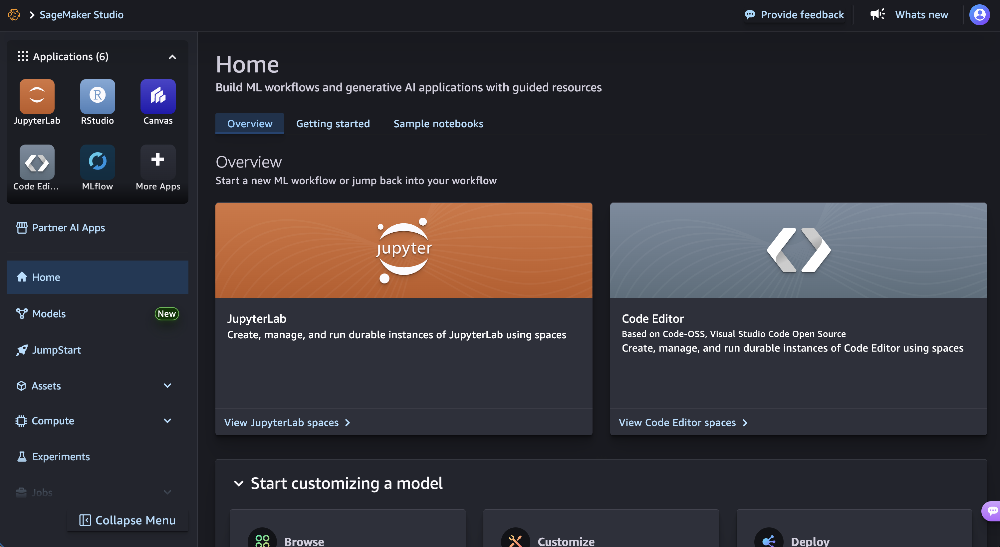

To issue presigned URL directly from CLI, enter the following command in CloudShell:

```bash
DOMAIN_ID=$(aws ssm get-parameter --name /groot-finetune/studio-domain-id \
    --query 'Parameter.Value' --output text --region us-east-1)

aws sagemaker create-presigned-domain-url \
    --domain-id ${DOMAIN_ID} \
    --user-profile-name ${USER_ID} \
    --region us-east-1
```

Create a **JupyterLab space** for the working environment.

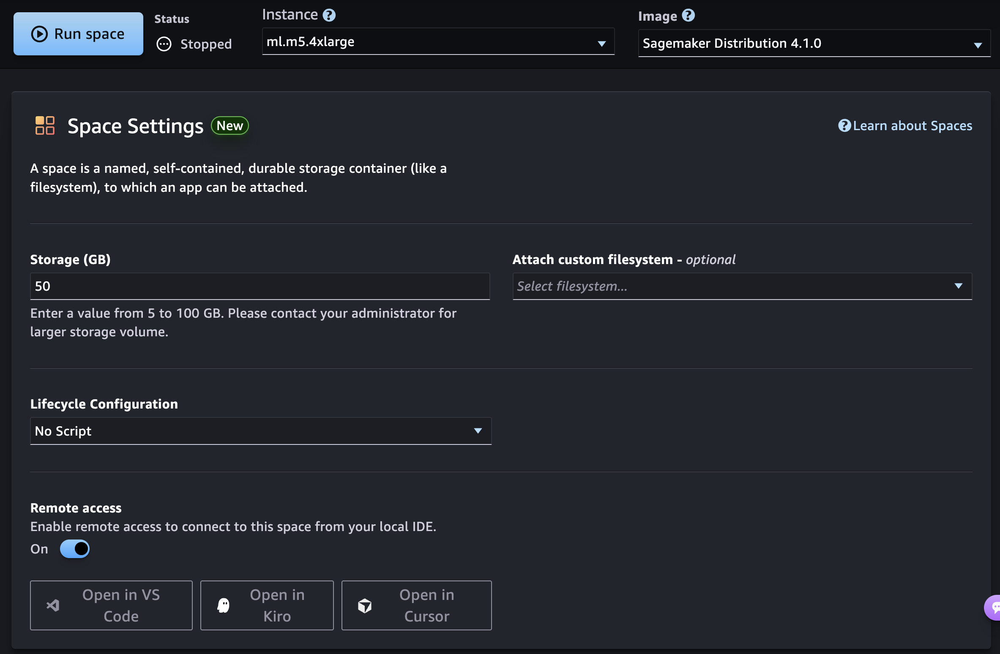

- **Notebook instance type**: `ml.m5.4xlarge`
- **Additional configuration - Volume size**: `50`
- **IAM role**: `GR00TNotebookRole-${USER_ID}`

Once the notebook is created, click **Open JupyterLab** to access it.

### 7.2.3 (Option 2) Continuing work in another environment (EC2/local)

`bin/update-config.ts` only populates `config.yaml` on the machine where it runs. If deploying infrastructure in CloudShell but building/training/deploying on EC2/local, you must sync `config.yaml` between environments (or re-run `npx ts-node bin/update-config.ts --user-id ${USER_ID}` in the working environment).

Copy the output from CloudShell and paste it into `e2e-workshop/groot/config.yaml` in your working environment:

```bash
# CloudShell
cat ~/aws-physical-ai-recipes/e2e-workshop/groot/config.yaml
```

```bash
# Working environment (EC2/local)
cd ~/aws-physical-ai-recipes/e2e-workshop/groot
nano config.yaml      # Paste the above content as-is
```

## 7.3 Pre-environment Setup

From here onwards, perform tasks in the JupyterLab environment created by SageMaker AI. Click **Open JupyterLab** on the created notebook to launch it.

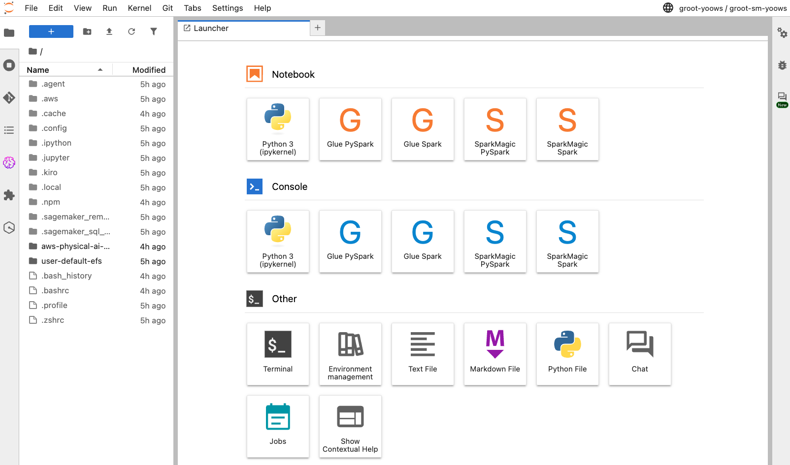

The workshop requires the following environment:

| Tool | Version |
|------|------|
| AWS CLI | v2 or higher |
| Python | 3.10 or higher |
| [uv](https://docs.astral.sh/uv/) | Latest |
| Git | Latest |

Execute the following commands in the **Terminal** window:

```bash
# Install AWS CLI v2 (skip if already v2)
# If `aws --version` shows aws-cli/2.x, OK. If v1 or not installed, run:
curl -L "https://awscli.amazonaws.com/awscli-exe-linux-x86_64.zip" -o /tmp/awscliv2.zip
unzip -q /tmp/awscliv2.zip -d /tmp/awscliv2
sudo /tmp/awscliv2/aws/install --update
hash -r
export PATH=/usr/local/bin:$PATH        # Prioritize /usr/local/bin/aws(v2)
aws --version                            # Verify aws-cli/2.x.x

# If uv not installed
curl -LsSf https://astral.sh/uv/install.sh | sh
exec $SHELL   # Update PATH
source $HOME/.local/bin/env
```

Using system `python` directly may cause version mismatches (< 3.10) or dependency conflicts depending on environment. Since dependencies are managed via `pyproject.toml` + `uv.lock`, a single `uv sync` exactly reproduces an isolated `.venv` with locked versions.

All subsequent python commands in this guide assume the venv is active. Perform the following once to create the venv, then add an auto-activation line to `~/.bashrc` so new terminals auto-enter:

```bash
# Move to groot domain folder and sync venv (once)
git clone https://github.com/hi-space/aws-physical-ai-recipes.git
cd ~/aws-physical-ai-recipes/e2e-workshop/groot
uv sync                       # Create .venv + install dependencies from lock
```

Register in `~/.bashrc` so venv auto-activates in new terminal tabs:

```bash
cat >> ~/.bashrc <<'EOF'
source ~/aws-physical-ai-recipes/e2e-workshop/groot/.venv/bin/activate
EOF
source ~/.bashrc
```

### Registering environment variables (for reuse in later commands)

Commands after this section execute in **JupyterLab Terminal** (File → New → Terminal).

Running the following commands in sequence creates a `config.yaml` file containing deployed resource information. Subsequently, scripts run based on resource names listed in `config.yaml`.

```bash
export USER_ID=<your-name>

cd ~/aws-physical-ai-recipes/e2e-workshop/infra/groot
npm install
npx ts-node bin/update-config.ts --user-id ${USER_ID} --region us-east-1
```

Since `${USER_ID}`, `${BUCKET}`, `${REGION}` appear repeatedly in later steps, registering them once in `~/.bashrc` auto-loads them when opening new terminal tabs.

```bash
cd ~/aws-physical-ai-recipes/e2e-workshop/groot
BUCKET=$(python -c "import yaml; print(yaml.safe_load(open('config.yaml'))['aws']['bucket_name'])")
REGION=$(python -c "import yaml; print(yaml.safe_load(open('config.yaml'))['aws']['region'])")
echo "USER_ID=$USER_ID  BUCKET=$BUCKET  REGION=$REGION"
```

Add extracted values to `~/.bashrc` for auto-loading in future sessions:

```bash
cat >> ~/.bashrc <<EOF
export USER_ID=$USER_ID
export BUCKET=$BUCKET
export REGION=$REGION
EOF
source ~/.bashrc
```

<details>
<summary><strong>Optional: Store HuggingFace token in SSM Parameter Store</strong></summary>

For N1.7 or when using HuggingFace datasets, securely store token:

```bash
aws ssm put-parameter --name /groot/hf-token \
    --value hf_xxxxxxxxxxxxxxxxxxxx --type SecureString --overwrite --region us-east-1
```

Training script auto-loads when specified as `--hf-token ssm:/groot/hf-token`.

</details>

---

## 7.3 Building Container Images (~30 minutes)

Container build is the longest step at 25-30 minutes, so **start it first** and run 7.4 dataset preparation in parallel to reduce total time.

Build training and inference Docker images with CodeBuild and push to ECR. Since CodeBuild project is created as `NO_SOURCE`, you must **directly specify source location (S3 zip) each time** you start a build.

Choose either flow:

- **A. Script flow** (quickly in one shot) — Use *Alternative: All at once with script* below
- **B. Console flow** (for learning, step-by-step visual confirmation) — Follow Steps 1-4

Either way, the result is the same: images push to ECR and `ecr.*_uri` in `config.yaml` gets filled.

<details open>
<summary><strong>All at once with script (A)</strong></summary>

Upload sources, trigger build, wait for completion, and update `config.yaml` ECR URI all in one shot.

```bash
cd ~/aws-physical-ai-recipes/e2e-workshop/groot
```

Execute the following code after moving to `~/aws-physical-ai-recipes/e2e-workshop/groot` path.

```bash
# Build both training + inference (wait until build completes)
python training/scripts/trigger_build.py --type all --bucket "${BUCKET}"
```

```bash
# Build training only
python training/scripts/trigger_build.py --type training --bucket "${BUCKET}"
```

```bash
# Build inference only, run in background without waiting for completion
python training/scripts/trigger_build.py --type inference --bucket "${BUCKET}" --no-wait
```

```bash
# Build training with GR00T n1.7 version
python training/scripts/trigger_build.py --type training --bucket "${BUCKET}" --groot-version n1.7
```

Once the script completes, you can proceed directly to 7.4.

</details>

### Step 1. Upload source zip to S3

Files required for CodeBuild:
 - `~/aws-physical-ai-recipes/e2e-workshop/groot/training/container/` — training container build context
 - `~/aws-physical-ai-recipes/e2e-workshop/groot/inference/sagemaker/container/` — inference container build context
 - `~/aws-physical-ai-recipes/e2e-workshop/groot/config.yaml` — SageMaker script common configuration

Always move to `~/aws-physical-ai-recipes/e2e-workshop/groot/` before running:

> If zip is created from a different directory, buildspec fails to find `training/container/Dockerfile` or `inference/sagemaker/container/Dockerfile`. Verify location with `pwd` before proceeding.

```bash
cd ~/aws-physical-ai-recipes/e2e-workshop/groot

SRC_KEY="codebuild-source/groot-sm-source.zip"
rm -f /tmp/groot-source.zip
zip -r /tmp/groot-source.zip training/container inference/sagemaker/container config.yaml
aws s3 cp /tmp/groot-source.zip "s3://${BUCKET}/${SRC_KEY}" --region "${REGION}"
echo "S3 source: s3://${BUCKET}/${SRC_KEY}"
```

Note the S3 key from the last output (`codebuild-source/groot-sm-source.zip`). Enter it as-is in the console in the next step.

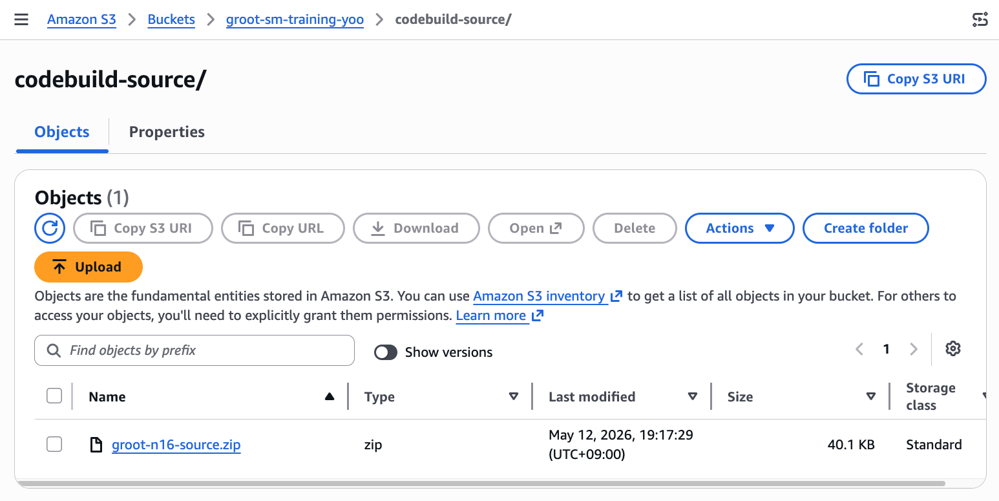

### Step 2. Start build in CodeBuild console

Access [CodeBuild console](https://console.aws.amazon.com/codesuite/codebuild/projects) and verify region in top-right is `${REGION}`.

#### 2-1. Building training container

1. Click **`groot-sm-training-build`** in project list. (All users share the same project, but each points to their own S3 zip at build start, so resulting images push to shared ECR `groot-sm-training` with same tag — if building simultaneously, last build gets latest, so avoid time conflicts).
2. Click **Start build with overrides** in top-right (must be *with overrides*, not just *Start build* — must specify both Source location and Buildspec path each time. If either is blank, placeholder buildspec from CloudFormation (`echo "No source..."`) runs and build ends as SUCCEEDED but nothing pushes to ECR).
3. Change only the following items; keep rest as default:

   | Section | Item | Value |
   |------|------|----|
   | **Source** | Source provider | Amazon S3 |
   | **Source** | Bucket | `${BUCKET}` (e.g., `groot-sm-artifacts-yoo`) |
   | **Source** | S3 object key | Key noted in Step 1 (`codebuild-source/groot-sm-source.zip`) |
   | **Buildspec** | Buildspec name | `training/container/buildspec.yml` |
   | **Environment variables** *(N1.7 build only)* | `GROOT_VERSION` | `n1.7` |
   | **Environment variables** *(N1.7 build only)* | `BASE_MODEL_PATH` | `nvidia/GR00T-N1.7-3B` |

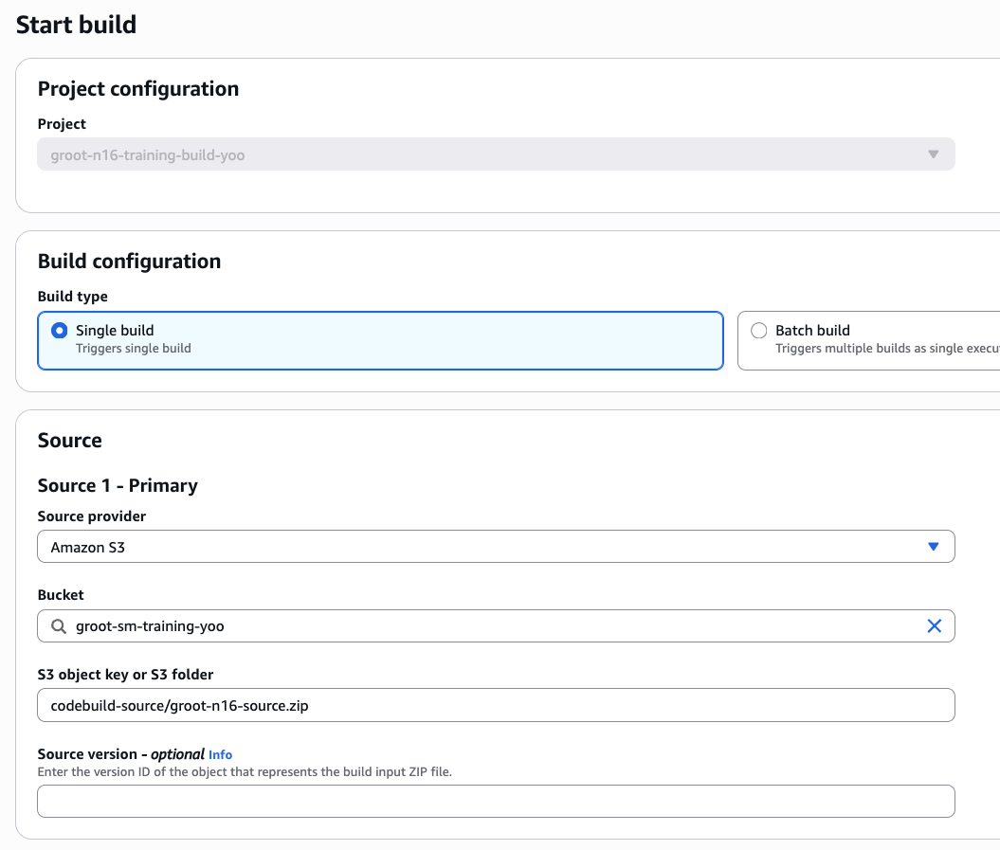

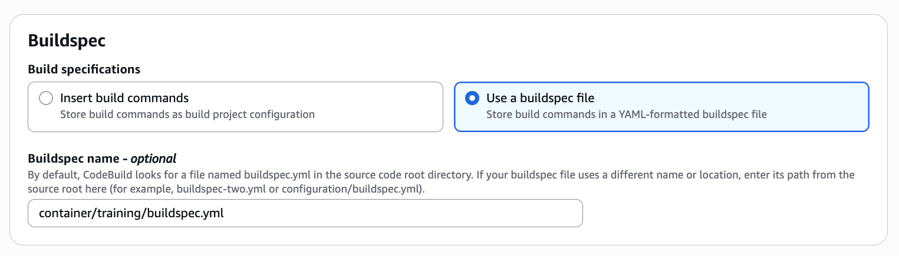

4. Click **Start build**. Takes approximately 25-30 minutes.

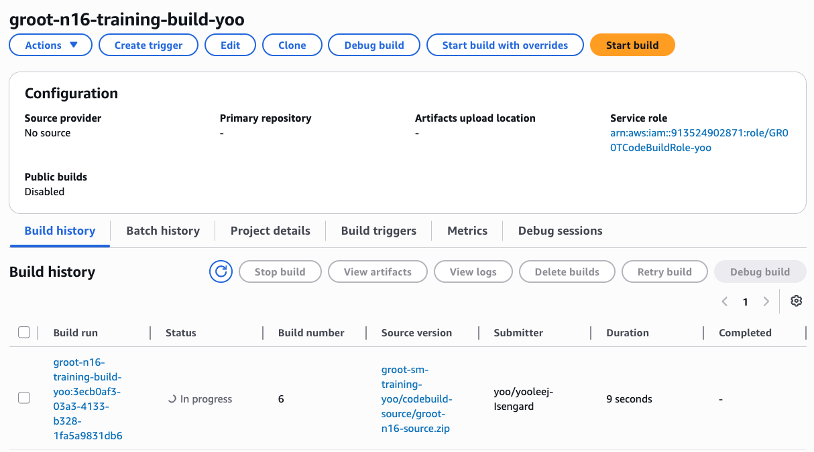

#### 2-2. Building inference container

Same way as training build, click *Start build with overrides* in **`groot-sm-inference-build`** project. Only difference is buildspec path:

  | Section | Item | Value |
   |------|------|----|
   | **Source** | Source provider | Amazon S3 |
   | **Source** | Bucket | `${BUCKET}` (e.g., `groot-sm-artifacts-yoo`) |
   | **Source** | S3 object key | Key noted in Step 1 (`codebuild-source/groot-sm-source.zip`) |
   | **Buildspec** | Buildspec name | `inference/sagemaker/container/buildspec.yml` |

Inference build requires no GROOT_VERSION environment variable override. Takes approximately 15-20 minutes.

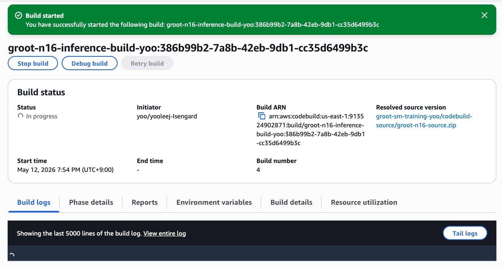

> Both builds are independent, so can run simultaneously. Reuse the same S3 zip in both builds.

### Step 3. Monitoring build progress

Monitor phase progress for each build in real-time from **Build history** tab in console. If you prefer CLI:

```bash
aws logs tail "/aws/codebuild/groot-sm-training-build" \
    --follow --region "${REGION}"
```

On successful build, images push to ECR (shared):
- `<account>.dkr.ecr.us-east-1.amazonaws.com/groot-sm-training:latest`
- `<account>.dkr.ecr.us-east-1.amazonaws.com/groot-sm-inference:latest`

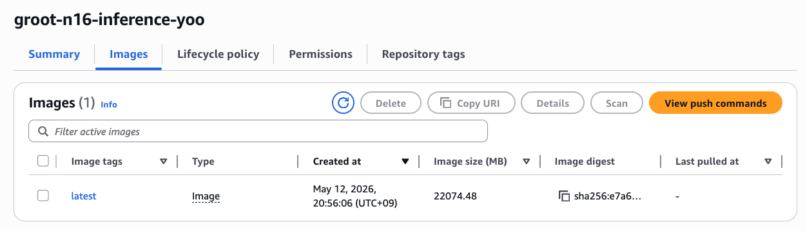

### Step 4. Record ECR URI in config.yaml

If built via console, `config.yaml` doesn't auto-update, so fill manually. Following block fills `ecr.training_uri`/`ecr.inference_uri` to match account/region (ECR names themselves have no per-user suffix):

```bash
export ACCOUNT_ID=$(aws sts get-caller-identity --query Account --output text)
export REGION

python - <<'PY'
import os, yaml
account = os.environ["ACCOUNT_ID"]
region  = os.environ["REGION"]
cfg = yaml.safe_load(open("config.yaml"))
cfg.setdefault("ecr", {})
cfg["ecr"]["training_uri"]  = f"{account}.dkr.ecr.{region}.amazonaws.com/groot-sm-training:latest"
cfg["ecr"]["inference_uri"] = f"{account}.dkr.ecr.{region}.amazonaws.com/groot-sm-inference:latest"
yaml.safe_dump(cfg, open("config.yaml", "w"), allow_unicode=True, default_flow_style=False)
print(cfg["ecr"])
PY
```

The later steps `run_training.py`, `deploy_endpoint.py`, and `run_pipeline.py` automatically use the ECR URI from `config.yaml`.


**If build fails:** Check CloudWatch logs for `flash-attn` or `CUDA` related errors. Usually resolved by clicking *Start build with overrides* again with same settings in console.


---

## 7.4 Preparing and Uploading Dataset (~5 minutes)

Can be done while container build from 7.3 runs in background. Upload SO-101 robot's leisaac-pick-orange dataset to S3 from new terminal window:

**Option 1: Pre-upload (local testing or private dataset)**

```bash
cd ~/aws-physical-ai-recipes/e2e-workshop/groot
python training/data/upload_dataset.py \
    --hf-dataset-id LightwheelAI/leisaac-pick-orange \
    --bucket "${BUCKET}" \
    --prefix datasets/leisaac-pick-orange
```

Expected output:

```
Downloading dataset: LightwheelAI/leisaac-pick-orange
Converting LeRobot v3 → v2.1 format...
Uploading to S3: s3://<your-bucket>/datasets/leisaac-pick-orange/
Upload complete: 45 files, ~3.2 GB
Dataset metadata: meta/modality.json, meta/info.json
```

#### Uploading SO-101 (NEW_EMBODIMENT) modality file (required)

`LightwheelAI/leisaac-pick-orange` is a SO-101 dataset but not a built-in GR00T embodiment, so training with `NEW_EMBODIMENT`, you **must upload the modality definition file alongside the dataset to S3** so the training container correctly recognizes dimension/key mappings.

```bash
# meta/modality.json — Define dataset dimension/key mappings
aws s3 cp training/data/configs/so101_modality.json \
    "s3://${BUCKET}/datasets/leisaac-pick-orange/meta/modality.json" \
    --region "${REGION}"

# modality_config.py at dataset root — Register embodiment_tag
aws s3 cp training/data/configs/so101_modality_config.py \
    "s3://${BUCKET}/datasets/leisaac-pick-orange/modality_config.py" \
    --region "${REGION}"
```

> For other robots/datasets, create manually referring to modality files under `training/data/configs/` (see *Preparing custom robot dataset* below). Built-in GR00T embodiments (`LIBERO_PANDA`, etc.) can skip this step.

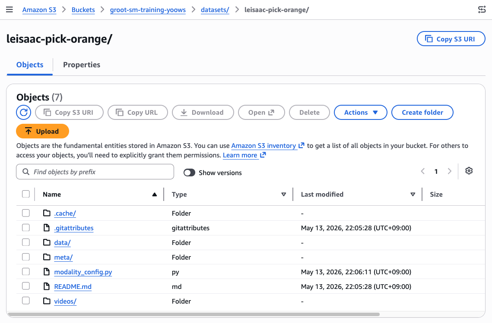

**Option 2: Download directly from HuggingFace**

Choose this path to skip S3 upload; container downloads directly from HuggingFace during training.

`LightwheelAI/leisaac-pick-orange` is a public dataset, downloadable without token. For private or gated datasets, and when using N1.7 backbone (`nvidia/Cosmos-Reason2-2B`, gated), it's safer to store token in SSM Parameter Store:

```bash
aws ssm put-parameter --name /groot/hf-token \
    --value hf_xxxxxxxxxxxxxxxxxxxx \
    --type SecureString --overwrite \
    --region "${REGION}"
```

Auto-load from SSM later during training with `--hf-dataset-id LightwheelAI/leisaac-pick-orange --hf-token ssm:/groot/hf-token` options.

<details>
<summary><strong>Preparing custom robot dataset</strong></summary>

To use a robot other than SO-101:

1. Prepare dataset in LeRobot v2.1 format (`meta/modality.json`, `meta/info.json`, `data/` structure)
2. Create `modality_config.py` at dataset root (reference: `training/data/configs/so101_modality_config.py`)
3. Upload:
   ```bash
   python training/data/upload_dataset.py \
       --local-path ./my-robot-dataset \
       --bucket "${BUCKET}" \
       --prefix datasets/my-robot
   ```
4. Specify `--embodiment-tag NEW_EMBODIMENT` during training

Built-in embodiments (`LIBERO_PANDA`, `OXE_DROID`, etc.) work without `modality_config.py`.

</details>

---

## 7.5 Registering SageMaker Pipeline Definition (~3 minutes)

[SageMaker Pipelines](https://docs.aws.amazon.com/sagemaker/latest/dg/pipelines.html) bundles training → Model Registry registration → Endpoint deployment in one definition, then **reuses** by changing only parameters. This step creates only the definition without starting training; actual training starts in 7.6 with *Start execution*.

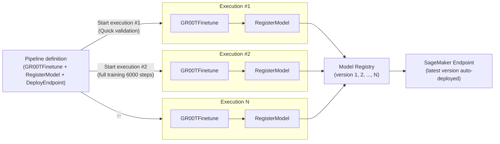
```mermaid
flowchart LR
    Definition["Pipeline definition\n(GR00TFinetune + RegisterModel + DeployEndpoint)"]

    Definition -->|"Start execution #1\n(Quick validation)"| Exec1
    Definition -->|"Start execution #2\n(full training 6000 steps)"| Exec2
    Definition -->|"..."| ExecN

    subgraph Exec1["Execution #1"]
        direction LR
        T1["GR00TFinetune"] --> R1["RegisterModel"]
    end
    subgraph Exec2["Execution #2"]
        direction LR
        T2["GR00TFinetune"] --> R2["RegisterModel"]
    end
    subgraph ExecN["Execution N"]
        direction LR
        TN["GR00TFinetune"] --> RN["RegisterModel"]
    end

    R1 --> Reg
    R2 --> Reg
    RN --> Reg
    Reg["Model Registry\n(version 1, 2, ..., N)"] --> EP["SageMaker Endpoint\n(latest version auto-deployed)"]
```

### Step 1. Upload training script (`sourcedir.tar.gz`) to S3

[SageMaker Script Mode](https://docs.aws.amazon.com/sagemaker/latest/dg/adapt-training-script.html) injects training scripts at runtime instead of baking into container image. Container contains only training dependencies (PyTorch, flash-attn, GR00T libraries); entrypoint script is received as separate tarball. Even after modifying `train.py`, only re-run this step without container rebuild.

```bash
cd ~/aws-physical-ai-recipes/e2e-workshop/groot

SRC_KEY="codebuild-source/sourcedir.tar.gz"
rm -f /tmp/sourcedir.tar.gz
tar -czf /tmp/sourcedir.tar.gz -C training/container train.py
aws s3 cp /tmp/sourcedir.tar.gz "s3://${BUCKET}/${SRC_KEY}" --region "${REGION}"
echo "S3 source: s3://${BUCKET}/${SRC_KEY}"
```

With Script Mode, just fix and re-upload `train.py` without rebuilding container. Container contains only training dependencies (PyTorch, flash-attn, GR00T libraries); entrypoint script loads at runtime.

### Step 2. Register Pipeline definition

[Pipeline Step](https://docs.aws.amazon.com/sagemaker/latest/dg/build-and-manage-steps.html) is a unit of work within workflow. Each Step, by **type** (Training / Processing / Model / Condition, etc.), SageMaker automatically creates and runs corresponding resources (Training Job, Processing Job, Model Package…); one Step's output (e.g., S3 path of `model.tar.gz`) naturally connects as input to next Step.

This guide's Pipeline comprises three Steps:

| Step | Type | Function |
|------|------|---------|
| `GR00TFinetune` | [TrainingStep](https://docs.aws.amazon.com/sagemaker/latest/dg/build-and-manage-steps.html#step-type-training) | Run SageMaker Training Job to fine-tune GR00T and save result as `model.tar.gz` to S3 |
| `RegisterModel` | [ModelStep](https://docs.aws.amazon.com/sagemaker/latest/dg/build-and-manage-steps.html#step-type-model) | Register `model.tar.gz` from above to [Model Registry](https://docs.aws.amazon.com/sagemaker/latest/dg/model-registry.html) in `Approved` status |
| `DeployEndpoint` | [LambdaStep](https://docs.aws.amazon.com/sagemaker/latest/dg/build-and-manage-steps.html#step-type-lambda) | If existing endpoint with same name, delete then create new SageMaker Model · EndpointConfig · Endpoint from training artifact. SageMaker directly invokes `groot-deploy-endpoint-${USER_ID}` Lambda created by CFN stack (no external exposure) |

This step **registers** the above definition to SageMaker only (actual training starts in 7.6).

```bash
python pipeline/run_pipeline.py --upsert-only
```

Expected output:

```
Building pipeline...
Enable Spot instance training (max wait: 86400 seconds)
Upserting pipeline (create/update definition)...
Pipeline upsert complete: groot-sm-finetuning-${USER_ID}
```

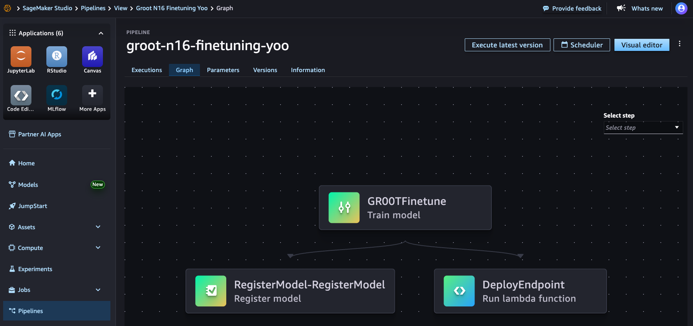

### Step 3. Verify definition in console

Access [SageMaker AI Console → Pipelines](https://console.aws.amazon.com/sagemaker/home#/pipelines) and click `groot-sm-finetuning-${USER_ID}` (e.g., `groot-sm-finetuning-yoo`).

- **Graph** tab: See `GR00TFinetune` → `RegisterModel` / `DeployEndpoint` flow (RegisterModel and DeployEndpoint run in parallel after TrainingStep).
- **Parameters** tab: View list of parameters changeable at execution.

| Parameter | Default | Description |
|----------|--------|------|
| `EmbodimentTag` | `NEW_EMBODIMENT` | Robot embodiment identifier |
| `DatasetS3Uri` | (empty) | Dataset S3 URI (S3 channel) |
| `InstanceType` | `ml.g5.2xlarge` | Training instance type |
| `MaxSteps` | `6000` | Total training steps |
| `GlobalBatchSize` | `32` | Global batch size |
| `NumGpus` | `1` | Number of GPUs to use |
| `EndpointName` | `config.yaml.inference.endpoint_name` | Endpoint name to deploy (fixed — same-name EP deleted and recreated each execution) |
| `EndpointInstanceType` | `ml.g5.2xlarge` | Endpoint instance type |

> Register Pipeline definition only once. Even after modifying `train.py`, just re-upload `sourcedir.tar.gz` from Step 1; re-define (upsert) only when modifying `run_pipeline.py` itself.

---

## 7.6 Starting Training with Pipeline Execution (~25 minutes)

Execute registered Pipeline starting with Quick validation (100 steps). One execution automatically progresses through **training → Model Registry(Approved) → Endpoint auto-deployment**. When training completes, `s3://${BUCKET}/output/<job-name>/output/model.tar.gz` is created, and same artifact goes through Registry registration and endpoint deployment in parallel.

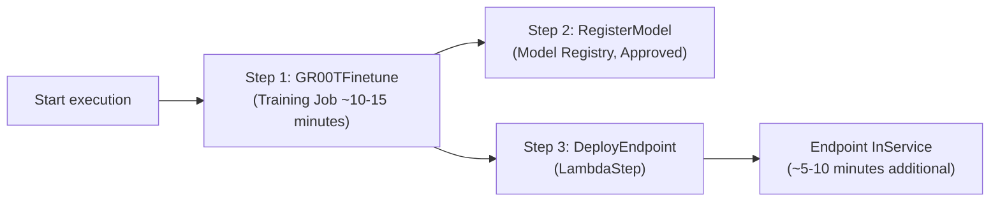
```mermaid
flowchart LR
    Start["Start execution"] --> Step1["Step 1: GR00TFinetune\n(Training Job ~10-15 minutes)"]
    Step1 --> Step2["Step 2: RegisterModel\n(Model Registry, Approved)"]
    Step1 --> Step3["Step 3: DeployEndpoint\n(LambdaStep)"]
    Step3 --> EP["Endpoint InService\n(~5-10 minutes additional)"]
```

- **A. Console flow** (Visually confirm Pipeline definition and input parameters) — Follow Steps 1-3
- **B. Script flow** (One-liner) — Use *Alternative: All at once with script* below

<details>
<summary><strong>Alternative: All at once with script (B)</strong></summary>

Execute registered definition with `--start-only`. If no definition exists, run 7.5 Step 2 first.

**Path 1: Load dataset from S3 (if pre-uploaded)**

```bash
python pipeline/run_pipeline.py --start-only \
    --dataset-s3-uri "s3://${BUCKET}/datasets/leisaac-pick-orange" \
    --max-steps 100
```

**Path 2: Download directly from HuggingFace**

```bash
python pipeline/run_pipeline.py --start-only \
    --hf-dataset-id LightwheelAI/leisaac-pick-orange \
    --hf-token ssm:/groot/hf-token \
    --max-steps 100
```

Full-scale training (6000 steps, multi-GPU):

```bash
python pipeline/run_pipeline.py --start-only \
    --dataset-s3-uri "s3://${BUCKET}/datasets/leisaac-pick-orange" \
    --max-steps 6000 \
    --num-gpus 4
```

> `--save-steps` not exposed (uses container training script default). Changing `--instance-type` is a definition change, so use regular execution (`run_pipeline.py --dataset-s3-uri ...`) for upsert+start in one shot instead of `--start-only`.

Expected output:

```
Executing pipeline...
Pipeline execution started!
  Execution ARN: arn:aws:sagemaker:us-east-1:123456789012:pipeline/groot-sm-finetuning-yoo/execution/abc123...
```

</details>

### Step 1. Start execution in console

Access [SageMaker AI Console → Pipelines](https://console.aws.amazon.com/sagemaker/home#/pipelines) → Select `groot-sm-finetuning-${USER_ID}` → Click **Execute latest version** (or **Start execution**) in top-right.

Fill only the following items; keep rest as default.

| Item | Value |
|------|----|
| Execution name | `quickval-<date>` (e.g., `quickval-20260512`) |
| EmbodimentTag | `NEW_EMBODIMENT` |
| DatasetS3Uri | `s3://${BUCKET}/datasets/leisaac-pick-orange` (empty if downloading from HF) |
| InstanceType | `ml.g6e.12xlarge` |
| MaxSteps | `100` (Quick validation) — `6000` for full training |
| GlobalBatchSize | `32` |
| NumGpus | `1` (for `ml.g5.2xlarge`) — `4` for `ml.g6e.12xlarge` |

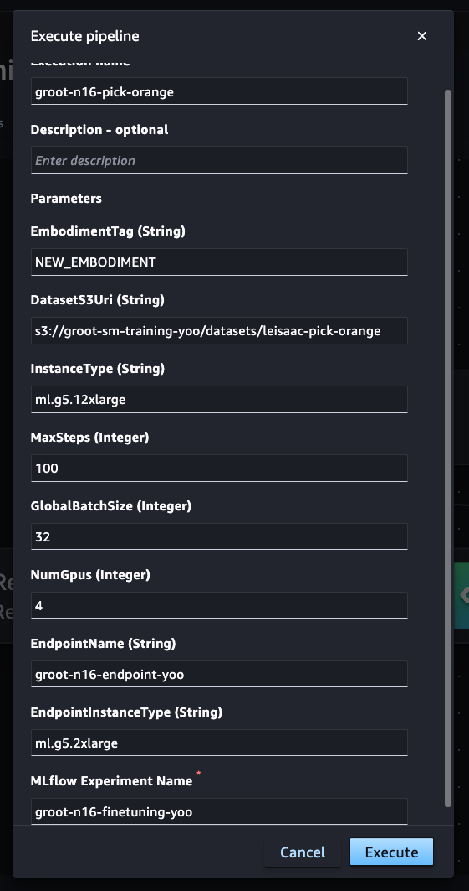

### Step 2. Monitoring execution progress

Monitor running pipeline from **Execution** screen. Select the Execution to enter the running graph screen.

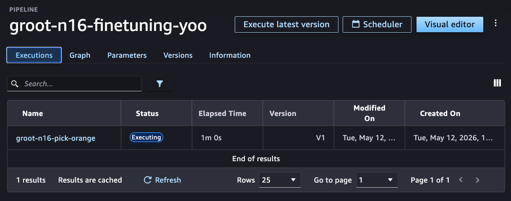

| Status | Meaning |
|------|------|
| `Executing` | Currently executing |
| `Succeeded` | Step completed |
| `Failed` | Step failed (check CloudWatch logs) |
| `Stopped` | User stopped |

Observe `GR00TFinetune` Step change to `Executing` in the graph.

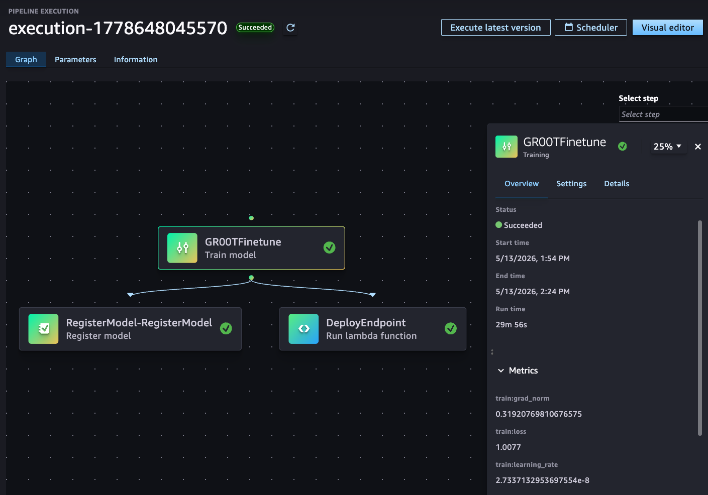

Click **Detail** - **Job name** link in `GR00TFinetune` Step to navigate to SageMaker → Training jobs screen to directly view instance provisioning/training logs.

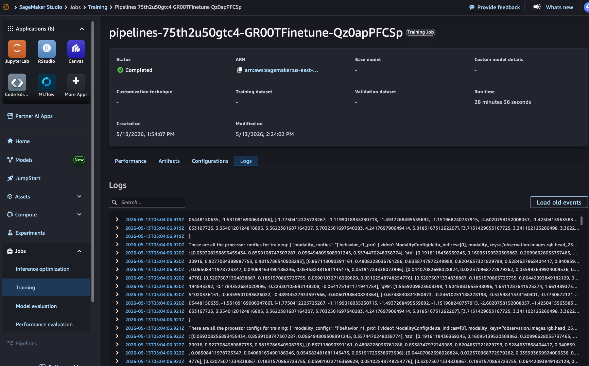

### Step 3. Note Execution metadata

Used in next sections 7.7 Monitoring and 7.8 Model Registry approval.

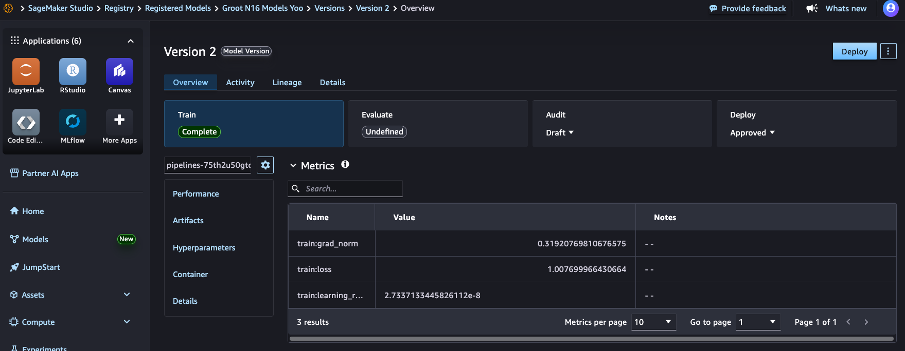

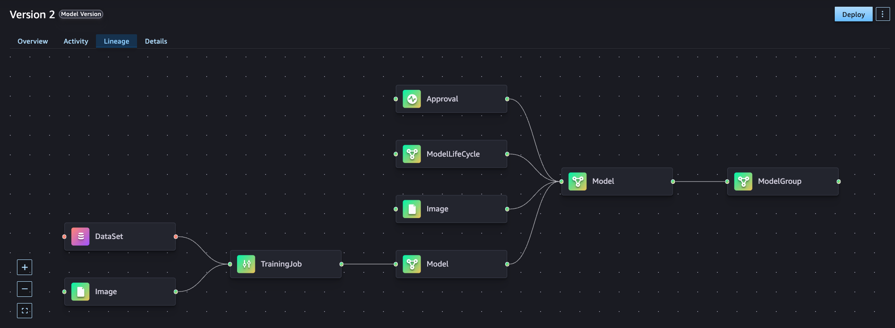

- **Execution name**: Name entered above
- **Training Job name**: Confirm from Step 2's *View training job* (format `pipeline-execution-<id>-GR00TFinetune-...`)
- **Output S3 location**: `s3://<your-bucket>/output/<job-name>/output/model.tar.gz` — Auto-created after training completes

---

## 7.7 Monitoring Training (~10-15 minutes)

Monitor progress of Training Job executing in Pipeline.

### 7.7.1 Checking SageMaker console

Navigate Console → **Pipelines → relevant Execution → `GR00TFinetune` Step → View training job** to view training instance/logs/metrics on one screen.

To check status of most recent Training Job via CLI:

```bash
NAME_PREFIX="pipelines-"
JOB_NAME=$(aws sagemaker list-training-jobs \
    --region "${REGION}" \
    --name-contains "${NAME_PREFIX}" \
    --sort-by CreationTime --sort-order Descending \
    --max-results 1 \
    --query "TrainingJobSummaries[0].TrainingJobName" --output text)
echo "JOB_NAME=$JOB_NAME"

aws sagemaker describe-training-job \
    --training-job-name "$JOB_NAME" \
    --region "${REGION}" \
    --query "TrainingJobStatus" \
    --output text
```

> Pipeline-created Training Job names follow `pipelines-<execution-id>-GR00TFinetune-...` pattern, so we use `--name-contains "pipelines-"`.

Training Job state transitions:

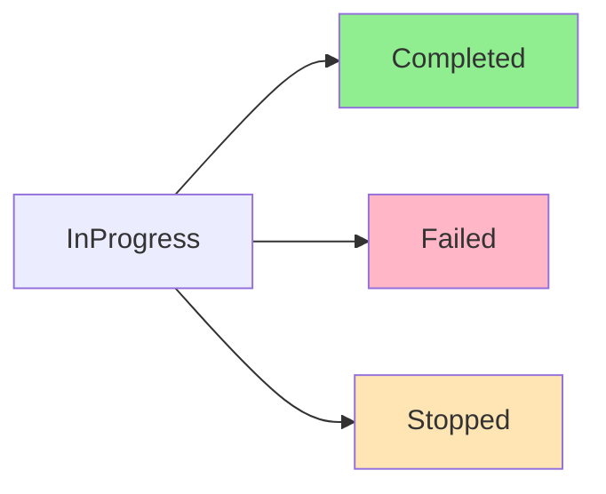
```mermaid
flowchart LR
    A["InProgress"] --> B["Completed"]
    A --> C["Failed"]
    A --> D["Stopped"]

    style B fill:#90EE90
    style C fill:#FFB6C6
    style D fill:#FFE5B4
```

| Status | Meaning | Expected Duration |
|------|------|-----------|
| InProgress | Training running | 10-15 minutes (100 steps) |
| Completed | Training complete → `RegisterModel` Step auto-progresses | — |
| Failed | Training failed (check logs) | — |
| Stopped | User stopped | — |

### 7.7.2 Checking CloudWatch logs

```bash
aws logs tail /aws/sagemaker/TrainingJobs \
    --log-stream-name-prefix "${JOB_NAME}/" \
    --region "${REGION}" --follow
```

> Default log group for SageMaker Training Job is `/aws/sagemaker/TrainingJobs`. CloudFormation-created `/aws/sagemaker/groot-sm-<userId>` is not used; refer to the above group.

Example normal training logs:

```
==========================================
Fine-tuning Workflow Starting
==========================================
Dataset validation complete
Starting training...
Using 1 GPUs
Total parameters: 3,144,016,000
Trainable parameters: 1,620,515,968 (51.54%)
Current global step: 0
  0%|          | 0/100 [00:00<?, ?it/s]
...
Step 50/100, Loss: 2.341
...
Step 100/100, Loss: 1.523
Training completed successfully
Model saved to: s3://<your-bucket>/output/<job-name>/output/model.tar.gz
```

### 7.7.3 MLflow tracking — track runs/metrics/params/artifacts

`GrootFinetuneSagemaker-${USER_ID}` stack creates SageMaker managed MLflow tracking server (`groot-mlflow-${USER_ID}`), and `bin/update-config.ts` auto-records ARN in `config.yaml`'s `mlflow.tracking_server_arn`. Training script auto-injects ARN to container env (`MLFLOW_TRACKING_URI` / `MLFLOW_EXPERIMENT_NAME` / `HF_MLFLOW_LOG_ARTIFACTS=true`).

**Access MLflow UI (presigned URL):**

```bash
aws sagemaker create-presigned-mlflow-tracking-server-url \
    --tracking-server-name "groot-mlflow-${USER_ID}" \
    --region "${REGION}" \
    --query AuthorizedUrl --output text
```

Paste issued URL into browser to view per-run metrics under experiment `groot-sm-finetune`:

- **Metrics** — loss, grad_norm, learning_rate, train_runtime, train_samples_per_second, train_steps_per_second, total_flos, train_loss
- **Params** — HF `TrainingArguments` 233+ (resume_from_checkpoint, learning_rate, batch_size, deepspeed config, all)
- **Artifacts** — `checkpoint-100/` (safetensors model ~9.9GB + DeepSpeed optimizer state) — `s3://<bucket>/mlflow-artifacts/<exp-id>/<run-id>/...`

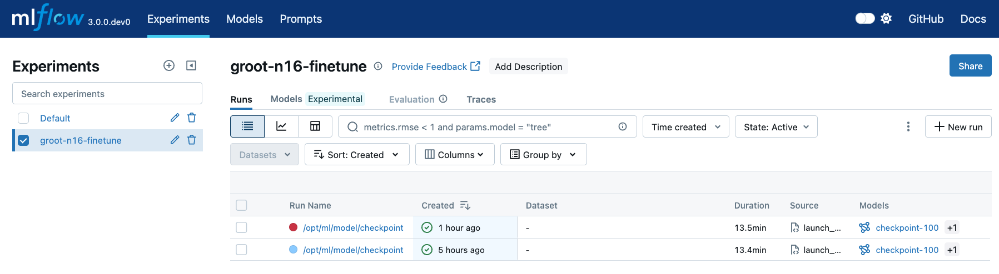

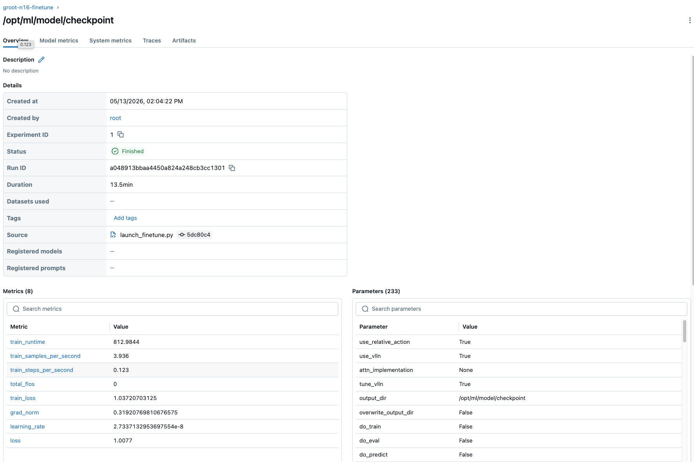

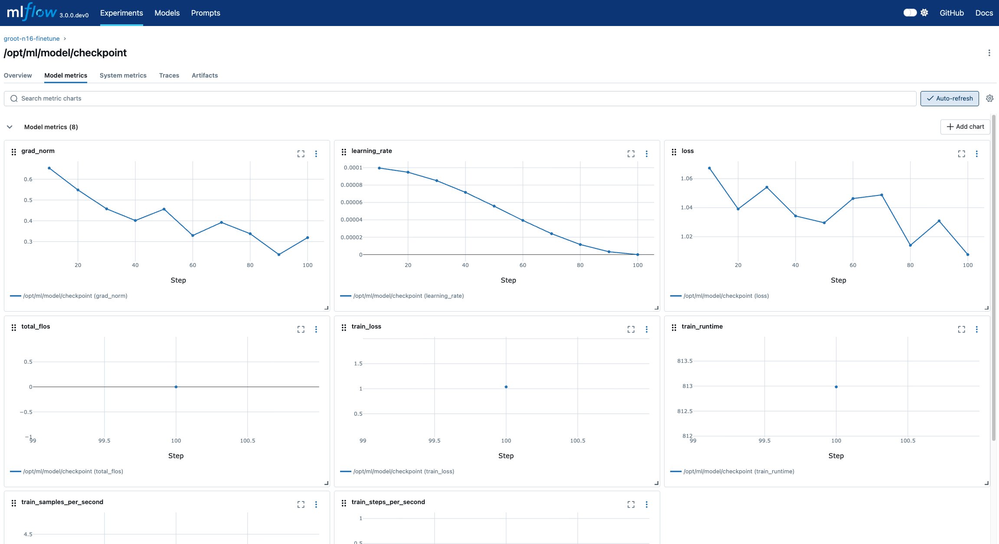

**Cost savings — pause when not in use:**

```bash
# Pause
aws sagemaker stop-mlflow-tracking-server \
    --tracking-server-name "groot-mlflow-${USER_ID}" --region "${REGION}"
```

```bash
# Resume use
aws sagemaker start-mlflow-tracking-server \
    --tracking-server-name "groot-mlflow-${USER_ID}" --region "${REGION}"
```

**Alternative — Weights & Biases:** Put API key in SSM `/groot/wandb-key` and add `--wandb-api-key ssm:/groot/wandb-key` to training command for simultaneous wandb logging (MLflow + wandb coexist).

---

## 7.8 Confirming Model Registry Auto-Approval (~1 minute)

`RegisterModel` Step automatically registers training results to [Model Registry](https://docs.aws.amazon.com/sagemaker/latest/dg/model-registry.html) in **`Approved` status**. Build manual approval/deployment processes as needed.

Confirm latest version is in `Approved` status from [SageMaker AI Console → Model registry](https://console.aws.amazon.com/sagemaker/home#/model-registry) → Model groups → `groot-sm-models-${USER_ID}`. No separate approval needed.

---

### When retraining is needed

To retrain with same dataset/different parameters, or train on different dataset, **skip 7.5** and just re-run 7.6's *Start execution* (reuse definition). Use console's *Create execution* form or `python pipeline/run_pipeline.py --start-only ...`.

After modifying `train.py`, just re-run 7.5 Step 1 (re-upload `sourcedir.tar.gz`); reflects in next Execution. If changing Pipeline definition itself, re-run from 7.5 Step 2 (`--upsert-only`).

<details>
<summary><strong>One-off Training Job without Pipeline (debugging)</strong></summary>

To quickly run training without Model Registry registration, use `training/scripts/run_training.py`. This path skips 7.8 Model Registry approval; in 7.9, directly specify model.tar.gz with `--model-s3-uri` for deployment.

```bash
python training/scripts/run_training.py \
    --dataset-s3-uri "s3://${BUCKET}/datasets/leisaac-pick-orange" \
    --max-steps 100 --save-steps 50
```

| Parameter | Default | Description |
|----------|--------|------|
| `--dataset-s3-uri` or `--hf-dataset-id` | (required) | Dataset path |
| `--max-steps` | 100 | Total training steps |
| `--save-steps` | 50 | Checkpoint save interval |
| `--instance-type` | ml.g5.2xlarge | Instance type |
| `--num-gpus` | 1 | Number of GPUs |
| `--groot-version` | (build default) | `n1.6` or `n1.7` |

</details>

---

## 7.9 Confirming Endpoint Auto-Deployment (~10 minutes)

`DeployEndpoint` LambdaStep automatically performs the following at pipeline end:

1. Delete existing endpoint with same name if present (wait for waiter, ~1-2 minutes)
2. Create SageMaker Model from training artifact + inference container image
3. Create EndpointConfig + Endpoint

LambdaStep terminates on successful `create_endpoint` API call, so pipeline ends quickly, but **endpoint takes additional 5-10 minutes to reach InService** (image pull + model load + health check).

### Checking status

```bash
EP_NAME=$(python -c "import yaml; print(yaml.safe_load(open('config.yaml'))['inference']['endpoint_name'])")

aws sagemaker describe-endpoint --endpoint-name "${EP_NAME}" --region "${REGION}" \
    --query '{Status:EndpointStatus,Variant:ProductionVariants[0]}' --output json
```

On normal progress, `EndpointStatus` transitions `Creating` → `InService`. Proceed to 7.10 inference test after reaching `InService`.

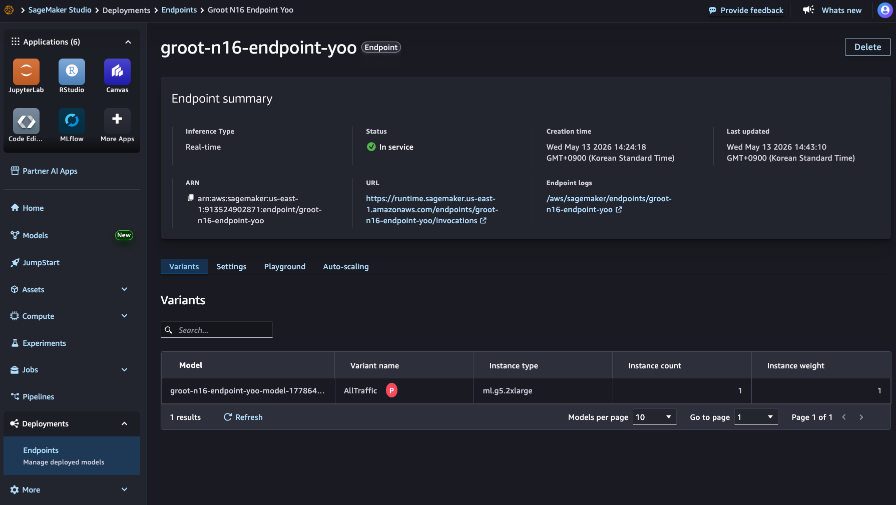


Endpoints incur cost while InService. Delete in 7.12 cleanup section if unnecessary.


---

## 7.10 Inference Testing (~5 minutes)

Test SO-101 robot inference with deployed Endpoint.

`inference/sagemaker/invoke_endpoint.py` auto-uses `inference.endpoint_name` from `config.yaml`, so `--endpoint-name` can be omitted.

### Quick start (images + instructions only)

```bash
python inference/sagemaker/invoke_endpoint.py \
    --images "front=./inference/sagemaker/sample/front.png;wrist=./inference/sagemaker/sample/wrist.png" \
    --instruction "pick up the orange"
```

### Call with actual joint state (SO-101 keyed proprioception)

Send current joint state from actual robot; model predicts action for that state:

```bash
python inference/sagemaker/invoke_endpoint.py \
    --image-path ./inference/sagemaker/sample/test.png \
    --proprioception "single_arm:0.1,0.2,0.3,0.4,0.5;gripper:0.0" \
    --instruction "pick up the orange"
```

Expected output:

```json
{
    "actions": [[0.15, 0.22, 0.31, 0.42, 0.51, 0.05], [...], ...],
    "timestamp": "2026-05-13T05:21:09.477637+00:00"
}
```

`actions` is the 16-step action sequence predicted by the model. Action dimension (number of values) is determined by the trained dataset's modality (SO-101: 6).

---

## 7.11 Checking Training Results

SageMaker results are saved to `s3://${BUCKET}/output/<job-name>/` directory in S3.

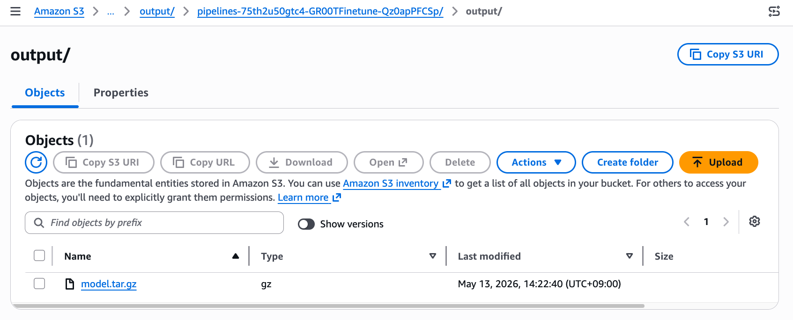

---

## 7.12 Cleanup

Delete resources after workshop to reduce costs.

### 1. Delete Endpoint:

```bash
python inference/sagemaker/deploy_endpoint.py --action delete
```

Expected output:

```
Deleting endpoint: groot-sm-endpoint-yoo
Endpoint deletion in progress...
Endpoint deleted successfully
```

### 2. Clean up SageMaker Studio apps/UserProfile (before deleting per-user stack):

CloudFormation cannot delete per-user stack if active KernelGateway/JupyterServer apps or your UserProfile remain. Empty them in order below. (Studio Domain itself is shared stack owned; do not delete).

```bash
DOMAIN_ID=$(aws ssm get-parameter --name /groot-finetune/studio-domain-id \
    --query 'Parameter.Value' --output text --region "${REGION}")

# Delete all active apps in your UserProfile
aws sagemaker list-apps --domain-id-equals "${DOMAIN_ID}" --region "${REGION}" \
    --query "Apps[?UserProfileName=='${USER_ID}' && Status!='Deleted'].[AppType,AppName]" --output text | \
while read -r TYPE APP; do
    aws sagemaker delete-app --domain-id "${DOMAIN_ID}" \
        --user-profile-name "${USER_ID}" --app-type "${TYPE}" --app-name "${APP}" \
        --region "${REGION}"
done
```

> UserProfile itself is owned by per-user stack (`GrootFinetuneSagemaker-${USER_ID}`), so next step's `cdk destroy` / CFN delete automatically removes it.

### 3. Stop (or delete) MLflow tracking server:

**For temporary breaks** without deleting full stack, just stop to stop hourly charges (artifacts remain on S3, metadata preserved):

```bash
aws sagemaker stop-mlflow-tracking-server \
    --tracking-server-name "groot-mlflow-${USER_ID}" \
    --region "${REGION}"
```

MLflow server also deleted when per-user stack deleted in next step; no separate action needed.

### 4. Delete CDK stacks (your per-user stacks only):

Shared stack (`GrootFinetuneShared`) may be used by other users, so **delete only your per-user stack**.

```bash
cd ~/aws-physical-ai-recipes/e2e-workshop/infra/groot
npm run destroy -- -c userId="${USER_ID}"
```

Or directly via CloudFormation API:

```bash
aws cloudformation delete-stack \
    --stack-name "GrootFinetuneSagemaker-${USER_ID}" \
    --region "${REGION}"

# (Optional) Also clean up Batch stack
aws cloudformation delete-stack \
    --stack-name "GrootBatchTrain-${USER_ID}" \
    --region "${REGION}"
```


**ECR Repository (shared ownership):** SageMaker training/inference ECR (`groot-sm-training`, `groot-sm-inference`) are shared stack owned; other users use them. **Do not delete.** Administrator cleans up with `cdk destroy GrootFinetuneShared` after workshop.

**S3 Bucket (per-user):** Auto-empties if objects exist on stack deletion, but manual cleanup also possible:

```bash
aws s3 rm "s3://${BUCKET}" --recursive
```



### 5. (Optional) Deactivate local virtual environment:

```bash
deactivate   # Exit current shell's .venv
# To also clean directory:
# rm -rf .venv
```

---

## 7.13 Troubleshooting

| Symptom | Cause | Solution |
|------|------|------|
| `Access to model nvidia/Cosmos-Reason2-2B is restricted` | N1.7 used but HF_TOKEN not set or license not agreed | Agree to license on [model page](https://huggingface.co/nvidia/Cosmos-Reason2-2B) then add `--hf-token ssm:/groot/hf-token` |
| ECR authentication failure (`Unauthorized`) | AWS credentials expired or insufficient permissions | Check `aws sts get-caller-identity` then refresh credentials |
| CodeBuild build failure | flash-attn download failure, network issues | Check CloudWatch `/aws/codebuild/groot-sm-training-build` then retry |
| `Resource of type 'AWS::ECR::Repository' with identifier 'groot-sm-...' already exists` | Remnants of old split stack SM ECR remain. New unified shared stack doesn't use same name, usually doesn't occur, but if old stack operated in same account, manually delete ECR then retry `npm run deploy:shared` | `aws ecr delete-repository --repository-name groot-sm-training --force` |
| Training Job ResourceLimitExceeded | Insufficient instance quota | Request increase for "Running On-Demand ml.g6e instances" in AWS Service Quotas |
| SageMaker Training Job fails immediately | Container image missing from ECR or insufficient IAM role | Check `aws ecr describe-repositories` and IAM permissions |
| Endpoint 5xx error (`ModelInvocationTimeOut`) | model.tar.gz missing inference_metadata.json | Check Training Job logs for model save completion |
| Pipeline DeployEndpoint Step failure (`transient state` error) | Same-name EP in Creating/Updating state | Wait for EP to reach InService/Failed, then retry pipeline |
| Pipeline DeployEndpoint Step failure (`AccessDenied`) | Insufficient Lambda IAM permissions or SageMakerRole missing lambda:InvokeFunction | Rerun `cd ~/aws-physical-ai-recipes/e2e-workshop/infra/groot && npm run deploy -- -c userId=${USER_ID}` to refresh IAM, check CloudWatch `/aws/lambda/groot-deploy-endpoint-${USER_ID}` logs |
| Inference dimension mismatch (`shape mismatch`) | proprioception value count ≠ model expected value | Check correct input format (keyed or flat) and dimensions in error message, retry |
| No model.tar.gz after Training Job | Training script failed or insufficient S3 permissions | Check CloudWatch logs for training completion message and validate IAM S3 permissions |

---

## References

* [AWS SageMaker User Guide - Training Jobs](https://docs.aws.amazon.com/sagemaker/latest/dg/train-model.html)
* [AWS SageMaker Model Registry](https://docs.aws.amazon.com/sagemaker/latest/dg/model-registry.html)
* [AWS SageMaker Real-time Endpoints](https://docs.aws.amazon.com/sagemaker/latest/dg/realtime-endpoints.html)
* [AWS ECR User Guide](https://docs.aws.amazon.com/AmazonECR/latest/userguide/what-is-ecr.html)
* [AWS CodeBuild User Guide](https://docs.aws.amazon.com/codebuild/latest/userguide/welcome.html)
* [NVIDIA Isaac-GR00T Repository](https://github.com/NVIDIA/Isaac-GR00T)
* [GR00T N1.6 Model (HuggingFace)](https://huggingface.co/nvidia/GR00T-N1.6-3B)
* [GR00T N1.7 Model (HuggingFace)](https://huggingface.co/nvidia/GR00T-N1.7-3B)
* [LightwheelAI/leisaac-pick-orange Dataset](https://huggingface.co/datasets/LightwheelAI/leisaac-pick-orange)
* [Module 6: VLA Fine-tuning on AWS Batch](6.-vla-train-batch.md)
