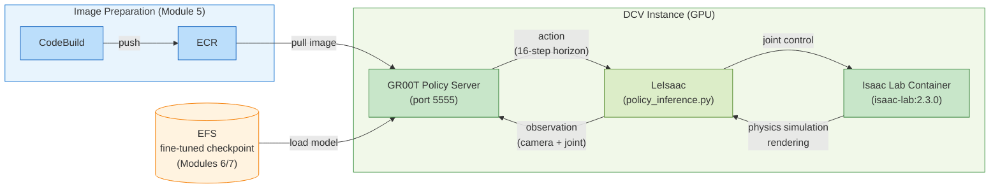
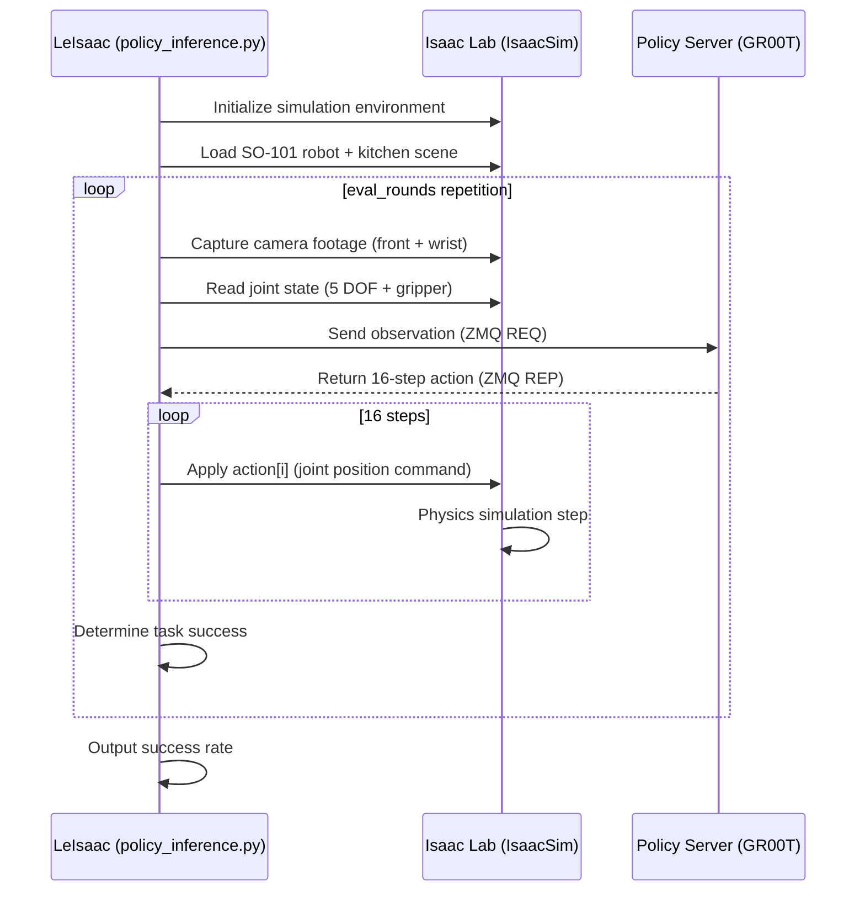
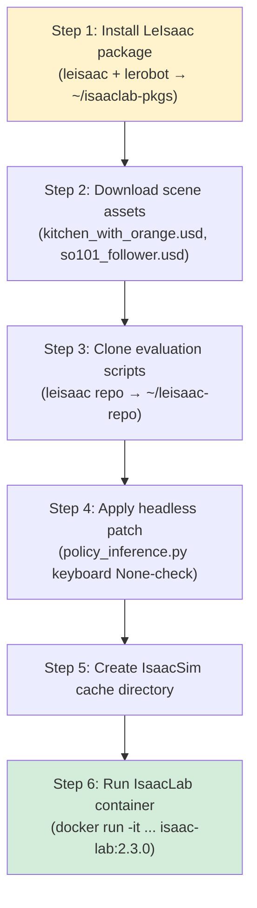
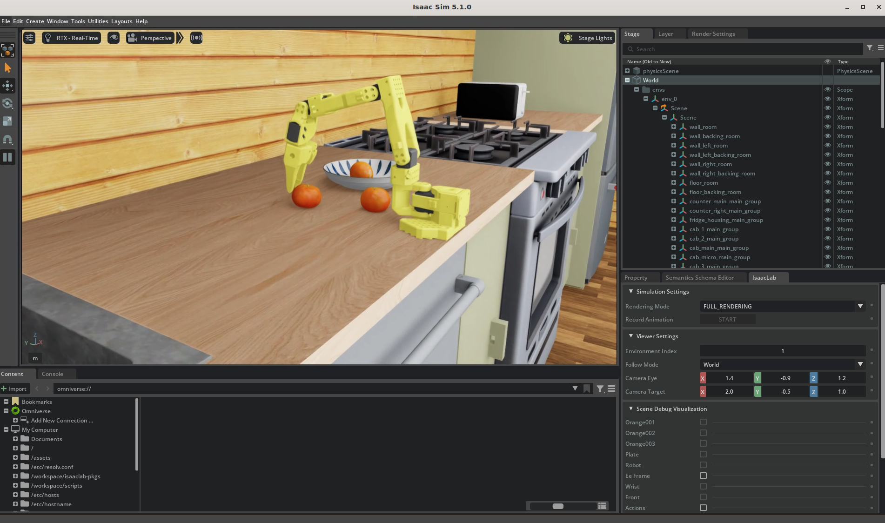

# 8. Closed-loop Evaluation

This section validates whether the fine-tuned GR00T model from the previous module can actually control the robot. We apply the action returned by Policy Server to the SO-101 robot in Isaac Lab simulation and evaluate whether the robot successfully performs the given task (picking up an orange) in a **closed-loop** manner.

| Aspect | [Module 5](5.-train-infra-setup.md) (Inference Test) | Module 8 (Closed-loop Evaluation) |
|------|---------------------|--------------------------|
| Validation Method | Dummy data → verify action shape | Actual simulation → measure task success rate |
| Simulation | None | Isaac Lab (IsaacSim + PhysX) |
| Environment | ZMQ ping/inference only | USD scene (kitchen + orange + robot) |
| Evaluation Metrics | Verify shape/dtype | Success rate based on `--eval_rounds` |

This module uses [LeIsaac](https://github.com/LightwheelAI/leisaac). LeIsaac is an open-source package that provides closed-loop evaluation environments for various robots on top of Isaac Lab, making it easy to construct simulation evaluation by combining USD scenes and robot models. Currently supports SO-101 (SO-ARM100's successor 5 DOF + gripper robot), and this workshop evaluates using **the task of picking an orange from the kitchen table and placing it on a plate** (LeIsaac-SO101-PickOrange-v0).

---

## Full Architecture



Run Policy Server using the GR00T container image built by CodeBuild in [Module 5](5.-train-infra-setup.md) (ECR), and load the checkpoint fine-tuned in [Module 6](6.-vla-train-batch.md) (AWS Batch) or [Module 7](7.-vla-train-sagemaker.md) (SageMaker). Isaac Lab container is pulled directly from NGC, and LeIsaac package and scene assets are automatically installed by `run-isaaclab.sh`.



Separate Policy Server (inference, ~8GB VRAM) and Isaac Lab (simulation + rendering, ~10GB VRAM) into different containers to isolate GPU memory. Simply replacing the model checkpoint enables immediate re-evaluation in the same environment. Both containers share the host network with `--network=host`, requiring no separate configuration for ZMQ communication.

LeIsaac is the evaluation orchestrator connecting the two containers via ZMQ. Each round collects observation and sends to Policy Server, sequentially applies the returned 16-step action to simulation. After executing all 16 steps, collects new observation and requests inference again, forming a real-time feedback loop.

---

## 8.1 Prerequisites

- Complete [Module 5](5.-train-infra-setup.md), [6](6.-vla-train-batch.md), or [7](7.-vla-train-sagemaker.md) (able to start Policy Server)
- DCV instance access available (DCV desktop session required — IsaacSim GUI)
- Minimum 20GB+ GPU memory recommended (Policy Server ~8GB + IsaacSim ~10GB)

Verify from DCV instance:

```bash
# Check GPU memory
nvidia-smi --query-gpu=name,memory.total --format=csv

# Verify Policy Server running (if already started in modules 5/6/7)
docker ps | grep groot-policy-server
ss -tlnp | grep 5555
```


Isaac Lab closed-loop must execute on **DCV desktop session**. SSH terminal alone cannot support IsaacSim's rendering pipeline. `--headless` mode is supported, but if `--enable_cameras` is present, GPU rendering is still required.


---

## 8.2 Run Policy Server

Start Policy Server with the fine-tuned checkpoint from [Module 6](6.-vla-train-batch.md) (AWS Batch) or [Module 7](7.-vla-train-sagemaker.md) (SageMaker). Skip this section if already running.

### 8.2.1 Prepare Checkpoint

Policy Server requires a fine-tuned checkpoint. If you completed [Module 6](6.-vla-train-batch.md) (VLA Fine-tuning on AWS Batch), it's stored on EFS; if you completed [Module 7](7.-vla-train-sagemaker.md) (VLA Training and Deployment Pipeline using SageMaker), it's on S3:

```bash
# Check EFS path if Module 6 completed
ls /home/ubuntu/environment/efs/gr00t/checkpoints/<JOB_ID>/checkpoint-6000
```

If no prepared checkpoint available, download directly from HuggingFace:

```bash
pip install -U "huggingface_hub[cli]"

hf download hi-space/GR00T-N1.6-3B-Pick-Orange \
  --local-dir /home/ubuntu/environment/efs/GR00T-N1.6-3B-Pick-Orange
```

### 8.2.2 Run Policy Server Container

Clean up existing containers first:

```bash
docker rm -f groot-policy-server 2>/dev/null
```

The image built for running GR00T Policy Server on the instance is stored in ECR with name `groot-sm-inference`. After ECR login, pull the image:

```bash
# ECR login
# aws ecr get-login-password --region $REGION | \
#   docker login --username AWS --password-stdin $ACCOUNT_ID.dkr.ecr.$REGION.amazonaws.com

# ECR_URI=$ACCOUNT_ID.dkr.ecr.$REGION.amazonaws.com/isaaclab-batch-<userId>:latest

# Pull GR00T image (~15GB, approximately 5 minutes)
docker pull $ECR_URI
```

Set the checkpoint path to load and run Policy Server with ECR image:

```bash
# Set fine-tuned model checkpoint path
CHECKPOINT=/home/ubuntu/environment/efs/GR00T-N1.6-3B-Pick-Orange

docker run -d --gpus all \
  --name groot-policy-server \
  --shm-size=8g \
  --network host \
  --entrypoint /bin/sh \
  -e PYTHONUNBUFFERED=1 \
  -v /home/ubuntu/.cache/huggingface:/root/.cache/huggingface \
  -v /home/ubuntu/environment/efs:/mnt/efs \
  $ECR_URI \
  -c "cd /opt/gr00t && python3 -m gr00t.eval.run_gr00t_server \
    --model-path /mnt/efs/${CHECKPOINT#/home/ubuntu/environment/efs/} \
    --embodiment-tag NEW_EMBODIMENT \
    --host 0.0.0.0 \
    --port 5555"
```

Check the running docker logs with the command below. Loading the checkpoint and starting the server takes approximately 1 minute:

```bash
docker logs -f groot-policy-server
```

Successful execution shows logs like the following:

```bash
Total number of DiT parameters:  1091722240
Using AlternateVLDiT for diffusion model
Tune action head projector: True
Tune action head diffusion model: True
Tune action head vlln: True
`use_fast` is set to `True` but the image processor class does not have a fast version.  Falling back to the slow version.
Loading checkpoint shards: 100%|██████████| 2/2 [00:04<00:00,  2.23s/it]
Server is ready and listening on tcp://0.0.0.0:5555
```

---

## 8.3 Configure LeIsaac Environment and Run IsaacLab Container

[LeIsaac](https://github.com/LightwheelAI/leisaac) is a package providing robot evaluation environments on top of Isaac Lab. The `run-isaaclab.sh` script in the workshop repository handles **all environment configuration through container execution** automatically.

### 8.3.1 Run Simulation Environment

Execute the `run-isaaclab.sh` script from the DCV desktop terminal. On first run, environment configuration proceeds automatically and completes, entering the IsaacLab container shell.

```bash
cd ~/aws-physical-ai-recipes/e2e-workshop/groot/inference
./run-isaaclab.sh
```

First run takes approximately 5~8 minutes. Subsequent runs enter the container immediately.

<details>
<summary><strong>What run-isaaclab.sh performs (detailed)</strong></summary>

The script leaves marker files after each step completes and skips them on subsequent runs.



| Step | Description | Marker / Condition |
|------|------|-------------|
| **1. Package Installation** | Install `leisaac[gr00t]` + `lerobot` into `~/isaaclab-pkgs/` using Python in IsaacLab container | `~/isaaclab-pkgs/.leisaac-installed` |
| **2. Asset Download** | Save kitchen scene (`kitchen_with_orange`) and SO-101 robot USD from GitHub Releases to `~/leisaac-assets/` | `~/leisaac-assets/.assets-downloaded` |
| **3. Script Clone** | Clone LeIsaac repository and place evaluation scripts like `policy_inference.py` in `~/leisaac-repo/` | `~/leisaac-repo/scripts/` existence |
| **4. Headless Patch** | Patch keyboard initialization in `policy_inference.py` to be None-safe (runnable from SSH) | Check `self._appwindow.get_keyboard()` existence |
| **5. Cache Directory** | Create cache directory used by IsaacSim on host (persists across container restarts) | Always runs |
| **6. Container Execution** | Enter IsaacLab container with `--network=host`, `--gpus all`. Mount packages, assets, scripts as volumes | — |

**Volumes mounted during container execution:**

| Host Path | Container Path | Purpose |
|------------|--------------|------|
| `~/leisaac-assets/` | `/assets` (ro) | USD scenes + robot models |
| `~/isaaclab-pkgs/` | `/workspace/isaaclab-pkgs` (rw) | LeIsaac Python packages |
| `~/leisaac-repo/scripts/` | `/workspace/scripts` (ro) | Evaluation scripts |
| `~/docker/isaac-sim/cache/*` | Each cache path (rw) | IsaacSim cache (reused) |

`--network=host` shares host network, enabling container to access Policy Server at `localhost:5555`.

</details>


Script execution results in entering **IsaacLab container bash shell**. Subsequent evaluation commands in 8.4 execute inside this container.


---

## 8.4 Run Closed-loop Evaluation

After `run-isaaclab.sh` execution and entering IsaacLab container shell, execute the command below.

After entering container shell, run closed-loop evaluation with the following command:

```bash
/workspace/isaaclab/_isaac_sim/python.sh /workspace/scripts/evaluation/policy_inference.py \
    --task=LeIsaac-SO101-PickOrange-v0 \
    --eval_rounds=10 \
    --policy_type=gr00tn1.6 \
    --policy_host=localhost \
    --policy_port=5555 \
    --policy_action_horizon=16 \
    --policy_language_instruction="Pick up the orange and place it on the plate" \
    --device=cuda \
    --enable_cameras
```

**Key Parameters:**

| Parameter | Description |
|----------|------|
| `--task` | LeIsaac task ID (SO-101 + orange picking environment) |
| `--eval_rounds` | Evaluation repetition count (success rate = successes/total) |
| `--policy_type` | Policy client type (N1.7 also uses `gr00tn1.6` — backward compatible) |
| `--policy_host` | Policy Server address |
| `--policy_port` | Policy Server port |
| `--policy_action_horizon` | Number of action steps GR00T predicts at once |
| `--policy_language_instruction` | Task instruction (natural language) |
| `--device` | Simulation compute device |
| `--enable_cameras` | Enable camera rendering pipeline (essential for observation generation) |


**N1.7 Compatibility Note**: LeIsaac does not yet officially support `gr00tn1.7` policy client. N1.7 models are backward compatible with N1.6 observation format, so run with `--policy_type=gr00tn1.6`. Will update when LeIsaac officially supports N1.7.


### 8.4.3 Normal Output Example

After approximately 3~5 minutes for IsaacSim initialization, evaluation begins:



```
[INFO] Loading task: LeIsaac-SO101-PickOrange-v0
[INFO] Scene: /assets/scenes/kitchen_with_orange/scene.usd
[INFO] Robot: /assets/robots/so101_follower.usd
[INFO] Policy client connected to localhost:5555
[INFO] Starting evaluation round 1/10...
[INFO] Round 1: SUCCESS (picked orange in 245 steps)
[INFO] Round 2: SUCCESS (picked orange in 312 steps)
...
[INFO] Evaluation complete: 7/10 success (70%)
```

IsaacSim GUI window appears on DCV desktop, and you can visually verify the robot picking up the orange.

---

## 8.5 Troubleshooting

| Symptom | Cause | Solution |
|------|------|------|
| `KeyError: 0` during eval | LeIsaac client language key mismatch | `sed -i 's/"annotation.human.task_description"/"annotation.human.action.task_description"/' ~/isaaclab-pkgs/leisaac/policy/service_policy_clients.py` |
| `No CUDA GPUs are available` | IsaacSim cache conflict | `rm -rf ~/docker/isaac-sim/cache/*` then retry |
| `omni.appwindow` returns None | Running from SSH (no GUI) | Run from DCV desktop or apply 8.3.5 headless patch |
| LeIsaac import failure | Package mount missing | Verify `-v ~/isaaclab-pkgs:/workspace/isaaclab-pkgs`, confirm `.leisaac-installed` exists |
| Scene loading failure (USD not found) | Assets not downloaded | Re-run 8.3.3 step, check `LEISAAC_ASSETS_ROOT=/assets` environment variable |
| ZMQ timeout (Policy Server unresponsive) | Network configuration issue | Verify `--network=host`, confirm Policy Server bound to `0.0.0.0` |
| GPU OOM | Policy Server + IsaacSim concurrent execution | Recommend G6E (L40S 48GB) or higher. G6 (L4 24GB) may have insufficient memory |
| Cache directory permission denied | Residual root execution | `sudo chown -R $(whoami):$(whoami) ~/docker/ ~/isaaclab-pkgs/` |

---

## 8.6 Cleanup

After evaluation completes, exit container with `exit` (auto-deleted with `--rm` flag). If Policy Server is no longer needed, clean up:

```bash
docker stop groot-policy-server
docker rm groot-policy-server
```

Installed LeIsaac packages and assets are reusable, so no need to delete. To free disk space:

```bash
# Optional cleanup
rm -rf ~/isaaclab-pkgs ~/leisaac-assets ~/leisaac-repo
rm -rf ~/docker/isaac-sim/cache
```

---

## References

* [LeIsaac GitHub](https://github.com/LightwheelAI/leisaac)
* [NVIDIA Isaac Lab Documentation](https://isaac-sim.github.io/IsaacLab/)
* [LeIsaac Releases (scene assets)](https://github.com/LightwheelAI/leisaac/releases/tag/v0.1.0)
* [NVIDIA Isaac Lab Container (NGC)](https://catalog.ngc.nvidia.com/orgs/nvidia/containers/isaac-lab)
