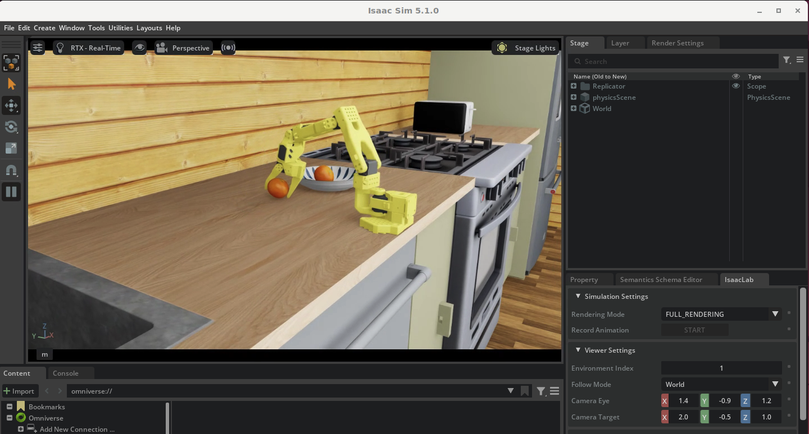

# 9. Edge Operation

In the previous module, we validated the fine-tuned GR00T N1.6 model through simulation in [Module 8](8.-evaluation.md). This module installs **AWS IoT Greengrass** on the same EC2 GPU instance to **virtually construct an edge device environment** and constructs an **MLOps pipeline** that deploys the trained model as a Greengrass component.

### Significance of This Module

In actual production, trained models must be deployed to edge devices like Jetson AGX Thor. However, since preparing physical devices is difficult in a workshop environment, we **treat the EC2 GPU instance as an edge device** and experience the same deployment pipeline. The Greengrass-based deployment structure built here can be directly applied to actual Jetson devices.

This completes the full **model training → deployment → operation** MLOps workflow:

```
[Modules 6/7] Model training → [Module 8] Simulation validation → [Module 9] Edge deployment (this module)
```

| Aspect | [Module 8](8.-evaluation.md) (Closed-loop Evaluation) | Module 9 (Edge Operation) |
|------|----------------------------------------------|--------------------------|
| Purpose | Model quality validation (simulation) | Deployment pipeline construction (MLOps) |
| Execution Environment | Isaac Lab container (same instance) | Greengrass Core (same instance) |
| Model Location | EFS / local | S3 → Greengrass component auto-downloads |
| Deployment Method | Manual docker run execution | AWS IoT Greengrass automatic deployment |
| Production Application | — | Same structure for OTA deployment to Jetson Thor fleet |

### Learning Goals

- Understand model deployment pipeline using AWS IoT Greengrass
- Component-based deployment structure (Docker image pull → model preparation → TRT optimization → inference server)
- Inference acceleration and benchmarking with TensorRT
- Deployment status monitoring (CloudWatch Logs, Greengrass CLI)


## Architecture Overview

```
┌─────────────────────────────────────────────────────────┐
│  AWS Cloud                                              │
│  ┌──────────┐  ┌──────────┐  ┌────────────────────┐   │
│  │ IoT Core │  │   ECR    │  │   S3 (models/data)  │   │
│  └────┬─────┘  └────┬─────┘  └─────────┬──────────┘   │
│       │              │                   │              │
│  ┌────┴──────────────┴───────────────────┴──────────┐  │
│  │         Greengrass Deployment                     │  │
│  │  ┌─────────────┐ ┌───────────┐ ┌──────────────┐ │  │
│  │  │ setup       │ │ inference │ │ benchmark    │ │  │
│  │  │ (model+TRT) │ │ (serving)  │ │ (measurement)│ │  │
│  │  └─────────────┘ └───────────┘ └──────────────┘ │  │
│  └──────────────────────────────────────────────────┘  │
│                         │                               │
└─────────────────────────┼───────────────────────────────┘
                          │ MQTT / TES
┌─────────────────────────┼───────────────────────────────┐
│  EC2 GPU Instance (L40S / Jetson Thor)                  │
│  ┌──────────────────────┴──────────────────────────┐   │
│  │  Greengrass Nucleus v2.17.0                      │   │
│  │  + Cli, LogManager, SecureTunneling              │   │
│  └──────────────────────────────────────────────────┘   │
│  ┌──────────────────────────────────────────────────┐   │
│  │  Docker (groot-n16-inference / groot-inference)   │   │
│  └──────────────────────────────────────────────────┘   │
└─────────────────────────────────────────────────────────┘
```

## Instance Access

Work on the `IsaacLab-Stable-<userId>-Instance` EC2 instance deployed in [Module 1](../e2e-workshop/1.-isaaclab-infra-setup.md).

### code-server (VSCode) Access

1. AWS Console → CloudFormation → `IsaacLab-Stable-<userId>` stack → Check `CodeServerUrl` in Outputs
2. Access CloudFront URL in browser (e.g., `https://dXXXXXXXXXXXX.cloudfront.net`)
3. Password: Value stored in Secrets Manager (same as DCV password)

Execute all subsequent commands in code-server terminal except for simulation execution.

---

## Prerequisites

### 1. Add IoT/Greengrass Permissions to EC2 Instance Role

Greengrass Nucleus provisioning automatically creates IoT resources, requiring the following permissions in EC2 instance role.

```bash
# Check instance role name
curl -s http://169.254.169.254/latest/meta-data/iam/security-credentials/

# Add permissions
aws iam put-role-policy \
  --role-name <INSTANCE_ROLE_NAME> \
  --policy-name GreengrassProvisionPolicy \
  --policy-document '{
    "Version": "2012-10-17",
    "Statement": [
      { "Effect": "Allow", "Action": "iot:*", "Resource": "*" },
      { "Effect": "Allow", "Action": "greengrass:*", "Resource": "*" },
      {
        "Effect": "Allow",
        "Action": [
          "iam:GetRole", "iam:CreateRole", "iam:AttachRolePolicy",
          "iam:GetPolicy", "iam:PassRole", "iam:CreatePolicy", "iam:TagRole",
          "iam:PutRolePolicy"
        ],
        "Resource": "*"
      },
      { "Effect": "Allow", "Action": "sts:GetCallerIdentity", "Resource": "*" }
    ]
  }'
```

> **Note**: These permissions are used only during Greengrass installation (provisioning). After installation, Greengrass components access AWS services through TES Role (GreengrassV2TokenExchangeRole).

### 2. Other Requirements

- Docker installed (including nvidia-container-toolkit)
- Java 11+ (for Greengrass Nucleus execution)
- AWS CLI v2

## Installation

### N1.6 Model Deployment

Retrieve or update resource files:
```bash
cd ~
git clone https://github.com/hi-space/aws-physical-ai-recipes.git
```


```bash
cd ~/aws-physical-ai-recipes/e2e-workshop/edge/scripts
sudo bash setup-greengrass-workshop-N16.sh <USER_ID>
```


### Script Execution Steps

| Step | Description |
|------|------|
| Step 1 | Prerequisites (install JDK, unzip, etc.) |
| Step 2 | Create S3 bucket + download model from CloudFront |
| Step 3 | Create ECR repository + build/push Docker image |
| Step 3.5 | Verify IAM permissions (warnings only) |
| Step 4 | Install Greengrass Nucleus + IoT provisioning + deploy system components |
| Step 5 | Add S3/ECR/CloudWatch permissions to TES Role |
| Step 6 | Register workshop components (download recipes from S3) |

### Created Resources After Installation

| Resource | Name Pattern |
|--------|-----------|
| IoT Thing | `groot-{USER_ID}` |
| IoT Thing Group | `groot-{USER_ID}-group` |
| S3 Bucket | `groot-workshop-{USER_ID}-{ACCOUNT_ID}` |
| ECR Repository | `groot-n16-inference-{USER_ID}` (N1.6) / `groot-inference` (N1.7) |
| Greengrass Core Device | `groot-{USER_ID}` |

### System Components (Auto-deployed)

| Component | Version | Description |
|----------|------|------|
| aws.greengrass.Nucleus | 2.17.0 | Greengrass core |
| aws.greengrass.Cli | 2.17.0 | Device CLI |
| aws.greengrass.SecureTunneling | 2.0.0 | Remote tunneling |
| aws.greengrass.LogManager | 2.3.12 | CloudWatch log upload (includes workshop component) |

## Component Deployment

### Workshop Components

| Component | N1.6 Version | N1.7 Version | Description |
|----------|-----------|-----------|------|
| com.workshop.docker-build | 1.0.x | 2.0.x | Pull Docker image from ECR |
| com.workshop.setup | 1.0.x | 2.0.x | Download model + export ONNX + build TRT engine |
| com.workshop.inference | 1.0.x | 2.0.x | Run Policy Server (`gr00t.eval.run_gr00t_server`, ZMQ port 5555) |
| com.workshop.benchmark | 1.0.x | 2.0.x | PyTorch vs TRT benchmark |

#### Component Dependency Chain

```
com.workshop.docker-build (ECR pull)
    ↓ HARD dependency
com.workshop.setup (model + TRT build)
    ↓ HARD dependency
com.workshop.inference (Policy Server)
    
com.workshop.benchmark (HARD dependency on setup, independent of inference)
```

#### Inference Component Cautions

- **Server script**: `python -m gr00t.eval.run_gr00t_server` (ZMQ REQ/REP server)
  - ❌ `standalone_inference_script.py` is client/evaluation script (not server)
- **Lifecycle maintenance**: When `run` script exits, Greengrass calls shutdown, so must wait for container termination with `docker wait` after port verification
- **Greengrass components are immutable**: Cannot overwrite recipe with same version. Increment version number when modifying

### Manual Deployment (After Installation)

#### Step 1: Environment Preparation (Docker image + model + TRT engine)

Pull Docker image from ECR, download model from S3, then build TRT engine. First run takes approximately 10~15 minutes (skipped by cache on subsequent deployments).

```bash
aws greengrassv2 create-deployment \
  --target-arn arn:aws:iot:{REGION}:{ACCOUNT_ID}:thinggroup/groot-{USER_ID}-group \
  --deployment-name "workshop-n16-setup" \
  --components '{"aws.greengrass.Nucleus":{"componentVersion":"2.17.0"},"aws.greengrass.Cli":{"componentVersion":"2.17.0"},"aws.greengrass.SecureTunneling":{"componentVersion":"2.0.0"},"aws.greengrass.LogManager":{"componentVersion":"2.3.12"},"com.workshop.{USER_ID}.docker-build":{"componentVersion":"1.0.0"},"com.workshop.{USER_ID}.setup":{"componentVersion":"1.0.0"}}' \
  --deployment-policies '{"componentUpdatePolicy":{"action":"SKIP_NOTIFY_COMPONENTS"}}' \
  --region {REGION}
```

**Verify Results:**

```bash
# Check deployment status
aws greengrassv2 list-effective-deployments \
  --core-device-thing-name groot-{USER_ID} --region {REGION}
# → coreDeviceExecutionStatus: "SUCCEEDED"

# Check component status
aws greengrassv2 list-installed-components \
  --core-device-thing-name groot-{USER_ID} --region {REGION}
# → com.workshop.{USER_ID}.setup: lifecycleState "FINISHED"

# Verify TRT engine creation (on instance)
ls -lh /opt/groot/trt_n16/dit_model_bf16.trt
# → Confirm ~2.1GB file
```

#### Step 2: Run Benchmark

Compare PyTorch vs TRT (DiT Action Head) performance. **GPU OOM occurs with concurrent inference execution**, so deploy without inference.

```bash
aws greengrassv2 create-deployment \
  --target-arn arn:aws:iot:{REGION}:{ACCOUNT_ID}:thinggroup/groot-{USER_ID}-group \
  --deployment-name "workshop-n16-benchmark" \
  --components '{"aws.greengrass.Nucleus":{"componentVersion":"2.17.0"},"aws.greengrass.Cli":{"componentVersion":"2.17.0"},"aws.greengrass.SecureTunneling":{"componentVersion":"2.0.0"},"aws.greengrass.LogManager":{"componentVersion":"2.3.12"},"com.workshop.{USER_ID}.docker-build":{"componentVersion":"1.0.0"},"com.workshop.{USER_ID}.setup":{"componentVersion":"1.0.0"},"com.workshop.{USER_ID}.benchmark":{"componentVersion":"1.0.0"}}' \
  --deployment-policies '{"componentUpdatePolicy":{"action":"SKIP_NOTIFY_COMPONENTS"}}' \
  --region {REGION}
```

**Verify Results:**

```bash
# Check benchmark results (on instance)
grep -A5 "BENCHMARK RESULTS" /greengrass/v2/logs/com.workshop.${USER_ID}.benchmark.log
```

**Expected Results (L40S):**

```
pytorch                   |   126.0ms avg |    7.9 Hz
trt_dit_action_head       |    60.1ms avg |   16.6 Hz
TRT Speedup: 2.10x faster than PyTorch
```

#### Step 3: Deploy Inference Server

Start Policy Server (ZMQ port 5555). Used for Isaac Sim simulation evaluation. **Deploy excluding benchmark**.

```bash
aws greengrassv2 create-deployment \
  --target-arn arn:aws:iot:{REGION}:{ACCOUNT_ID}:thinggroup/groot-{USER_ID}-group \
  --deployment-name "workshop-n16-inference" \
  --components '{"aws.greengrass.Nucleus":{"componentVersion":"2.17.0"},"aws.greengrass.Cli":{"componentVersion":"2.17.0"},"aws.greengrass.SecureTunneling":{"componentVersion":"2.0.0"},"aws.greengrass.LogManager":{"componentVersion":"2.3.12"},"com.workshop.{USER_ID}.docker-build":{"componentVersion":"1.0.0"},"com.workshop.{USER_ID}.setup":{"componentVersion":"1.0.0"},"com.workshop.{USER_ID}.inference":{"componentVersion":"1.0.0"}}' \
  --deployment-policies '{"componentUpdatePolicy":{"action":"SKIP_NOTIFY_COMPONENTS"}}' \
  --region {REGION}
```

**Verify Results:**

```bash
# Check component status
aws greengrassv2 list-installed-components \
  --core-device-thing-name groot-{USER_ID} --region {REGION}
# → com.workshop.{USER_ID}.inference: lifecycleState "RUNNING"

# Check Policy Server port (on instance)
ss -tlnp | grep 5555
# → Confirm LISTEN 0.0.0.0:5555

```

> **Note**: To verify in detail logs that server started correctly, run `docker logs groot-workshop-inference --tail 5` on the instance. When message `Server is ready and listening on tcp://0.0.0.0:5555` is output, it's normal.

## Benchmark Results

### N1.6 (EC2 g6e.xlarge, NVIDIA L40S)

| Mode | Avg Latency | P50 | P95 | P99 | Std | Frequency | Speedup |
|------|-------------|-----|-----|-----|-----|-----------|---------|
| PyTorch (BF16) | 126.0 ms | 125.5 ms | 128.4 ms | 137.5 ms | 2.5 ms | **7.9 Hz** | — |
| TRT (DiT Action Head) | 60.1 ms | 60.0 ms | 60.6 ms | 61.9 ms | 0.4 ms | **16.6 Hz** | **2.10x** |

> 50 iterations, 5 warmup. Results from Greengrass `com.workshop.benchmark` v1.0.1.
> TRT accelerates only DiT Action Head (N1.6 method). Backbone (Qwen3 VL) remains PyTorch.

### N1.7 (EC2 g6e.4xlarge, NVIDIA L40S)

| Mode | Avg Latency | P50 | P95 | Frequency | Speedup |
|------|-------------|-----|-----|-----------|---------|
| PyTorch (BF16) | 158.7 ms | 158.2 ms | 164.0 ms | **6.3 Hz** | — |
| TRT (Full Pipeline) | 50.8 ms | 50.8 ms | 52.2 ms | **19.7 Hz** | **3.13x** |

> N1.7 Full Pipeline TRT (both backbone and DiT accelerated).


## Isaac Sim Closed-loop Simulation Evaluation

Perform closed-loop evaluation by connecting Policy Server (port 5555) deployed via Greengrass with Isaac Sim.

### Prerequisites

- Policy Server running on port 5555 (Greengrass `com.workshop.inference` or manual docker run)
- DCV desktop session access (IsaacSim GUI rendering required)
- Minimum 20GB GPU memory (Policy Server ~8GB + IsaacSim ~10GB)

```bash
# Verify Policy Server is running
ss -tlnp | grep 5555
```

### Step 1: Configure IsaacLab environment + enter container

Execute from DCV desktop terminal. First run automatically installs LeIsaac package, scene assets, evaluation scripts (approximately 5~8 minutes).

```bash
cd ~/aws-physical-ai-recipes/e2e-workshop/groot/inference
./run-isaaclab.sh
```

After script completion, enter IsaacLab container shell.

### Step 2: Run Closed-loop Evaluation

Execute inside IsaacLab container:

```bash
/workspace/isaaclab/_isaac_sim/python.sh /workspace/scripts/evaluation/policy_inference.py \
    --task=LeIsaac-SO101-PickOrange-v0 \
    --eval_rounds=10 \
    --policy_type=gr00tn1.6 \
    --policy_host=localhost \
    --policy_port=5555 \
    --policy_action_horizon=16 \
    --policy_language_instruction="Pick up the orange and place it on the plate" \
    --device=cuda \
    --enable_cameras
```

**Key Parameters:**

| Parameter | Description |
|----------|------|
| `--task` | LeIsaac task ID (SO-101 + orange picking environment) |
| `--eval_rounds` | Evaluation repetition count (fast test: 3, formal evaluation: 10+) |
| `--policy_type` | `gr00tn1.6` (N1.7 also backward compatible with same use) |
| `--policy_host` | Policy Server address (`localhost` due to `--network=host`) |
| `--policy_port` | Policy Server ZMQ port |
| `--policy_action_horizon` | Action step count GR00T predicts at once |
| `--policy_language_instruction` | Task instruction (natural language) |
| `--enable_cameras` | Enable camera rendering (essential for observation generation) |

### Normal Output Example

After approximately 3~5 minutes for IsaacSim initialization, evaluation starts:

```
[INFO] Loading task: LeIsaac-SO101-PickOrange-v0
[INFO] Policy client connected to localhost:5555
[INFO] Starting evaluation round 1/10...
[INFO] Round 1: SUCCESS (picked orange in 245 steps)
[INFO] Round 2: SUCCESS (picked orange in 312 steps)
...
[INFO] Evaluation complete: 7/10 success (70%)
```

<figure><figcaption>Isaac Sim Closed-loop Evaluation Execution (SO-101 + Pick Orange)</figcaption></figure>


## Monitoring

### Verify Device Deployment Status

```bash
aws greengrassv2 list-effective-deployments \
  --core-device-thing-name groot-{USER_ID} \
  --region {REGION}
```

### Check Component Logs (on instance)


Setup script automatically inserts `{USER_ID}` into component names. Log filenames follow `com.workshop.{USER_ID}.<component>.log` format accordingly.


```bash
# Greengrass overall logs
tail -f /greengrass/v2/logs/greengrass.log

# Individual component logs (replace USER_ID with your ID)
tail -f /greengrass/v2/logs/com.workshop.{USER_ID}.benchmark.log
tail -f /greengrass/v2/logs/com.workshop.{USER_ID}.inference.log
tail -f /greengrass/v2/logs/com.workshop.{USER_ID}.setup.log
```

### CloudWatch Logs (LogManager integration)

LogManager automatically uploads logs from the following components to CloudWatch Logs:
- `com.workshop.{USER_ID}.setup`
- `com.workshop.{USER_ID}.docker-build`
- `com.workshop.{USER_ID}.inference`
- `com.workshop.{USER_ID}.benchmark`

Log group: `/aws/greengrass/GreengrassSystemComponent/{REGION}/groot-{USER_ID}`

### Greengrass CLI (on instance)

```bash
# List installed components
/greengrass/v2/bin/greengrass-cli component list

# Get component details
/greengrass/v2/bin/greengrass-cli component details -n com.workshop.{USER_ID}.benchmark

# Check local deployment status
/greengrass/v2/bin/greengrass-cli deployment status -l
```

## Uninstall

```bash
# Full N1.6 uninstall
sudo bash setup-greengrass-workshop-N16.sh <USER_ID> --uninstall
```

### Uninstall Actions

| Step | Action |
|------|------|
| 1/6 | Stop Greengrass service + delete `/greengrass/v2` |
| 2/6 | Cancel/delete Greengrass deployments + delete Core Device |
| 3/6 | Detach/delete IoT Certificate, delete Thing, delete Thing Group |
| 4/6 | Delete Greengrass components (N1.6: 1.x versions only, N1.7: 2.x versions only) |
| 5/6 | Remove TES Role inline policies |
| 6/6 | Provide ECR/S3 delete commands (manual) |

> **Note**: ECR repositories and S3 buckets are not automatically deleted for data protection. Delete manually using provided commands.

### Docker Image Configuration (N1.6 — verified)

```
Base: nvcr.io/nvidia/pytorch:24.12-py3
  - CUDA 12.4, Python 3.12, system TRT 10.7
  - torch 2.7.1+cu128 (uv sync)
  - transformers (latest, Qwen3 support)
  - onnxscript, onnx, onnxruntime (must install in venv — for ONNX export)
  - gr00t N1.6 (Isaac-GR00T commit 5dc80c4)
  
⚠️ Critical: Remove pip TRT 10.16.0.72 → symlink system TRT 10.7
   (pip wheel TRT 10.16.0.72 has CUDA initialization bug)

⚠️ When installing onnxscript, must specify venv python:
   uv pip install --python /workspace/gr00t-repo/.venv/bin/python onnxscript onnx onnxruntime
   (if installed in system python, venv torch cannot find it)
```


## Troubleshooting

### Greengrass Installation Failure: `iot:GetPolicy` permission missing

EC2 instance role lacks IoT permissions. See [Prerequisites](#1-add-iotgreengrass-permissions-to-ec2-instance-role).

### Deployment Failure: `COMPONENT_VERSION_REQUIREMENTS_NOT_MET`

Component version dependency conflict. Deploy all components with same major version.

### Benchmark Failure: `Unrecognized arguments`

Docker image ENTRYPOINT conflict. Add `--entrypoint /bin/bash` and execute as `-c "cd /workspace/gr00t-repo && python ..."` form.

### Core Device Remains in Console

Core Device is deleted during `--uninstall`. Manual delete:
```bash
aws greengrassv2 delete-core-device --core-device-thing-name groot-{USER_ID} --region {REGION}
```

### TRT Benchmark Failure: `CUDA initialization failure with error: 35`

Pip-installed TRT 10.16.0.72 wheel has CUDA initialization bug. Solution:
- Use Docker image base `nvcr.io/nvidia/pytorch:24.12-py3` (includes system TRT 10.7)
- Remove pip TRT from venv and symlink system TRT 10.7

```bash
# Run inside container
VENV_SP=/workspace/gr00t-repo/.venv/lib/python3.12/site-packages
SYS_SP=/usr/local/lib/python3.12/dist-packages
rm -rf $VENV_SP/tensorrt $VENV_SP/tensorrt_libs $VENV_SP/tensorrt_bindings $VENV_SP/tensorrt_cu12* $VENV_SP/tensorrt-* $VENV_SP/tensorrt_*.dist-info
ln -sf $SYS_SP/tensorrt $VENV_SP/tensorrt
[ -d $SYS_SP/tensorrt_libs ] && ln -sf $SYS_SP/tensorrt_libs $VENV_SP/tensorrt_libs
[ -d $SYS_SP/tensorrt_bindings ] && ln -sf $SYS_SP/tensorrt_bindings $VENV_SP/tensorrt_bindings
```

### TRT Engine Build Failure: OOM (exit code 137)

Out of memory during ONNX export. `com.workshop.setup` component restarts automatically on failure. Stop other GPU-using containers and re-deploy.

---
