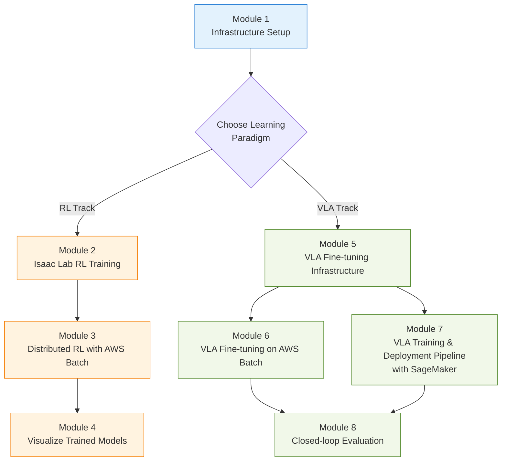

# Physical AI End-to-End on AWS

This workshop covers both core learning paradigms of Physical AI on AWS infrastructure. You will train reinforcement learning (RL) policies for humanoid robots using NVIDIA Isaac Lab, fine-tune Vision-Language-Action (VLA) Foundation Models with NVIDIA GR00T to follow natural language commands, and validate the results in simulation with closed-loop evaluation.

* [**AWS Batch**](https://docs.aws.amazon.com/batch/latest/userguide/what-is-batch.html): Automatically provision compute resources based on workload volume and scale, optimizing resource distribution to reduce costs while enabling sophisticated robot learning in significantly less time than single GPU instances.
* [**Amazon SageMaker**](https://docs.aws.amazon.com/sagemaker/latest/dg/whatis.html): Train GR00T VLA models with Training Jobs, manage versions with Model Registry, and provide immediate REST API inference environments through Real-time Endpoints.
* [**Amazon ECR**](https://docs.aws.amazon.com/AmazonECR/latest/userguide/what-is-ecr.html): Docker containers significantly reduce setup time and provide reusable assets and consistent standards across large-scale distributed learning and simulation programs.
* [**Amazon EFS**](https://docs.aws.amazon.com/efs/latest/ug/whatisefs.html): Multiple instances share RL checkpoints, GR00T fine-tuning results, and simulation assets to seamlessly connect training → inference → evaluation stages.
* [**AWS CDK**](https://docs.aws.amazon.com/cdk/v2/guide/home.html): Define cloud infrastructure using programming languages and automatically provision the entire environment with a single command, enabling rapid standardized environment sharing across teams.

### Physical AI and Two Learning Paradigms

Physical AI is artificial intelligence designed for robots operating in the real physical world. Learning tasks like walking or object manipulation requires millions of trials and errors. Doing this with physical robots is time-consuming, expensive, and risks robot damage.

This workshop teaches two core paradigms using a Sim-to-Real approach:

| Aspect | Reinforcement Learning (RL Policy) | Vision-Language-Action (VLA Model) |
|--------|------------------------------------|------------------------------------|
| **Representative Model** | Isaac Lab + PPO (skrl) | NVIDIA GR00T N1.6/N1.7 (3B params) |
| **Inputs** | Joint states, IMU, contact sensors | Camera images + natural language commands + joint states |
| **Outputs** | Single-task joint torques/positions | 16-step future actions (action horizon) |
| **Learning Method** | Simulation-based trial-and-error from scratch | Large-scale pre-training + custom dataset fine-tuning |
| **Task Scope** | Single task (e.g., humanoid locomotion) | General-purpose (diverse tasks via natural language) |
| **Workshop Modules** | Modules 2–4 | Modules 5–8 |

Both paradigms share the **same AWS infrastructure** ([Module 1](1.-isaaclab-infra-setup.md), and training results can be immediately visualized and evaluated through EFS.

### Architecture

The complete infrastructure is defined with [AWS CDK](https://github.com/hi-space/aws-physical-ai-recipes/tree/main/e2e-workshop/infra/isaaclab), and a single deployment automatically configures the environment for both RL and VLA.

* **DCV Instance (EC2 GPU)**: Build Isaac Sim/Isaac Lab Docker images and visually inspect simulations. Validated containers are uploaded to Amazon ECR.
* **AWS Batch Multi-Node Parallel (MNP) Jobs**: [Multi-node parallel jobs](https://docs.aws.amazon.com/batch/latest/userguide/multi-node-parallel-jobs.html) enable distributed execution of RL training and GR00T fine-tuning. NCCL AllReduce synchronizes gradients across nodes.
* **Amazon SageMaker** (optional): Train GR00T VLA models and deploy Real-time Endpoints for inference.
* **Amazon EFS**: Permanently store checkpoints and logs during multi-node training. Mount the same EFS on the DCV instance for evaluation without separate file copying.

***

### Hands-on Modules

#### Module 1. Common Infrastructure

[**1. Cloud Infrastructure Setup and Verification**](1.-isaaclab-infra-setup.md)

Automatically provision the environment with AWS CDK. All resources—VPC, EC2 GPU instances (DCV), AWS Batch, EFS, ECR—are created with a single command. Verify that simulation and training work correctly on a single EC2 instance, then upload validated containers to Amazon ECR.

#### RL Track — Humanoid Robot Reinforcement Learning with Isaac Lab

[**2. Isaac Lab Reinforcement Learning Training**](2.-isaaclab-rl-train.md)

Use Isaac Lab to train rough terrain locomotion for the Unitree H1 humanoid robot with [skrl](https://skrl.readthedocs.io/) PPO in a GPU-accelerated physics simulation environment. Optimize control policies by simultaneously simulating 2,048 virtual robots on a single GPU.

[**3. Large-Scale RL Training with AWS Batch**](3.-isaaclab-rl-train-batch.md)

Launch AWS Batch multi-node parallel (MNP) jobs with validated containers. Synchronize gradients across 2 nodes × 4 GPUs (8 total) using NCCL AllReduce, and manually create the four components: Compute Environment, Job Definition, Job Queue, and Job. Checkpoints and TensorBoard logs are saved to EFS and can be monitored in real-time from DCV.

[**4. Visualize Trained Models in IsaacSim**](4.-isaaclab-rl-test.md)

Load trained RL policies in IsaacSim inference mode (`play.py`) using Docker containers with mounted EFS. Compare pre-trained 72,000-iteration models with directly trained `best_agent.pt`, and archive validated checkpoints from EFS to S3 for long-term storage.

#### VLA Track — Natural Language Robot Control with GR00T Foundation Models

[**5. VLA Fine-tuning Infrastructure Deployment**](5.-train-infra-setup.md)

Deploy the `infra/groot` CDK stack for NVIDIA GR00T N1 (3B params) Vision-Language-Action fine-tuning, configuring CodeBuild, ECR, and AWS Batch environments. Validate base model inference by launching a ZMQ-based Policy Server with the built container image. Explore receding horizon control that generates 16-step action horizons from natural language commands and camera images.

[**6. VLA Fine-tuning on AWS Batch**](6.-vla-train-batch.md)

Fine-tune the GR00T VLA model on AWS Batch using custom robot datasets (SO-101, leisaac-pick-orange). Cover single-node training through Multi-Node Multi-GPU distributed training, using training images auto-built by CodeBuild. Resulting checkpoints are directly accessible from EFS to DCV.

[**7. VLA Training and Deployment Pipeline with SageMaker**](7.-vla-train-sagemaker.md)

Train the same dataset using AWS SageMaker. Build the complete MLOps pipeline from Training Job → Model Registry → Real-time Endpoint deployment for immediate REST API inference. Compare learning curves with Module 6 batch results to understand infrastructure trade-offs.

[**8. Isaac Lab Closed-Loop Evaluation**](8.-evaluation.md)

Evaluate fine-tuned GR00T models in closed-loop Isaac Lab simulation using the [LeIsaac](https://github.com/LightwheelAI/leisaac) framework. Perform natural language tasks with the SO-101 robot—picking oranges and placing them on plates in a kitchen scene—and measure success rates based on `eval_rounds`.

#### Appendix

[**Appendix. Practical Tips and Reference**](99-tips.md)

Best practices for AWS services used in the workshop (S3, EFS, ECR) and EC2 instance SSH access methods.

---

### References

* [**\[GitHub\]** AWS Physical AI Recipes — Isaac Lab Workshop CDK](https://github.com/hi-space/aws-physical-ai-recipes/tree/main/e2e-workshop/infra/isaaclab)
* [**\[Workshop Studio\]** NVIDIA Isaac Lab on AWS](https://catalog.us-east-1.prod.workshops.aws/workshops/075ce3fe-6888-4ea9-986e-5bdd1b767ef7/en-US)
* [**\[AWS Blog\]** Scale Reinforcement Learning with AWS Batch Multi-Node Parallel Jobs](https://aws.amazon.com/blogs/hpc/scale-reinforcement-learning-with-aws-batch-multi-node-parallel-jobs/)
* [**\[NVIDIA\]** Isaac Lab Documentation](https://isaac-sim.github.io/IsaacLab/)
* [**\[NVIDIA\]** GR00T Foundation Model](https://developer.nvidia.com/gr00t)
