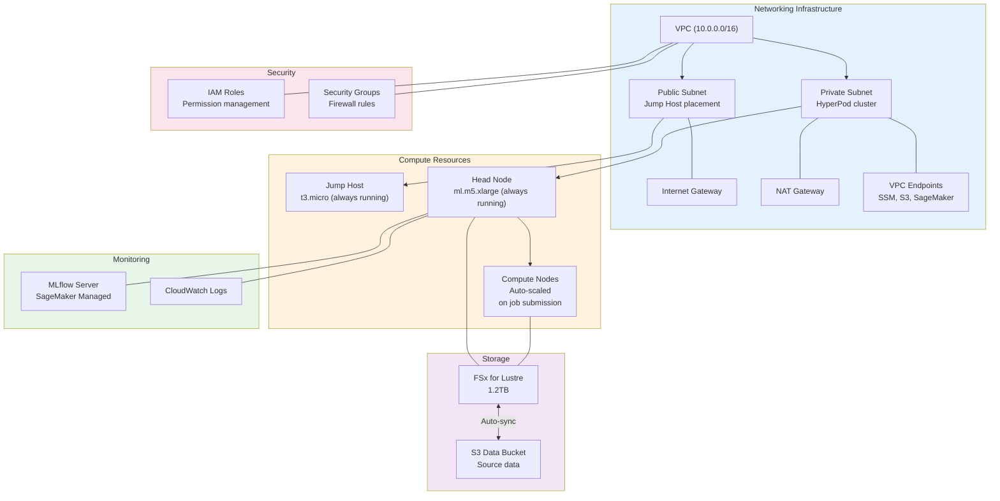
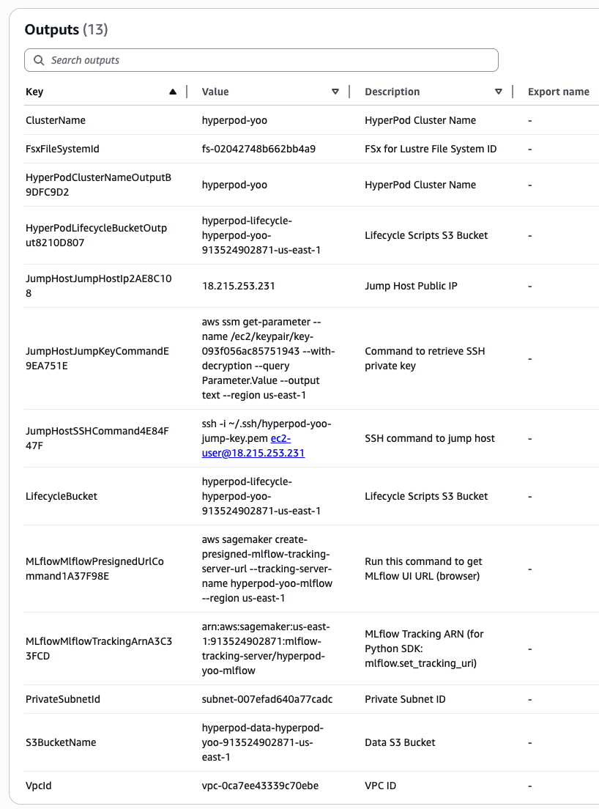
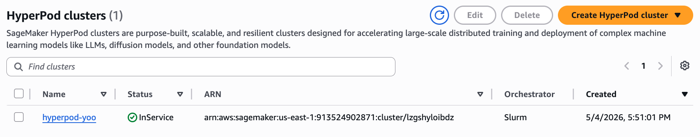
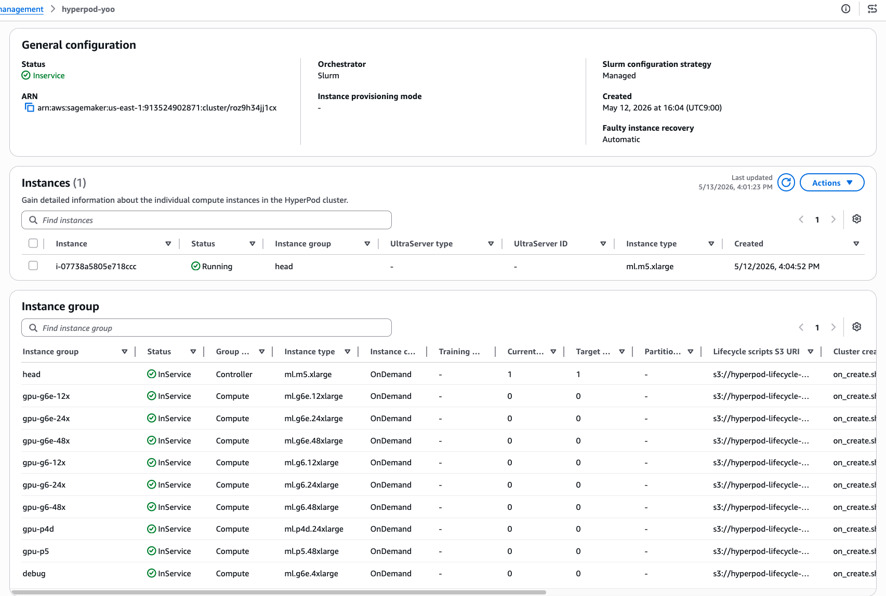

# 1. Infrastructure Deployment

Automatically provision a SageMaker HyperPod distributed training environment using AWS CDK. The HyperPod cluster, FSx for Lustre, Jump Host, and MLflow server are all created with a single command.

## CDK Deployment Overview

AWS CDK (Cloud Development Kit) lets you define cloud infrastructure as code in Python or TypeScript. Running `cdk deploy` automatically creates the following components:



### Key Deployed Components

| Component | Role | Duration |
|---------|------|---------|
| **VPC** | Isolated network environment | Always running |
| **Jump Host (t3.micro)** | SSH gateway from the internet | Always running |
| **HyperPod Head Node** | SLURM scheduler and cluster controller | Always running |
| **FSx for Lustre** | High-performance shared storage (S3-synced) | Always running |
| **MLflow Server** | Training metrics tracking and experiment management | Always running |
| **Compute Nodes** | Nodes where actual training runs | Created only when jobs are submitted |

### Cost Considerations

- **Fixed costs**: Jump Host, Head Node, FSx, MLflow (always running)
- **Variable costs**: Compute Nodes (charged only during job execution)
- Cost-effective for frequent long-duration distributed training

---

## Prerequisites

### AWS Account and Permissions

* AWS account with admin or SageMaker, EC2, VPC, IAM, FSx permissions
* Recommended region: **`us-east-1`** (US East N. Virginia)

### Service Quotas


**HyperPod uses SageMaker-specific quotas separate from EC2 vCPU quotas.** Raising EC2 quotas does not enable HyperPod instances. You must explicitly request SageMaker service quotas.


In AWS Console → [Service Quotas](https://console.aws.amazon.com/servicequotas/) → **Amazon SageMaker**, search for quotas in the format `ml.<type> for cluster usage`. Minimum requirements for this workshop:

- `ml.m5.xlarge for cluster usage`: 1 or more (head node)
- `ml.g6e.12xlarge for cluster usage` or `ml.g6.12xlarge for cluster usage`: desired number of GPU nodes


**Approval can take 1-3 business days, so submit requests at least 1 week before the workshop.** New AWS accounts start with GPU quotas (g6/g6e/p series) at **zero**.


<details>

<summary><strong>SageMaker HyperPod Quota Request Guide (us-east-1)</strong></summary>

Before joining the HyperPod training workshop, request increased Service Quotas for GPU instances.

#### Prerequisites

- Logged in to AWS account
- Region: **us-east-1 (N. Virginia)**
- AWS CLI credentials configured (if using CLI)

#### Recommended Request Quantities

New accounts have limited SQI quotas based on account age and spend history. Tier-based requests increase approval likelihood.

| Tier | Instance Size | Recommended Quantity |
|---|---|---|
| Small | xlarge ~ 2xlarge | 64 |
| Medium | 8xlarge ~ 12xlarge | 32 |
| Large | 24xlarge ~ 48xlarge | 16 |
| Premium | p4de, p5 | 8 |

> After approval, additional increases are available, so start with these values.

#### Target Quota List

**On-Demand Instance (for cluster usage)** — Used for HyperPod cluster on-demand compute nodes.

| Quota Code | Instance Type | GPU | Request Value |
|---|---|---|---|
| L-6F0EC0FD | ml.g6.xlarge | L4 x1 | 64 |
| L-F63839BF | ml.g6.2xlarge | L4 x1 | 64 |
| L-8BC5FA3F | ml.g6.12xlarge | L4 x4 | 32 |
| L-513D1D07 | ml.g6.24xlarge | L4 x4 | 16 |
| L-B896E0F0 | ml.g6.48xlarge | L4 x8 | 16 |
| L-DE7D3776 | ml.g6e.xlarge | L40S x1 | 64 |
| L-69F95BD9 | ml.g6e.8xlarge | L40S x1 | 32 |
| L-A15DF696 | ml.g6e.12xlarge | L40S x4 | 32 |
| L-CCEE4B8C | ml.g6e.24xlarge | L40S x4 | 16 |
| L-177AF1AD | ml.g6e.48xlarge | L40S x8 | 16 |
| L-0F9E0C66 | ml.g7e.8xlarge | L40S x1 | 32 |
| L-3B7F2FD0 | ml.p4de.24xlarge | A100 x8 | 8 |
| L-8762A75F | ml.p5.48xlarge | H100 x8 | 8 |

**Spot Instance (for cluster spot instance usage)** — Used for HyperPod cluster spot compute nodes. Use for cost savings.

| Quota Code | Instance Type | GPU | Request Value |
|---|---|---|---|
| L-8BC5FA3F | ml.g6.12xlarge | L4 x4 | 32 |
| L-513D1D07 | ml.g6.24xlarge | L4 x4 | 16 |
| L-B896E0F0 | ml.g6.48xlarge | L4 x8 | 16 |
| L-AF730FBA | ml.g6e.8xlarge | L40S x1 | 32 |
| L-3B7F2FD0 | ml.p4de.24xlarge | A100 x8 | 8 |

#### Request Method 1: AWS Console

1. Access [Service Quotas Console](https://console.aws.amazon.com/servicequotas/home/services/sagemaker/quotas)
2. Verify region is **us-east-1**
3. Search for quota code (e.g., `L-6F0EC0FD`) or instance type
4. Select quota → Click **Request increase at account-level**
5. Enter requested value from the table → Submit

#### Request Method 2: AWS CLI (Batch Request)

Run the script below to request tier-based quotas in one command:

```bash
# On-Demand (for cluster usage) - Small (64)
for code in L-6F0EC0FD L-F63839BF L-DE7D3776; do
  aws service-quotas request-service-quota-increase \
    --service-code sagemaker \
    --quota-code "$code" \
    --desired-value 64 \
    --region us-east-1
done

# On-Demand - Medium (32)
for code in L-8BC5FA3F L-69F95BD9 L-A15DF696 L-0F9E0C66; do
  aws service-quotas request-service-quota-increase \
    --service-code sagemaker \
    --quota-code "$code" \
    --desired-value 32 \
    --region us-east-1
done

# On-Demand - Large (16)
for code in L-513D1D07 L-B896E0F0 L-CCEE4B8C L-177AF1AD; do
  aws service-quotas request-service-quota-increase \
    --service-code sagemaker \
    --quota-code "$code" \
    --desired-value 16 \
    --region us-east-1
done

# On-Demand - Premium (8)
for code in L-3B7F2FD0 L-8762A75F; do
  aws service-quotas request-service-quota-increase \
    --service-code sagemaker \
    --quota-code "$code" \
    --desired-value 8 \
    --region us-east-1
done
```

```bash
# Spot - Medium (32)
for code in L-8BC5FA3F L-AF730FBA; do
  aws service-quotas request-service-quota-increase \
    --service-code sagemaker \
    --quota-code "$code" \
    --desired-value 32 \
    --region us-east-1
done

# Spot - Large (16)
for code in L-513D1D07 L-B896E0F0; do
  aws service-quotas request-service-quota-increase \
    --service-code sagemaker \
    --quota-code "$code" \
    --desired-value 16 \
    --region us-east-1
done

# Spot - Premium (8)
for code in L-3B7F2FD0; do
  aws service-quotas request-service-quota-increase \
    --service-code sagemaker \
    --quota-code "$code" \
    --desired-value 8 \
    --region us-east-1
done
```

#### Check Request Status

```bash
aws service-quotas list-requested-service-quota-change-history-by-quota \
  --service-code sagemaker \
  --quota-code L-6F0EC0FD \
  --region us-east-1
```

Status values:
- `PENDING` — Under review
- `CASE_OPENED` — AWS Support case created (large instances)
- `APPROVED` — Approved
- `DENIED` — Rejected (review reason and resubmit or open Support case)

#### Important Notes

- **Large instances** like `p5.48xlarge` (H100) may not auto-approve. If status is `CASE_OPENED`, explain your use case in the AWS Support case.
- If a pending request exists for the same quota, new requests will be rejected. Wait for the existing request to complete before resubmitting.
- After quota approval, physical capacity must be separately verified. Notify us of the workshop schedule in advance.
- EC2 vCPU quotas and SageMaker cluster quotas are **completely separate**. Even if you raised EC2 quotas, you must separately raise `ml.<type> for cluster usage` quotas for HyperPod.

</details>

### Optional

* Session Manager Plugin: For easy EC2 console access, install it ([Installation Guide](https://docs.aws.amazon.com/systems-manager/latest/userguide/session-manager-working-with-install-plugin.html))

---

## 1.1 CloudShell Environment Setup (~5 minutes)

1. Log in to [AWS Console](https://console.aws.amazon.com).

2. Set the region in the top right to **US East (N. Virginia) `us-east-1`**.

3. Click the `>_` icon at the top to launch CloudShell.

4. Run the following commands:

```bash
# Set your identifier (lowercase letters/numbers/hyphens only)
export USER_ID=<your_name>

# Clone the repository
git clone --depth 1 https://github.com/hi-space/aws-physical-ai-recipes.git ~/aws-physical-ai-recipes

# Navigate to CDK project directory
cd ~/aws-physical-ai-recipes/hyperpod-training/infra

# Install dependencies
npm install
```


CloudShell comes with Node.js 18+ and AWS CDK CLI pre-installed. Just run `npm install`.



All subsequent steps use the `${USER_ID}` variable. When opening a new shell session or reconnecting via SSH, re-run `export USER_ID=<your_name>` or add it to `~/.bashrc`.


---

## 1.2 CDK Bootstrap (First Time Only)

If this is your first time using CDK with this account/region, run:

```bash
cdk bootstrap aws://$(aws sts get-caller-identity --query Account --output text)/us-east-1
```

This command:
- Creates an S3 bucket for CloudFormation stack storage
- Sets up IAM roles and permissions
- Provisions basic infrastructure for CDK deployment

---

## 1.3 Infrastructure Deployment (~20 minutes)

**If you deployed IsaacLab infrastructure in a previous workshop**, you may already have a VPC with the same `userId` tag. HyperPod automatically discovers existing VPCs by `UserId` tag, so you must use the **same `userId`** from the IsaacLab deployment. In this case, add `-c createVpc=false` to reuse the existing VPC and avoid duplication:

```bash
npx cdk deploy \
  -c userId=${USER_ID} \
  -c region=us-east-1 \
  -c createVpc=false \
  --require-approval never
```

For a standalone HyperPod deployment with a new VPC, use:

```bash
npx cdk deploy \
  -c userId=${USER_ID} \
  -c region=us-east-1 \
  --require-approval never
```


`userId` supports **lowercase letters, numbers, and hyphens (-) only**. This value is included in all resource names.


To monitor deployment progress, run in another terminal:

```bash
# Monitor CloudFormation stack status
aws cloudformation describe-stacks \
  --stack-name HyperPod-${USER_ID} \
  --region us-east-1 \
  --query "Stacks[0].StackStatus" \
  --output text
```

<details>

<summary><strong>Customize Deployment Parameters</strong></summary>

| Parameter | Default | Description |
|---------|--------|------|
| `userId` | (required) | User identifier |
| `region` | us-east-1 | Deployment region |
| `gpuMaxCount` | 4 | Max nodes per GPU instance group |
| `gpuUseSpot` | false | Use Spot instances |
| `fsxCapacityGiB` | 1200 | FSx storage capacity (GiB) |
| `enableMlflow` | true | Create MLflow server |
| `createVpc` | true | Create new VPC (false to reuse existing) |
| `vpcCidr` | 10.0.0.0/16 | VPC CIDR block |

GPU instances are auto-configured with fallback priority:

| Rank | Instance | GPU | VRAM | Note |
|------|---------|-----|------|------|
| 1 | ml.g6e.12xlarge | 4× L40S | 192GB | Default training |
| 2 | ml.g6e.48xlarge | 8× L40S | 384GB | Large-scale training |
| 3 | ml.g6.12xlarge | 4× L4 | 96GB | Cost-effective |
| 4 | ml.p4d.24xlarge | 8× A100 | 320GB | NVLink large-scale |
| 5 | ml.p5.48xlarge | 8× H100 | 640GB | Maximum performance |

**Small-scale test deployment:**

```bash
npx cdk deploy \
  -c userId=${USER_ID} \
  -c region=us-east-1 \
  -c gpuMaxCount=1 \
  -c fsxCapacityGiB=600 \
  --require-approval never
```

**Large-scale training deployment:**

```bash
npx cdk deploy \
  -c userId=${USER_ID} \
  -c region=us-east-1 \
  -c gpuMaxCount=8 \
  -c fsxCapacityGiB=2400 \
  --require-approval never
```

</details>

---

## 1.4 Deployment Verification

When deployment completes, CloudFormation Outputs will be displayed. Save them for later use:

```bash
aws cloudformation describe-stacks \
  --stack-name HyperPod-${USER_ID} \
  --region us-east-1 \
  --query "Stacks[0].Outputs[*].{Key:OutputKey,Value:OutputValue}" \
  --output table
```

### Key Outputs

| Output | Description | Example |
|--------|------|------|
| `JumpHostIp` | Jump Host Public IP | 54.224.204.194 |
| `JumpKeyCommand` | SSH key download command | `aws ssm get-parameter ...` |
| `ClusterName` | HyperPod cluster name | hyperpod-alice |
| `S3BucketName` | Data S3 bucket | hyperpod-data-hyperpod-alice-... |
| `FsxFileSystemId` | FSx file system ID | fs-0e5c6b6f5fa8413fc |
| `MLflowTrackingUri` | MLflow UI URL (browser) | https://us-east-1.experiments... |
| `MlflowTrackingArn` | MLflow ARN (Python SDK) | arn:aws:sagemaker:us-east-1:... |

You can also view outputs in the CloudFormation console.



---

## 1.5 Cluster Status Check

After deployment completes, verify cluster status:

```bash
CLUSTER_NAME="hyperpod-${USER_ID}"

aws sagemaker describe-cluster \
  --cluster-name ${CLUSTER_NAME} \
  --region us-east-1 \
  --query "{Status:ClusterStatus,Groups:InstanceGroups[*].{Name:InstanceGroupName,Count:CurrentCount}}"
```

When `Status: InService` is confirmed, deployment is successful. Only the head node runs continuously; compute nodes auto-scale on job submission.

In the console, search for `SageMaker AI`, then select **HyperPod clusters** from the left menu to view your created cluster:



Click the cluster to see its status, confirm SLURM orchestrator, and view nodes:



---

## 1.6 Next Steps

Once deployment is complete, proceed to [**2. Cluster Access and Verification**](2.-cluster-access.md) to SSH to the Head Node via Jump Host and verify SLURM status.

---

## Troubleshooting

### CDK Deployment Failure

```bash
# 1. Check deployment logs
aws cloudformation describe-stack-events \
  --stack-name HyperPod-${USER_ID} \
  --region us-east-1 \
  --query "StackEvents[?ResourceStatus=='CREATE_FAILED']"

# 2. Verify service quotas
aws service-quotas get-service-quota \
  --service-code sagemaker \
  --quota-code L-<QUOTA-ID> \
  --region us-east-1
```

### Insufficient GPU Quota (InsufficientCapacity / ResourceLimitExceeded)

HyperPod cannot start instances for two reasons:

**1) Insufficient Quota (`ResourceLimitExceeded`)**

```bash
# Check HyperPod-specific quotas
aws service-quotas list-service-quotas \
  --service-code sagemaker \
  --region us-east-1 \
  --query "Quotas[?contains(QuotaName, 'cluster') && Value > \`0\`].[QuotaName, Value]" \
  --output table

# Request increase
aws service-quotas request-service-quota-increase \
  --service-code sagemaker \
  --quota-code <QUOTA_CODE> \
  --desired-value <desired_quantity> \
  --region us-east-1
```

**2) Insufficient Capacity (`InsufficientCapacity`)**

Physical instances are unavailable in the region/AZ. Try:
- Different instance type (g5 → g6e, etc.)
- Retry after some time
- Use a different region


EC2 vCPU quotas and SageMaker cluster quotas are **completely separate**. Even if you raised EC2 quotas, you must separately raise `ml.<type> for cluster usage` quotas for HyperPod.


### Rollback (Cancel Deployment)

```bash
aws cloudformation delete-stack \
  --stack-name HyperPod-${USER_ID} \
  --region us-east-1
```

---

## References

* [**[AWS SageMaker HyperPod]** Official Documentation](https://docs.aws.amazon.com/sagemaker/latest/dg/sagemaker-hyperpod.html)
* [**[AWS CDK]** Infrastructure as Code Guide](https://docs.aws.amazon.com/cdk/v2/guide/home.html)
* [**[Amazon FSx for Lustre]** User Guide](https://docs.aws.amazon.com/fsx/latest/LustreGuide/what-is.html)
* [**[GitHub]** AWS Physical AI Recipes — HyperPod CDK](https://github.com/hi-space/aws-physical-ai-recipes/tree/main/hyperpod-training/infra)
