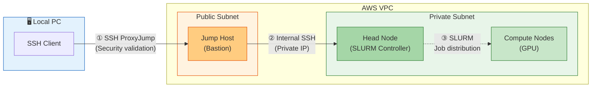
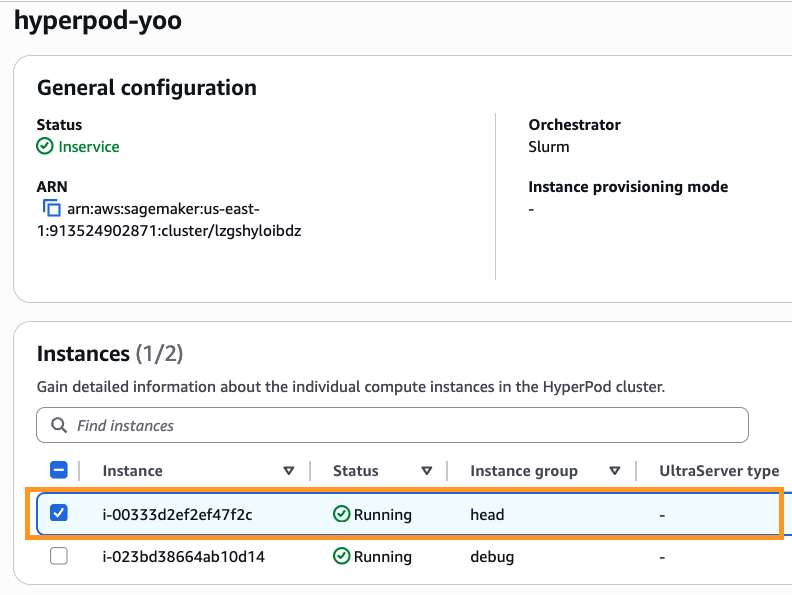

# 2. Cluster Access and Verification

HyperPod cluster nodes reside in a Private Subnet and lack public IPs. For security, access them via a Jump Host (Bastion Host) in the Public Subnet using SSH.


Commands in this document use the `${USER_ID}` environment variable. In a new shell session, first run:
```bash
export USER_ID=<your_name>   # Same value from Step 1
```


## Why Access via Jump Host?

**HyperPod network security design:**
- **Private Subnet nodes**: Head Node and compute nodes reside in a Private Subnet with no public IPs. External internet access is intentionally blocked—a security best practice to prevent data exfiltration and unauthorized access.
- **Jump Host (Bastion Host)**: The Jump Host in the Public Subnet serves as a single entry point between the internet and private network. All inbound connections are validated at the Jump Host before forwarding to internal nodes.
- **Proxy-based communication**: SSH ProxyJump enables single-command access from your local machine, but implements multi-layer authentication through the Jump Host.

**Architecture:**



---

## What is SLURM?

SLURM (Simple Linux Utility for Resource Management) is a job scheduler for HPC and distributed systems.

- **Role**: Fairly allocates shared computing resources (CPU, GPU, memory) among multiple users
- **In distributed training**: Submit GPU training jobs; SLURM automatically allocates resources and manages execution order
- **HyperPod auto-scaling**: Submit SLURM jobs → HyperPod auto-provisions GPU nodes → job completes → nodes auto-terminate for cost savings

**Example:**
```bash
# Submit training job using 8 GPUs with SLURM
srun --gpus-per-node=8 python train.py

# SLURM automatically:
# 1. Requests node with 8 GPUs from HyperPod
# 2. Waits for node provisioning
# 3. Executes job
# 4. Releases resources after completion
```

---

## HyperPod's SLURM Managed Mode

AWS SageMaker HyperPod uses **SLURM Managed mode**, meaning:

- **Auto-managed**: `slurmctld` (SLURM controller) is automatically managed by AWS's `SageMakerClusterAgent`; no manual start/stop needed
- **Job submission via SSH**: Via SSH to Head Node, submit jobs with `sbatch` or `srun`. This is the standard HyperPod workflow
- **Session Manager caveat**: AWS console Session Manager for HyperPod node access is unreliable and often fails. Always use SSH
- **Compute node auto-scaling**: Compute nodes (`ml.g6e.12xlarge`, `ml.g6.12xlarge`, etc.) start with `instanceCount=0` and auto-provision on job submission. They auto-terminate after training ends, incurring no idle charges

---

### 2.1 Download Jump Host SSH Key

Use the `JumpHostJumpKeyCommand` output value from CDK deployment.

**Example CDK output:**
```
HyperPod-${USER_ID}.JumpHostJumpKeyCommand... = aws ssm get-parameter --name /ec2/keypair/key-0932d04fbda4dc5a7 --with-decryption --query Parameter.Value --output text --region us-east-1
```

Copy the `JumpHostJumpKeyCommand` value and append `> ~/.ssh/hyperpod-${USER_ID}-jump-key.pem` to save it:

**How to run:**
```bash
# JumpHostJumpKeyCommand value + file save
aws ssm get-parameter \
  --name /ec2/keypair/key-0932d04fbda4dc5a7 \
  --with-decryption \
  --query Parameter.Value \
  --output text \
  --region us-east-1 > ~/.ssh/hyperpod-${USER_ID}-jump-key.pem

chmod 600 ~/.ssh/hyperpod-${USER_ID}-jump-key.pem
```

**Expected output:**
```
ls -la ~/.ssh/hyperpod-${USER_ID}-jump-key.pem
# -rw------- 1 user user 1679 May 3 10:00 ~/.ssh/hyperpod-${USER_ID}-jump-key.pem
```

---

### 2.2 Jump Host Access

Use the `JumpHostJumpHostIp` or `JumpHostSSHCommand` value from CDK Output:

```bash
# Use JumpHostJumpHostIp value
ssh -i ~/.ssh/hyperpod-${USER_ID}-jump-key.pem ec2-user@54.196.110.185
```

**Expected output:**
```
The authenticity of host '<IP>' can't be established.
ECDSA key fingerprint is SHA256:...
Are you sure you want to continue connecting (yes/no)? yes
Warning: Permanently added '<IP>' (ECDSA) to the known_hosts file.

       __|  __|_  )
       _|  (     /   Amazon Linux 2023
      ___|\___|___|

ec2-user@ip-10-x-x-x:~$
```

---

### 2.3 Head Node Access

#### Head Node Private IP


Run the following commands on **your local PC or CloudShell**, not inside Jump Host. Jump Host lacks SageMaker API permissions and won't respond.


**Step 1.** Find Head Node's Instance ID.

In SageMaker console → HyperPod clusters → `hyperpod-${USER_ID}` → **Instances** tab, find the Instance ID in the `head` group:



Or use CLI:

```bash
aws sagemaker list-cluster-nodes \
  --cluster-name hyperpod-${USER_ID} \
  --region us-east-1
```

**Step 2.** Query the Private IP using the Instance ID:

```bash
aws sagemaker describe-cluster-node \
  --cluster-name hyperpod-${USER_ID} \
  --node-id <Instance_ID_from_above> \
  --region us-east-1 \
  --query "NodeDetails.PrivatePrimaryIp" \
  --output text
```

**Expected output:**
```
10.0.1.162
```

Jump Host has the Head Node SSH key (`~/.ssh/cluster_access_key`) pre-deployed.

```bash
# SSH to Head Node from Jump Host
ssh -i ~/.ssh/cluster_access_key ubuntu@<HEAD_NODE_IP>
```

**Expected output:**
```
Welcome to Ubuntu 20.04.6 LTS (GNU/Linux 5.15.0-1065-aws x86_64)

ubuntu@hyperpod-head:~$
```

---

### 2.4 SSH Config Setup (Recommended)

Add the following to `~/.ssh/config` on your local PC to SSH in one command:

```
Host hyperpod-jump
    HostName <JUMP_HOST_IP>
    User ec2-user
    IdentityFile ~/.ssh/hyperpod-${USER_ID}-jump-key.pem

Host hyperpod
    HostName <HEAD_NODE_PRIVATE_IP>
    User ubuntu
    IdentityFile ~/.ssh/cluster_access_key
    ProxyJump hyperpod-jump
```

Download `cluster_access_key` from S3:

```bash
aws s3 cp s3://hyperpod-lifecycle-hyperpod-${USER_ID}-<ACCOUNT_ID>-us-east-1/ssh/cluster_access_key \
  ~/.ssh/cluster_access_key
chmod 600 ~/.ssh/cluster_access_key
```

**Expected output:**
```
download: s3://hyperpod-lifecycle-hyperpod-...-us-east-1/ssh/cluster_access_key to ~/.ssh/cluster_access_key
```

Now connect directly:

```bash
ssh hyperpod
```

---

### 2.5 Cluster Environment Verification

After SSH to Head Node, verify:

```bash
# Check SLURM status
sinfo

# Verify FSx mount
df -h /fsx

# Check directory structure
ls /fsx/
```

**Expected SLURM output:**

```
PARTITION AVAIL  TIMELIMIT  NODES  STATE NODELIST
dev*         up   infinite      0    n/a
```

Zero compute nodes is normal. SLURM provisions GPU nodes when jobs are submitted.

**Expected FSx output:**

```
Filesystem            Size  Used Avail Use% Mounted on
10.0.x.x@tcp:/fsx   1.2T  100G  1.1T  8% /fsx
```

**FSx directory structure:**

```bash
ls /fsx/
# datasets  checkpoints  scratch
```

| Directory | Purpose |
|---------|------|
| `/fsx/datasets` | Training data (auto-synced from S3) |
| `/fsx/checkpoints` | Model checkpoints (saved during training) |
| `/fsx/scratch` | Temporary job files |

---

### 2.6 Workshop Environment Initialization

On Head Node, run once:

```bash
# Clone repository
git clone --depth 1 https://github.com/hi-space/aws-physical-ai-recipes.git /fsx/scratch/aws-physical-ai-recipes

# Install GR00T training environment (venv method, ~5-10 minutes)
bash /fsx/scratch/aws-physical-ai-recipes/hyperpod-training/scripts/setup_groot_env.sh
```

This script:
- Installs system packages (`ffmpeg`, `git-lfs`)
- Installs `uv` package manager
- Clones Isaac-GR00T repository (`/fsx/scratch/Isaac-GR00T`)
- Creates Python 3.10 virtual environment (`/fsx/envs/gr00t`)
- Installs GR00T packages and dependencies (`bitsandbytes`, `flash-attn`, etc.)


**Also set up HuggingFace token:**
GR00T N1.7 is a gated model requiring a token before training.
```bash
echo "hf_xxxxxxxxxxxx" > /fsx/scratch/.hf_token
```


---

### 2.7 VS Code Remote-SSH (Optional)

To work remotely in VS Code:

1. Install **Remote-SSH** extension in VS Code
2. `Ctrl+Shift+P` → **Remote-SSH: Connect to Host...** → select `hyperpod`
3. Open remote folder: `/fsx/scratch`

You can now edit files, use terminal, and debug as if local.

**Verify connection:**

```bash
# Run in VS Code terminal (remote host)
whoami
# ubuntu

pwd
# /fsx/scratch
```
