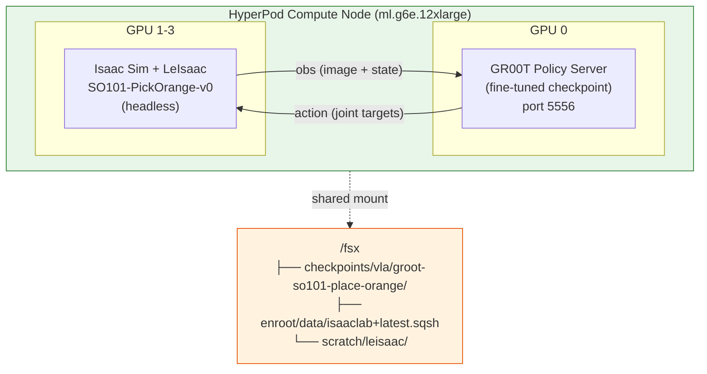

# 6. Simulation Verification (Closed-loop Evaluation)

Validate that the GR00T model trained in HyperPod can actually complete the orange pick task in LeIsaac simulation. Run headless closed-loop evaluation on HyperPod compute nodes.

---

## Open-loop vs Closed-loop Evaluation

| Aspect | Open-loop (Step 4.8) | Closed-loop (this chapter) |
|--|--|--|
| Method | Compare predicted actions to ground truth from dataset | Model directly controls robot in simulation |
| Metrics | MSE (prediction error) | Task success rate, episode length |
| Conclusion | "Does model fit data well?" | **"Does robot actually complete task?"** |

---

## 6.1 Architecture Overview



**Everything runs on a single node:**
1. GPU 0: GR00T policy server (loads fine-tuned checkpoint, serves via ZMQ)
2. GPU 1-3: Isaac Sim + LeIsaac PickOrange environment (headless physics simulation)
3. ZMQ communication: observation → policy → action loop

---

## 6.2 Prerequisites

| Requirement | Verification |
|----------|-----------|
| VLA training complete (Chapter 4) | `ls /fsx/checkpoints/vla/groot-so101-place-orange/checkpoint-2000/` |
| Isaac Lab environment ready | `ls /fsx/enroot/data/isaaclab+latest.sqsh` |
| LeIsaac installed | `ls /fsx/scratch/leisaac/` |

### Install Isaac Lab + LeIsaac (First Time Only)

```bash
bash /fsx/scratch/aws-physical-ai-recipes/hyperpod-training/scripts/setup_isaaclab_env.sh
```

This script automates Isaac Sim container import + LeIsaac clone + package setup (~15 minutes).

---

## 6.3 Run Closed-loop Evaluation

### Submit SLURM Job

```bash
sbatch /fsx/scratch/aws-physical-ai-recipes/hyperpod-training/slurm-templates/vla/eval_closed_loop.sbatch
```

Default settings:
- **Model**: `/fsx/checkpoints/vla/groot-so101-place-orange/checkpoint-2000`
- **Environment**: `LeIsaac-SO101-PickOrange-v0`
- **Instruction**: "pick up the orange"
- **Episodes**: 10
- **GPU**: 4× L40S (1 for policy, 3 for simulation)

### Custom Configuration

```bash
# Use different checkpoint
MODEL_PATH=/fsx/checkpoints/vla/groot-so101-place-orange/checkpoint-1000 \
  sbatch /fsx/scratch/aws-physical-ai-recipes/hyperpod-training/slurm-templates/vla/eval_closed_loop.sbatch

# Evaluate more episodes
EVAL_ROUNDS=50 \
  sbatch /fsx/scratch/aws-physical-ai-recipes/hyperpod-training/slurm-templates/vla/eval_closed_loop.sbatch
```

### Environment Variables

| Variable | Default | Description |
|------|--------|------|
| `MODEL_PATH` | /fsx/checkpoints/vla/groot-so101-place-orange/checkpoint-2000 | Checkpoint path |
| `EMBODIMENT_TAG` | NEW_EMBODIMENT | Robot tag |
| `INSTRUCTION` | pick up the orange | Task instruction |
| `EVAL_ROUNDS` | 10 | Evaluation episodes |
| `GROOT_VERSION` | n1.6 | Model version (n1.6 or n1.7) |
| `POLICY_PORT` | 5556 | ZMQ port |

---

## 6.4 Execution Flow

After job submission, check logs:

```bash
tail -f /fsx/scratch/logs/closed-loop-<JOB_ID>.out
```

**Expected log output:**
```
==================================================
GR00T Closed-loop Evaluation — LeIsaac PickOrange
==================================================
Job ID: 42
Node: ip-10-0-1-153
Model: /fsx/checkpoints/vla/groot-so101-place-orange/checkpoint-2000
Instruction: pick up the orange
Episodes: 10
Start: Fri May  9 10:30:00 UTC 2026
==================================================

[1/4] Starting GR00T Policy Server (port 5556, GPU 0)...
  Waiting for policy server (PID: 12345)...
  Policy server ready! (took 95s)

[3/4] Running LeIsaac PickOrange closed-loop evaluation...
  Episode  1/10: SUCCESS (steps: 342)
  Episode  2/10: SUCCESS (steps: 289)
  Episode  3/10: TIMEOUT (steps: 1000)
  ...
  Episode 10/10: SUCCESS (steps: 456)

[4/4] Stopping policy server...

==================================================
Closed-loop evaluation completed successfully!

Results (/fsx/checkpoints/vla/groot-so101-place-orange/metrics.json):
{"success_rate": 0.7, "episodes": 10, "avg_episode_length": 534.2}

End: Fri May  9 10:45:00 UTC 2026
==================================================
```

---

## 6.5 Interpret Results

Results automatically save to `metrics.json`:

```bash
cat /fsx/checkpoints/vla/groot-so101-place-orange/metrics.json
```

```json
{"success_rate": 0.7, "episodes": 10, "avg_episode_length": 534.2}
```

| Metric | Meaning | Target |
|------|------|------|
| success_rate | Task completion ratio | > 0 (confirms training worked) |
| episodes | Total evaluation episodes | - |
| avg_episode_length | Average steps to complete | Lower is more efficient |


**If success_rate > 0**, you've confirmed the fine-tuned GR00T model successfully picks orange in simulation. Workshop objective achieved!



**Sim-to-real gap**: High simulation success doesn't guarantee real-world performance. Simulation validates the model's core behavior capability.


---

## 6.6 Troubleshooting

| Symptom | Cause | Solution |
|------|------|----------|
| Policy server crashed at startup | Corrupt checkpoint or memory error | Verify checkpoint files and compare sizes with `du -sh` |
| Policy server not ready after 180s | Cosmos encoder loading slowly | Increase wait timeout or retry |
| LeIsaac not found | setup_isaaclab_env.sh not run | Re-run the setup script |
| Isaac Sim container not found | Enroot image not created | Re-run `setup_isaaclab_env.sh` |
| success_rate = 0 | Training insufficient or dataset mismatch | Retrain with higher `MAX_STEPS` |
| ZMQ connection refused | Port conflict | Change `POLICY_PORT=5557` or similar |
| GPU OOM in simulation | L40S memory insufficient | Reduce `MAX_STEPS_PER_EPISODE` |

---

## References

* [LeIsaac Documentation](https://lightwheelai.github.io/leisaac/)
* [Isaac-GR00T Evaluation](https://github.com/NVIDIA/Isaac-GR00T/tree/main/gr00t/eval)
* [LightwheelAI/so101-place-orange Dataset](https://huggingface.co/datasets/LightwheelAI/so101-place-orange)
