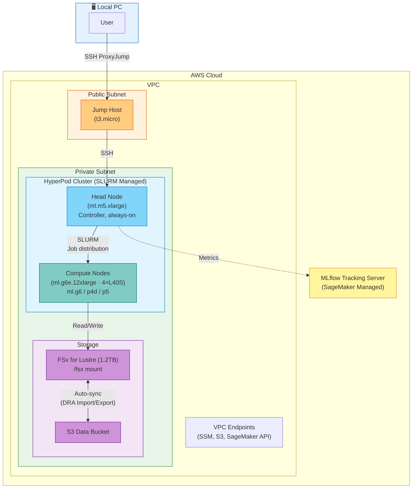

# Distributed Training for RL/VLA Models with HyperPod

In this workshop, you will set up a distributed training environment for Physical AI (VLA/RL) models using AWS SageMaker HyperPod, and practice the complete pipeline from data preparation through training execution and MLflow monitoring.

## Physical AI and Distributed Training

**Physical AI** is AI that enables physical agents like robots to operate in the real world. Physical AI models (VLA: Vision Language Action or reinforcement learning policies) require millions of training samples and many hours to days of GPU computation.

**Why distributed training matters:**
- **Speed**: Reduce multi-day training on a single GPU to hours with parallel processing across multiple GPUs
- **Scale**: Handle massive datasets with millions of samples by distributing across multiple nodes
- **Cost efficiency**: For long-duration training, maintaining an always-on cluster is more economical than ad-hoc training runs

This workshop will guide you through the complete cycle of distributed training using AWS infrastructure.

### AWS Services Overview

* **[Amazon SageMaker HyperPod](https://docs.aws.amazon.com/sagemaker/latest/dg/sagemaker-hyperpod.html)**
  - Always-on GPU cluster managed by SLURM (Simple Linux Utility for Resource Management)
  - Auto-recovery: Automatically provisions replacement nodes when node failures occur
  - Elastic scaling: Automatically adds or removes compute nodes based on training job requirements
  - Why use it?: Always-on cluster optimized for long-duration training with free SSH access and SLURM job submission
  - [AWS Documentation](https://docs.aws.amazon.com/sagemaker/latest/dg/sagemaker-hyperpod.html)

* **[Amazon FSx for Lustre](https://docs.aws.amazon.com/fsx/latest/LustreGuide/what-is.html)**
  - High-performance parallel file system (optimized for HPC/ML workloads)
  - Auto-sync with S3: Data uploaded to S3 automatically syncs to /fsx, and checkpoints automatically back up to S3
  - Why use it?: Required for fast simultaneous read/write of large datasets (GB~TB) across multiple GPU nodes
  - [AWS Documentation](https://docs.aws.amazon.com/fsx/latest/LustreGuide/what-is.html)

* **[Amazon SageMaker MLflow Tracking Server](https://docs.aws.amazon.com/sagemaker/latest/dg/mlflow.html)**
  - Managed MLflow server: Track experiments, compare metrics, and manage model versions
  - Automatically logs metrics (loss, accuracy, etc.) during training and enables real-time monitoring via web UI
  - Why use it?: Centrally track progress and performance of training running simultaneously across multiple GPU nodes
  - [AWS Documentation](https://docs.aws.amazon.com/sagemaker/latest/dg/mlflow.html)

* **[AWS CDK (Cloud Development Kit)](https://docs.aws.amazon.com/cdk/v2/guide/home.html)**
  - Define cloud infrastructure as code using programming languages like Python or TypeScript
  - Single `cdk deploy` command automatically provisions VPC, HyperPod, FSx, Jump Host, MLflow, IAM roles, and more
  - Why use it?: Automates complex infrastructure setup, ensures reproducibility, and enables version control
  - [AWS Documentation](https://docs.aws.amazon.com/cdk/v2/guide/home.html)

### Why HyperPod?

Training Physical AI models (GR00T, RT-2, etc.) differs from typical ML training:

- **Long training duration**: VLA models train continuously for hours to days, often requiring hyperparameter adjustments and debugging mid-training
- **Frequent iterative experiments**: You run multiple training sessions with different datasets and compare results
- **Direct GPU node access required**: You often need to check logs mid-training, debug the environment, and inspect checkpoints

**SageMaker HyperPod** is an always-on GPU cluster service optimized for these requirements:

| Feature | Description |
|------|------|
| **SLURM-based job management** | Industry-standard HPC scheduler; submit jobs via `sbatch`/`srun` with automatic GPU resource allocation |
| **Elastic scaling** | Compute nodes scale to zero when idle, auto-provision on job submission → minimizes idle costs |
| **Auto-recovery** | Automatically creates replacement nodes on failures and resumes training from checkpoints |
| **Always-on SSH access** | Continuous SSH access to Head Node → free debugging, environment setup, and real-time monitoring |
| **FSx shared storage** | All nodes share the same `/fsx` file system → start training immediately without data copying |
| **MLflow integration** | Integrated managed MLflow server to centrally track distributed training metrics |

### HyperPod vs AWS Batch

| Aspect | HyperPod (this workshop) | AWS Batch ([Isaac Lab workshop](../physical-ai-e2e-workshop/README.md)) |
|------|-------------------|--------------------------|
| Cluster lifetime | Always-on (Head Node always running) | Created/deleted per job |
| Scheduler | SLURM (HPC standard) | AWS Batch Scheduler |
| Node access | SSH (always available) | None (job submission only) |
| Fault recovery | Auto-recovery + checkpoint resume | Job retry (restart from beginning) |
| Suited for | Long training, debugging, iterative experiments | One-off large-scale training |
| Cost model | Always-on Head Node + compute usage | Pay for job runtime only |


VLA fine-tuning centers on iterative training with different datasets, monitoring intermediate results, and adjusting hyperparameters. HyperPod with direct SSH access and real-time job management is the best fit for this workflow.


## Architecture

## Workshop Flow

### Prerequisites

Before starting this workshop, verify the following:

- AWS account with appropriate permissions (IAM admin or SageMaker, EC2, VPC permissions)
- **[Physical AI E2E Workshop](../physical-ai-e2e-workshop/README.md)** completed (recommended)
  - Helps understand foundational concepts of Physical AI and robot simulation
  - Enables comparison between Isaac Lab RL training and HyperPod distributed learning

---

[**1. Infrastructure Deployment**](1.-infra-deploy.md)

Deploy the HyperPod cluster, FSx, Jump Host, and MLflow all at once using CDK from CloudShell.

[**2. Cluster Access and Verification**](2.-cluster-access.md)

SSH to the Head Node via Jump Host and verify SLURM and FSx status.

[**3. Data Preparation**](3.-data-preparation.md)

Upload training data to S3, which automatically syncs to FSx. Prepare dataset structure in LeRobot v2 format.

[**4. VLA Training Execution (GR00T Fine-tuning)**](4.-vla-training.md)

Submit and monitor GR00T VLA model fine-tuning jobs using SLURM. Choose between N1.6 (default, no HF token required) or N1.7 (gated); both use identical workflows.

[**5. RL Training (Isaac Lab — Advanced)**](5.-rl-training.md)

Run SO-101 robot RL training headless in an Isaac Sim container.

[**6. Simulation Verification (Closed-loop Evaluation)**](6.-simulation-verification.md)

Validate the VLA model trained in HyperPod with closed-loop simulation in Isaac Lab on AWS EC2.

[**7. Resource Cleanup**](7.-cleanup.md)

Delete all infrastructure using CDK after the workshop.

---

## References

* [**[GitHub]** AWS Physical AI Recipes — HyperPod Workshop CDK](https://github.com/hi-space/aws-physical-ai-recipes/tree/main/hyperpod-training/infra)
* [**[NVIDIA GR00T]** GR00T N1.7 Documentation](https://docs.nvidia.com/isaac/foundation_models/gr00t/gr00t-n1/)
* [**[AWS SageMaker HyperPod]** Official Documentation](https://docs.aws.amazon.com/sagemaker/latest/dg/sagemaker-hyperpod.html)
* [**[Companion Workshop]** Physical AI E2E Workshop](../physical-ai-e2e-workshop/README.md)
