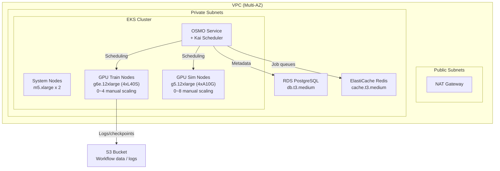
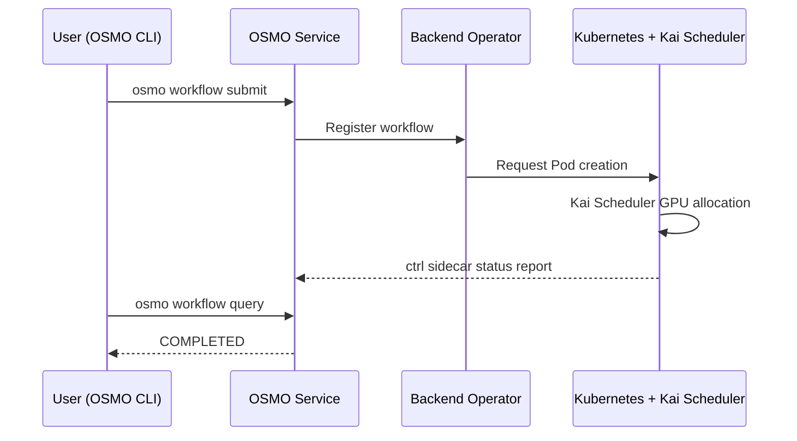

# NVIDIA OSMO on AWS EKS (TBU)

In this workshop, you will deploy NVIDIA OSMO on AWS EKS and run GR00T Fine-tuning workflows using the OSMO CLI. Infrastructure is deployed with a single CDK command, and GPU training is orchestrated with a single OSMO workflow YAML file.

* [**Amazon EKS**](https://docs.aws.amazon.com/eks/latest/userguide/what-is-eks.html): A managed Kubernetes service that runs OSMO services and GPU workloads.
* [**Amazon S3**](https://docs.aws.amazon.com/AmazonS3/latest/userguide/Welcome.html): Stores training datasets, workflow logs, and model checkpoints.
* [**Amazon RDS**](https://docs.aws.amazon.com/AmazonRDS/latest/UserGuide/CHAP_PostgreSQL.html): A managed PostgreSQL database that stores OSMO metadata and workflow state.
* [**Amazon ElastiCache**](https://docs.aws.amazon.com/AmazonElastiCache/latest/red-ug/WhatIs.html): A managed Redis service for OSMO job queues.
* [**AWS CDK**](https://docs.aws.amazon.com/cdk/v2/guide/home.html): Infrastructure as TypeScript code, provisioned automatically with a single command.

### What is OSMO?

[NVIDIA OSMO](https://github.com/NVIDIA/OSMO) is an open-source workflow orchestrator for Physical AI. It enables you to run GPU-intensive tasks like robot training (GR00T Fine-tuning) and simulation data generation (Isaac Sim) on Kubernetes using a single YAML file.

| Feature | Description |
|---------|-------------|
| Kubernetes-native | Runs on standard Kubernetes clusters (EKS, AKS, GKE) |
| NVIDIA Stack Integration | Orchestrates Isaac Sim, Isaac Lab, and GR00T containers directly |
| Kai Scheduler | Manages GPU quotas fairly via Queue CRDs |
| Open Source | Apache 2.0 license |

### Architecture

### Workflow Execution Flow

### Workshop Steps

| Step | Description | Duration |
|------|-------------|----------|
| 1 | [Infrastructure Deployment (CDK)](1.-infra-deploy.md) | ~20 min |
| 2 | [Kubernetes Setup](2.-eks-setup.md) | ~5 min |
| 3 | [OSMO Installation (Helm)](3.-osmo-install.md) | ~10 min |
| 4 | [OSMO Configuration (Credential, Config, Queue)](4.-osmo-config.md) | ~10 min |
| 5 | [GPU Workflow Verification](5.-gpu-verification.md) | ~5 min |
| 6 | [GR00T Fine-tuning Execution](6.-groot-finetune.md) | ~20 min |
| 7 | [Cleanup](7.-cleanup.md) | ~10 min |

---

### References

* [**\[GitHub\]** AWS Physical AI Recipes — OSMO CDK](https://github.com/hi-space/aws-physical-ai-recipes/tree/main/osmo/cdk)
* [**\[NVIDIA\]** OSMO GitHub](https://github.com/NVIDIA/OSMO)
* [**\[NVIDIA\]** OSMO Cookbook (Workflow Examples)](https://github.com/NVIDIA/OSMO/tree/main/cookbook)
* [**\[NVIDIA\]** GR00T (Generalist Robot 00 Technology)](https://developer.nvidia.com/isaac/groot)
* [**\[AWS\]** Amazon EKS Documentation](https://docs.aws.amazon.com/eks/latest/userguide/what-is-eks.html)
