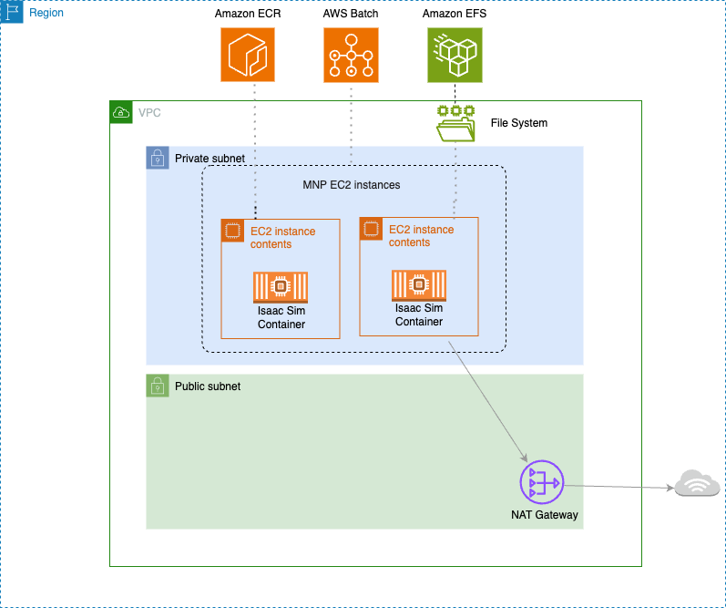

# NVIDIA Isaac Lab on AWS

이 실습에서는 AWS에서 Isaac Lab을 활용해 로봇 행동을 학습하는 방법을 배웁니다. 시뮬레이션된 로봇이 작업을 수행하도록 학습시키고, AWS Batch로 여러 컴퓨팅 노드에 걸쳐 학습을 확장하여 프로세스를 가속화합니다.

* **AWS Batch**: 워크로드 양과 규모에 따라 컴퓨팅 리소스를 자동으로 프로비저닝하고 워크로드 분산을 최적화하여, 비용을 절감하면서도 단일 GPU 인스턴스보다 훨씬 짧은 시간에 정교한 로봇 학습을 수행할 수 있습니다.
* **Amazon ECR**: Docker 컨테이너를 활용하면 설정 시간을 크게 줄이고, 대규모 분산 학습과 시뮬레이션 프로그램 전반에 걸쳐 재사용 가능한 자산과 일관된 표준을 제공할 수 있습니다.
* **Amazon EFS**: 배치 작업 실행 간 학습 체크포인트와 결과를 영구적으로 보관하여 작업 중단 없이 지속적인 학습이 가능합니다.
* **AWS CloudFormation**: 템플릿 기반으로 전체 인프라를 자동 구성하여 팀 간 표준화된 환경을 빠르게 공유할 수 있습니다.

### 아키텍처 설명

<figure><figcaption></figcaption></figure>

AWS Batch에 NVIDIA Isaac Lab을 배포하는 전체 아키텍처 입니다.

* NVIDIA Isaac Sim 기본 이미지와 Isaac Lab 저장소로 커스텀 컨테이너를 빌드하고 테스트합니다. 이 작업은 Amazon DCV가 설치된 EC2 인스턴스에서 원격 데스크톱으로 진행할 수 있습니다. 검증된 컨테이너는 Amazon ECR에 업로드됩니다.
* [AWS Batch 멀티노드 병렬 작업 ](https://docs.aws.amazon.com/batch/latest/userguide/multi-node-parallel-jobs.html)[(MNP, Multi-node parallel jobs)](https://docs.aws.amazon.com/batch/latest/userguide/multi-node-parallel-jobs.html)을 시작하면, 필요한 노드 수만큼 컴퓨팅과 네트워킹 리소스가 자동으로 프로비저닝됩니다. NVIDIA Isaac Lab이 노드 간 통신을 조율하여 분산 학습을 진행합니다.
* [Amazon EFS](https://docs.aws.amazon.com/ko_kr/efs/latest/ug/whatisefs.html)는 배치 작업 실행 간 데이터를 영구 보관합니다. 메인 노드가 MNP 클러스터 전체의 학습 결과를 수집하고, 학습된 모델의 체크포인트와 로그를 EFS에 저장합니다.
* 저장된 데이터는 추후 다른 AWS Batch 작업이나 EC2 인스턴스에서 분석 및 평가에 활용할 수 있습니다.

### **실습 과정**

[**1. 클라우드 인프라 준비**](1.-gpu.md)

AWS CloudFormation 템플릿으로 환경을 자동으로 구성합니다. Dockerfile 기반 컨테이너로 시뮬레이션 및 학습 환경을 표준화하여 팀 간 공유가 쉽고 설정 시간을 절약할 수 있습니다. EFS 스토리지, NAT Gateway, EC2 인스턴스, 보안 그룹 등 필요한 모든 리소스가 자동으로 생성됩니다.

[**2. 시뮬레이션과 학습 환경 확인**](2.-isaac-sim-isaac-lab.md)

먼저 EC2 단일 인스턴스에서 시뮬레이션과 ㅎ을 테스트합니다. 로봇이 제대로 시뮬레이션되고 학습이 정상 작동하는지 확인한 후, 검증된 컨테이너를 Amazon ECR에 업로드합니다.

[**3. 대규모 학습 실행**](3.-aws-batch.md)

검증된 컨테이너로 AWS Batch 작업을 시작합니다. 여러 노드로 자동 확장되며, AWS Batch가 오케스트레이션을 담당합니다. 학습 중 체크포인트와 결과는 EFS에 저장되고, 로그는 CloudWatch에 기록됩니다.

[**4. 모델 테스트**](4.-isaacsim.md)

EC2 인스턴스에서 학습된 모델을 실행하여 성능을 확인합니다. 개선점을 파악하고 다시 학습하는 과정을 AWS Batch로 빠르게 반복하여, 새로운 로봇 동작을 신속하게 개발할 수 있습니다.

***

### References




