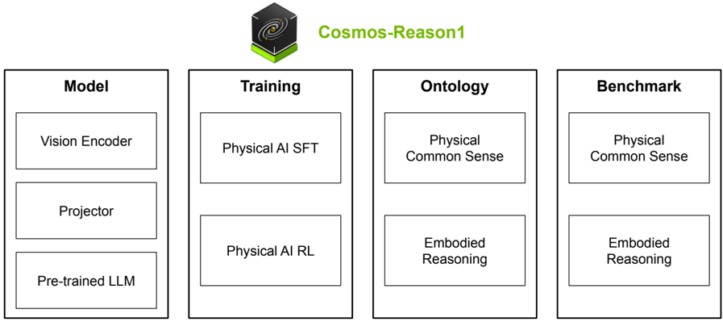
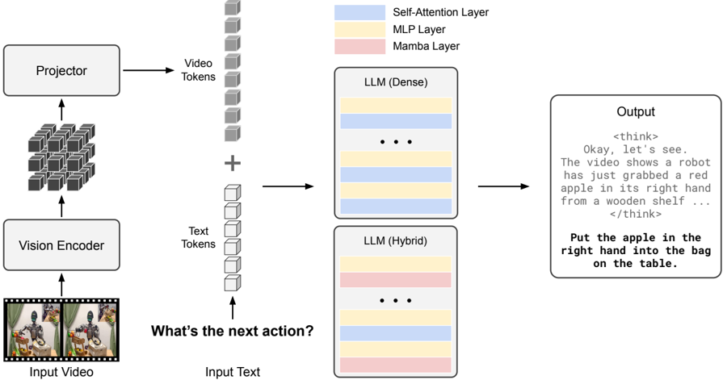
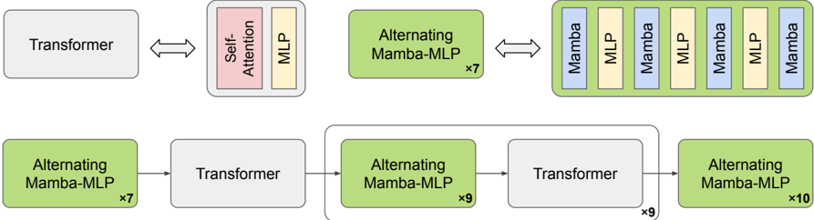

# Cosmos-Reason 1

### 들어가며

AI가 점점 똑똑해지고 있습니다. GPT-4는 코딩 문제를 풀고, Claude는 복잡한 논리 퍼즐을 해결하며, DeepSeek-R1은 수학 경시 문제에서 인간을 능가합니다. 하지만 이런 모델들에게 "물이 담긴 컵을 들고 계단을 내려가라"는 간단한 작업을 시키면 어떨까요? 놀랍게도, 텍스트 기반 추론에서는 천재적인 이런 모델들이 물리 세계와의 상호작용에서는 기본적인 상식조차 결여하고 있습니다.

기존 대형 언어 모델(LLM)들은 방대한 인터넷 텍스트 데이터로 학습되었지만, 실제 물리 세계가 어떻게 작동하는지에 대한 직관적 이해가 부족합니다. 중력이 물체에 어떻게 작용하는지, 물체가 다른 물체와 어떻게 상호작용하는지, 로봇 팔이 물건을 집을 때 무슨 일이 일어나는지를 진정으로 이해하지 못합니다. 이는 Physical AI 시스템 개발에 큰 걸림돌이 됩니다.

오늘 소개할 논문 "Cosmos-Reason1"은 NVIDIA가 이 문제를 해결하기 위해 제시한 해법입니다. Cosmos-Reason1은 비디오를 통해 물리 세계를 인식하고, 긴 chain-of-thought 추론 과정을 거쳐 물리적으로 타당한 답변과 embodied 의사결정을 생성하는 멀티모달 대형 언어 모델입니다. 이 글에서는 Cosmos-Reason1의 핵심 아이디어, 학습 방법론, 그리고 실제 성능을 자세히 살펴보겠습니다.

***

### 개요

<figure><figcaption></figcaption></figure>

> Cosmos-Reason1에는 Physical AI SFT 및 Physical AI RL을 포함하여 두 단계로 훈련된 7B 및 56B의 두 가지 Multimodal LLM이 포함되어 있습니다. 또한 물리적 상식(Physical Common Sense)과 구체화된 추론(Embodied Reasoning)을 위한 두 가지 온톨로지를 정의하고, 모델의 Physical AI 추론 기능을 평가하기 위해 두 가지 벤치마크를 구축합니다.

Cosmos-Reason1은 **물리적 세계를 이해하고 추론하기 위해 설계된 멀티모달 대규모 언어 모델(Multimodal Large Language Model)**&#xC785;니다. 이 모델은 물리적 상식 추론(Physical Common Sense Reasoning)과 구체화된 추론(Embodied Reasoning)이라는 두 가지 핵심 능력을 갖추고 있으며, 긴 사고 체인(Long Chain-of-Thought) 프로세스를 통해 복잡한 물리 현상을 설명할 수 있습니다. NVIDIA가 개발한 이 모델 제품군은 7B와 56B의 두 가지 규모로 제공되며, 감독학습(Supervised Fine-Tuning, SFT)과 강화학습(Reinforcement Learning, RL)의 두 단계 훈련을 통해 물리 AI 능력을 획기적으로 향상합니다.

### 문제 정의

최근 대규모 언어 모델(LLM)의 발전은 코딩과 수학 같은 복잡한 문제 해결에서 놀라운 성과를 보였습니다. 그러나 이러한 모델들은 물리적 세계에 대한 지식을 실제 상호작용과 연결시키지 못한다는 약점을 가지고 있습니다.

초기 연구들은 기존 LLM이나 VLM(Vision-Language Model)을 로봇 시스템에 그대로 적용하려 했습니다. 예를 들어,

1. **Zero-shot Task Planning**: LLM에게 "식탁을 차리세요"라고 하면, LLM이 자연어로 계획을 생성합니다. 하지만 이런 계획들은 물리적 제약을 고려하지 않아 실행 불가능한 경우가 많았습니다.
2. **Code as Policies**: LLM이 로봇 제어 코드를 직접 생성하는 방식입니다. 그러나 LLM은 물리 세계에 대한 직관이 부족해 비현실적인 동작을 생성하곤 했습니다.

이런 한계는 근본적인 문제에서 비롯됩니다: **모델이 물리적 상식(physical common sense)을 갖고 있지 않다는 것입니다.**

로봇이나 자율주행 차량 같은 물리 AI 시스템이 지능적으로 행동하려면 단순히 텍스트 지식만으로는 부족합니다. 이들은 다음 세 가지를 필요로 합니다:

1. **물리적 상식**: 세상이 어떻게 움직이는지에 대한 직관적 이해
2. **구체화된 추론**: 특정 로봇이나 인간이 주어진 상황에서 어떤 행동을 취해야 하는지에 대한 판단
3. **인과관계 이해**: 내 행동이 물리적 세계에 어떤 영향을 미칠 것인지에 대한 예측

기존의 비전-언어 모델(Vision-Language Model, VLM)은 이러한 물리적 추론을 충분히 수행하지 못합니다. 따라서 NVIDIA 연구팀은 물리 AI 특화 모델을 개발하기로 결정했습니다.

### Cosmos-Reason1의 핵심 아이디어

NVIDIA 연구팀은 Physical AI를 위해 두 가지 핵심 능력을 정의했습니다:

**1. Physical Common Sense (물리적 상식)**

물리적 상식은 환경에 대한 일반적이고 embodiment에 구애받지 않는 이해를 의미합니다. 마치 어린 아이가 생후 몇 개월 만에 물체 영속성(object permanence)과 중력을 이해하는 것처럼, AI도 수동적 관찰을 통해 물리 세계가 어떻게 작동하는지 배워야 합니다.

연구팀은 물리적 상식을 세 가지 주요 범주로 나누는 계층적 온톨로지(ontology)를 제안했습니다:

* **Space (공간)**: 물체 간의 관계, 상호작용, 환경 (예: 컵이 책상 위에 있다, 공이 상자 안에 들어갈 수 있다)
* **Time (시간)**: 시간에 따라 전개되는 행동과 사건 (예: 사건의 순서, 인과관계, 계획)
* **Fundamental Physics (기본 물리)**: 물체의 속성과 핵심 물리 법칙 (예: 역학, 전자기학, 열역학)

이 세 범주는 다시 16개의 세부 하위 범주로 나뉩니다.&#x20;

**2. Embodied Reasoning (체화된 추론)**

Embodied reasoning은 물리 세계와 실제로 상호작용하는 능력입니다. 단순히 이해하는 것을 넘어, 행동을 계획하고 실행해야 합니다. 연구팀은 네 가지 핵심 능력을 정의했습니다.

* **복잡한 감각 입력 처리**: 불완전하고 애매한 시각 정보에서 의미 있는 패턴 추출
* **행동 효과 예측**: "로봇 팔이 이 물체를 잡으면 어떻게 될까?" 같은 인과 관계 이해
* **물리적 제약 존중**: 관성, 마찰, 재료 특성 등 실제 물리 법칙 고려
* **상호작용을 통한 학습**: 피드백을 통해 행동을 동적으로 개선

### 모델 아키텍처

<figure><figcaption></figcaption></figure>

> 입력 비디오와 입력 텍스트 프롬프트가 주어지면 비디오는 비전 인코더와 프로젝터에 의해 비디오 토큰으로 LLM의 토큰 내장 공간에 투영됩니다. 텍스트 토큰은 비디오 토큰과 연결되어 LLM 백본, 고밀도 Transformer 또는 하이브리드 Mamba-MLP-Transformer 아키텍처에 공급됩니다. 이 모델은 긴 CoT 프로세스를 통해 응답을 출력할 수 있습니다.

#### 다중 모드 아키텍처

기존 텍스트 전용 LLM 백본 및 비전 인코더를 사용하여 다중 모드 LLM(대형 언어 모델)을 구축하기 위한 다양한 아키텍처 설계가 있습니다. Cosmos-Reason1은 일반적으로 사용되는 아키텍처인 decoder-only 전용 아키텍처를 채택했습니다. 이는 LLaVA와 유사한 방식으로, 모든 모달리티(이미지, 비디오, 텍스트)를 통합된 방식으로 처리합니다.

구체적인 구조는 다음과 같습니다:

1. **Vision Encoder**: InternViT-300M을 사용해 비디오 프레임을 처리합니다. 각 448×448 프레임은 1,024개의 시각 토큰으로 변환됩니다.
2. **Projector**: 2×2 PixelShuffle 다운샘플링을 통해 시각 토큰을 256개로 줄이고, 2-layer MLP로 텍스트 토큰 임베딩 공간에 정렬합니다.
3. **LLM Backbone**: Cosmos-Reason1-7B는 Qwen2.5-VL 기반의 dense Transformer를, 56B는 Nemotron-H 기반의 hybrid Mamba-MLP-Transformer를 사용합니다.

#### 백본 아키텍처: Mamba-MLP-Transformer 하이브리드

<figure><figcaption></figcaption></figure>

> Cosmos-Reason1-56B에 ​​사용된 하이브리드 Mamba-MLP-Transformer 백본 아키텍처를 나타낸 그림입니다. Transformer 블록은 Self-attention 레이어와 MLP 레이어로 구성됩니다. 그림 상단에는 Alternating Mamba-MLP 모듈의 예시도 함께 보여줍니다.

기존의 순수 트랜스포머 기반 모델과 달리, Cosmos-Reason1은 **Mamba-MLP-Transformer 하이브리드** 백본을 사용합니다.

* **Mamba**: 효율적인 시퀀스 모델링을 위한 상태 공간 모델(State Space Model)
* **MLP**: 다층 퍼셉트론(Multi-Layer Perceptron)으로 비선형 변환 수행
* **Transformer**: 어텐션(Attention) 메커니즘을 통한 장거리 의존성 포착

이 조합은 계산 효율성 증가, 메모리 사용량 감소, 긴 추론 체인에서의 성능 향상에 장점이 있습니다.

**Hybrid Mamba-MLP-Transformer의 장점**

Transformer는 self-attention 메커니즘 때문에 시퀀스 길이의 제곱에 비례하는 계산 복잡도(O(n²))를 가집니다. 긴 비디오를 처리할 때 이는 치명적인 병목이 됩니다.

Mamba 아키텍처는 selective state space model을 활용해 선형 복잡도(O(n))를 달성합니다. "상태(state)"를 유지하며 시퀀스를 순차적으로 처리하되, 중요한 정보는 상태에 유지하고 덜 중요한 정보는 잊어버리도록 학습합니다. 마치 사람이 대화에서 중요한 부분은 기억하고 사소한 부분은 흘려듣는 것과 유사합니다.

하지만 Mamba만으로는 모든 디테일을 포착하기 어렵습니다. 따라서 Cosmos-Reason1-56B는 Mamba layer와 Transformer layer를 혼합한 hybrid 아키텍처를 사용합니다. 118개 layer 중 대부분은 효율적인 Mamba layer로, 일부만 Transformer layer로 구성하여 효율성과 성능의 균형을 맞췄습니다.

### 학습 방법론

Cosmos-Reason1은 두 단계로 학습됩니다.

1. **Physical AI SFT(Supervised Fine-Tuning)**
2. **Physical AI RL(Reinforcement Learning)**

#### Stage 1: Physical AI SFT

사전 학습된 VLM 모델(예: Qwen2.5-VL 또는 Nemotron-H-VLM)에서 시작하여, Physical AI 특화 데이터로 Fine-tuning 합니다. 이 단계에서 모델은 물리적 개념어휘(vocabulary)를 학습하고, 물리 현상을 설명하는 방식을 익힙니다.

SFT 단계에서는 약 400만 개의 비디오-텍스트 쌍을 큐레이션했습니다. 이 데이터는 다음을 포함합니다:

**Physical Common Sense SFT**

* 물리적 상식 질문-답변 쌍 (약 70,000개)
* 구체화된 추론 예제 (약 35,000개)
* 직관적 물리학 시나리오 (약 30,000개)

**Embodied Reasoning SFT**

데이터 생성 파이프라인은 다음과 같습니다.

<figure><figcaption></figcaption></figure>

> Embodied Reasoning SFT 데이터 큐레이션 파이프라인: (1) 하위 작업에 해당하는 짧은 수평선 세그먼트를 추출하고, (2) 상태-동작 컨텍스트를 얻기 위해 추출된 클립에 캡션을 추가하고, (3) "다음 타당한 하위 작업 예측"을 위한 QA 쌍을 관리하고, (4) R1에게 추론을 유도하기 위한 질문과 캡션을 제공하고, (5) 유효한 SFT 샘플을 얻기 위해 추론 추적을 정리하고 다시 작성합니다.

* 고품질 비디오 큐레이션 (인간 선호도 기반)
* 상세한 캡션 작성 (인간 또는 VLM 사용)
* LLM을 프롬프트하여 질문 생성 (이해용 vs. 추론용 구분)
* DeepSeek-R1을 사용해 추론 trace 추출
* 규칙 기반 정제 및 재작성

#### Stage 2: Physical AI RL

SFT 후에는 강화학습을 통해 모델을 더욱 개선합니다. 수학이나 코딩과 달리 Physical AI에서는 정답이 명확하지 않습니다. "다음 행동은 무엇인가?"라는 질문에는 여러 타당한 답이 있을 수 있습니다. 이를 해결하기 위해 연구팀은 GRPO (Group Relative Policy Optimization) 알고리즘 기반의 규칙 기반의 검증 가능한 보상(rule-based verifiable rewards) 을 설계했습니다. 이 단계에서 모델은 미묘한 물리 원리, 예를 들어 시간의 화살표(arrow of time)나 물체의 영속성(object permanence)을 습득합니다.

* **리워드 설계**: 물리적으로 타당한 답변에 높은 보상 부여
  * **Accuracy Reward**: Multiple choice question에서 정답을 맞췄는지 문자열 매칭으로 검증
  * **Format Reward**: 추론 과정을 `<think></think>` 태그로, 답변을 `<answer></answer>` 태그로 감싸는지 확인
* **검증 가능한 규칙**: 규칙 기반 보상으로 신뢰성 확보
* **정책 최적화**: 모델이 물리적 올바름을 최대화하도록 유도

***

### 데이터와 벤치마크

공정한 평가를 위해 연구팀은 새로운 벤치마크를 구축했습니다.

#### 데이터

**1. 물리적 상식 데이터**

모델 기반 생성 파이프라인을 통해 물리적 상식 질문 70,000개를 수집

* 형식: 비디오 또는 이미지 + 예/아니오 또는 객관식 질문
* 예제: "이 물체는 물에 떠있을까?"
* 난이도: 기초부터 고급까지 다양한 수준

**2. 구체화된 추론 (Embodied Reasoning) 데이터**

로봇(예: AgiBot)의 실제 상호작용 비디오에서 35,000개의 데이터 수집

* 각 프레임에서 로봇이 취할 수 있는 다음 행동 추론
* 자연 행위자(인간)의 행동 설명 30,000개
* 형식: 비디오 + "로봇/사람이 다음에 어떻게 행동할까?"

**3. 직관적 물리학 데이터**

세 가지 핵심 물리 개념에 대한 특화 데이터

* **시간의 화살표** (Arrow of Time): 비디오가 앞으로 재생되는지 역으로 재생되는지 판단
* **공간 퍼즐** (Spatial Puzzles): 물체 배치와 위치 이해
* **물체 영속성** (Object Permanence): 가려진 물체의 위치 추론

***

### 실험 결과

#### Physical Common Sense 성능

| 모델                     | Space | Time | Physics | 평균              |
| ---------------------- | ----- | ---- | ------- | --------------- |
| Gemini 2.0 Flash       | 53.8  | 50.0 | 46.9    | 50.2            |
| GPT-4o                 | 61.3  | 54.7 | 50.9    | 55.6            |
| OpenAI o1              | 63.8  | 58.1 | 58.0    | 59.9            |
| Qwen2.5-VL-7B          | 48.8  | 56.4 | 37.2    | 47.4            |
| **Cosmos-Reason1-7B**  | 54.2  | 58.7 | 50.0    | **54.3** (+6.9) |
| **Cosmos-Reason1-56B** | 61.3  | 65.5 | 53.9    | **60.2** (+2.0) |

Cosmos-Reason1-7B는 기반 모델(Qwen2.5-VL) 대비 6.9% 향상, 56B는 2.0% 향상을 보였습니다. 56B 모델은 OpenAI o1을 근소하게 앞섰습니다.

#### Embodied Reasoning 성능

| 모델                     | Bridge | RoboVQA | AgiBot | HoloAssist | AV   | RoboFail | 평균               |
| ---------------------- | ------ | ------- | ------ | ---------- | ---- | -------- | ---------------- |
| GPT-4o                 | 42.0   | 71.8    | 32.0   | 65.0       | 46.0 | 63.0     | 53.3             |
| OpenAI o1              | 42.0   | 80.0    | 44.0   | 63.0       | 37.0 | 61.0     | 54.5             |
| **Cosmos-Reason1-7B**  | 58.8   | 83.8    | 49.4   | 63.0       | 55.6 | 60.0     | **61.8** (+11.0) |
| **Cosmos-Reason1-56B** | 65.0   | 80.0    | 47.6   | 57.8       | 65.8 | 66.2     | **63.7** (+10.2) |

두 모델 모두 기반 VLM 대비 10% 이상의 대폭적인 성능 향상을 보였습니다. 특히 BridgeData V2(로봇 팔 조작)와 AV(자율주행)에서 두드러진 개선이 있었습니다.

#### Intuitive Physics 성능: 기존 모델의 충격적인 실패

| 모델                    | AoT  | Spatial Puzzle | Object Permanence | 평균               |
| --------------------- | ---- | -------------- | ----------------- | ---------------- |
| Random Guess          | 50.0 | 25.0           | 50.0              | 41.7             |
| Gemini 2.0 Flash      | 50.0 | 31.0           | 48.0              | 43.0             |
| GPT-4o                | 50.0 | 77.0           | 48.0              | 58.3             |
| OpenAI o1             | 51.0 | 64.0           | 49.0              | 54.7             |
| **Cosmos-Reason1-7B** | 56.0 | 85.4           | 82.0              | **74.5** (+32.4) |

놀랍게도, MMMU 같은 표준 벤치마크에서 우수한 성능을 보이는 GPT-4o와 OpenAI o1조차 Arrow of Time과 Object Permanence에서는 **무작위 추측 수준**입니다. 이는 기존 VLM들이 물리 세계에 대한 진정한 이해가 부족함을 보여줍니다.

Cosmos-Reason1-7B는 SFT만으로도 평균 74.5%를 달성하며, 32.4%p의 엄청난 개선을 보였습니다.

#### Physical AI RL의 추가 개선

| 벤치마크              | SFT  | +RL  | 개선   |
| ----------------- | ---- | ---- | ---- |
| Common Sense      | 54.3 | 56.2 | +1.9 |
| Embodied (평균)     | 60.7 | 65.7 | +5.0 |
| Intuitive Physics | 74.5 | 81.5 | +7.0 |

RL 학습은 모든 벤치마크에서 추가적인 성능 향상을 가져왔습니다. 특히 Intuitive Physics에서 7.0%p의 큰 개선이 있었습니다.

> **흥미로운 발견**: RL 이후 모델은 애매한 질문에 대해 제공된 선택지를 모두 거부하는 법을 학습했습니다. 예를 들어, 자율주행 시나리오에서 제시된 모든 선택지가 물리적으로 불가능한 경우, 모델은 각 선택지를 신중히 평가한 후 "none"이라고 답하며 보수적인 판단을 내렸습니다.

***

### 핵심 기여와 시사점

#### 1. 체계적인 Ontology 제안

Cosmos-Reason1은 Physical AI 능력을 체계적으로 정의한 최초의 시도입니다:

* 16개 세부 범주로 구성된 physical common sense ontology
* 능력 × embodiment 2차원 embodied reasoning ontology

이 프레임워크는 향후 Physical AI 연구의 표준이 될 수 있습니다.

#### 2. Rule-based Verifiable Rewards for Physical AI

수학/코딩에서 성공한 RL 접근법을 Physical AI에 적용하는 것은 어려웠습니다. 정답이 명확하지 않기 때문입니다. 연구팀은 MCQ와 자기 지도 학습 작업을 통해 이 문제를 우회했습니다.

특히 Intuitive Physics 데이터는 확장 가능하다는 점이 중요합니다:

* Spatial Puzzle: 어떤 이미지든 적용 가능
* Arrow of Time: 단순히 비디오를 역재생하면 됨
* Object Permanence: 시뮬레이션 환경에서 쉽게 생성

#### 3. 하드웨어 효율적인 RL 프레임워크

완전히 비동기적인 RL 프레임워크로 기존 대비 160% 효율 향상을 달성했습니다. 더불어 노드 장애 시에도 자동으로 재구성하여 학습을 계속하는 내결함성을 갖췄습니다.

#### 4. 기존 모델의 치명적 약점 발견

GPT-4o, Gemini, OpenAI o1 같은 최첨단 모델들이 Arrow of Time과 Object Permanence에서 무작위 추측 수준이라는 발견은 충격적입니다. 이는 현재 벤치마크들이 모델의 물리 세계 이해를 제대로 측정하지 못함을 시사합니다.

***

### 실용적 활용 가능성

Cosmos-Reason1은 다음 분야에서 즉시 활용 가능합니다:

**1. 로봇 공학**

* 제조업 로봇: 복잡한 조립 작업에서 다음 단계 예측
* 서비스 로봇: 가정이나 병원에서 물체 조작
* 휴머노이드 로봇: 인간과 유사한 작업 수행

**2. 자율주행**

* 복잡한 도로 상황에서 안전한 의사결정
* 예측하기 어려운 보행자/차량 행동 대응
* 극한 날씨 조건에서의 주행

**3. AR/VR**

* 물리적으로 타당한 가상 환경 생성
* 사용자 행동에 대한 현실적인 반응 시뮬레이션

**4. 시뮬레이션 및 훈련**

* 로봇 정책을 실제 배포 전에 시뮬레이션에서 검증
* 위험한 시나리오에서 인간 훈련 (예: 우주 비행사, 구조대원)

***

### 향후 연구 방향

**1. 상호작용을 통한 학습**

* 현재 모델은 기초적인 물리 원리를 이해하지만, 다음과 같은 고급 개념까지 확장 가능합니다:
  * 동역학(dynamics): 물체의 움직임 예측
  * 에너지 보존: 폐쇄 시스템에서의 에너지 변환
  * 분자/양자 수준의 현상: 화학반응, 물질의 상태 변화
* 능동적 탐험과 피드백 학습 추가 필요
  * 시뮬레이션 환경에서 훈련한 모델을 실제 로봇에 적용
  * 안전한 로봇 정책 학습
  * 현실의 물리 엔진과 시뮬레이션 간 차이 극복 필요

**2. 멀티모달 확장**

* 현재는 비디오 중심
* 촉각, 청각, 힘 센서 등 다양한 센서 통합

**3. 실시간 추론 최적화**

* 현재 모델은 주로 오프라인 분석에 사용되지만, 로봇은 즉각적인 의사결정 필요
* 추론 속도와 품질의 트레이드오프 연구

***

### 결론

Cosmos-Reason1은 물리적 세계를 이해하고 추론하는 AI 시스템의 새로운 가능성을 제시합니다. 명확한 온톨로지, 체계적인 데이터 수집, 효율적인 아키텍처, 그리고 강화학습을 통한 최적화를 결합함으로써, 기존 모델보다 훨씬 나은 물리 이해 능력을 달성했습니다.

이 연구의 가장 큰 가치는 다음 두 가지입니다:

1. **개념적 기여**: 물리 AI의 근본 능력을 체계적으로 정의하고 측정할 수 있는 프레임워크 제공
2. **실용적 기여**: 오픈소스 모델, 데이터, 코드를 통해 커뮤니티가 이를 바탕으로 더욱 발전된 시스템을 만들 수 있도록 지원

로봇, 자율주행차, 가정용 AI 등이 우리 생활 속에 점점 더 침투하는 현재, Cosmos-Reason1과 같은 기초 기술의 개발은 매우 중요합니다. 이 모델이 제시하는 길을 따라, 앞으로 수년간 더욱 정교한 물리 AI 시스템이 등장할 것으로 기대됩니다.

Cosmos-Reason1은 Physical AI 분야의 새로운 가능성을 열었습니다. 코드와 모델 가중치를 NVIDIA Open Model License 하에 공개하여, 커뮤니티가 이 연구를 발전시킬 수 있도록 했습니다. 앞으로 Physical AI 시스템이 인간처럼 물리 세계를 이해하고 상호작용하는 날이 점점 가까워지고 있습니다.

***

### Citation

```bibtex
@misc{nvidia2025cosmosreason1physicalcommonsense,
      title={Cosmos-Reason1: From Physical Common Sense To Embodied Reasoning}, 
      author={NVIDIA and : and Alisson Azzolini and Junjie Bai and Hannah Brandon and Jiaxin Cao and Prithvijit Chattopadhyay and Huayu Chen and Jinju Chu and Yin Cui and Jenna Diamond and Yifan Ding and Liang Feng and Francesco Ferroni and Rama Govindaraju and Jinwei Gu and Siddharth Gururani and Imad El Hanafi and Zekun Hao and Jacob Huffman and Jingyi Jin and Brendan Johnson and Rizwan Khan and George Kurian and Elena Lantz and Nayeon Lee and Zhaoshuo Li and Xuan Li and Maosheng Liao and Tsung-Yi Lin and Yen-Chen Lin and Ming-Yu Liu and Xiangyu Lu and Alice Luo and Andrew Mathau and Yun Ni and Lindsey Pavao and Wei Ping and David W. Romero and Misha Smelyanskiy and Shuran Song and Lyne Tchapmi and Andrew Z. Wang and Boxin Wang and Haoxiang Wang and Fangyin Wei and Jiashu Xu and Yao Xu and Dinghao Yang and Xiaodong Yang and Zhuolin Yang and Jingxu Zhang and Xiaohui Zeng and Zhe Zhang},
      year={2025},
      eprint={2503.15558},
      archivePrefix={arXiv},
      primaryClass={cs.AI},
      url={https://arxiv.org/abs/2503.15558}, 
}
```

### **참고 자료**

* [**\[Paper\]** Cosmos-Reason1: From Physical Common Sense To Embodied Reasoning](https://arxiv.org/abs/2503.15558)
* [**\[Github\]** nvidia-cosmos/cosmos-reason1](https://github.com/nvidia-cosmos/cosmos-reason1)
