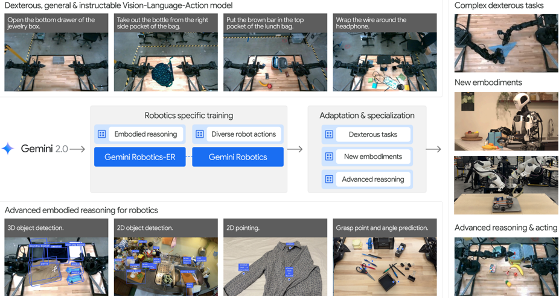
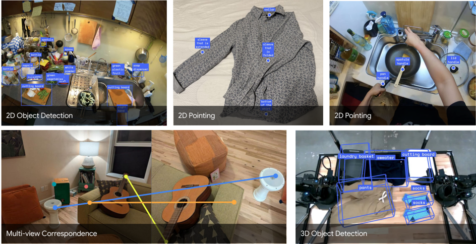
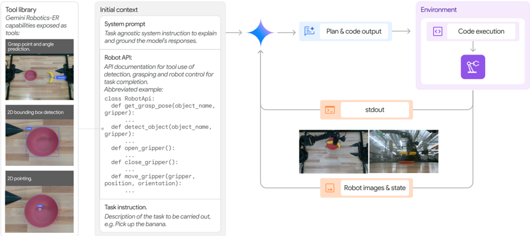
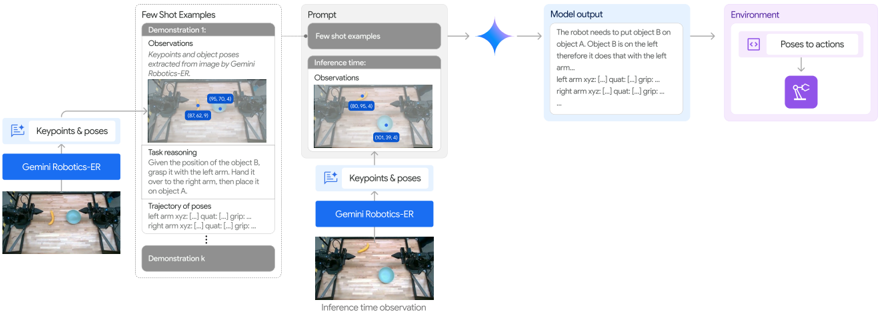
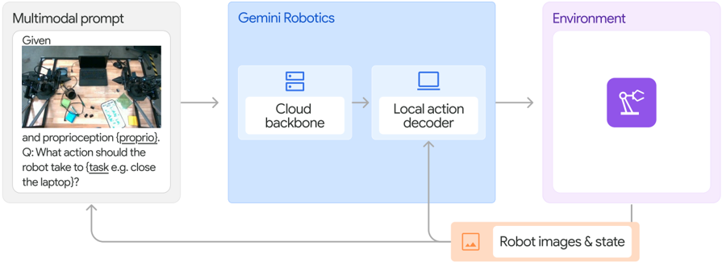

# Gemini Robotics

### 들어가며

물리 세계에서 범용 AI가 제 역할을 하려면 디지털 세계와는 완전히 다른 접근이 필요합니다. AI가 실제 공간에서 움직이려면 인간 수준의 체화된 추론(embodied reasoning) 능력을 갖춰야 합니다. 우리는 평소 3D 공간을 인식하고, 물체 사이의 관계를 파악하며, 직관적으로 물리 법칙을 이해하는 걸 대수롭지 않게 여깁니다. 하지만 이 능력이야말로 모든 체화 AI의 핵심 기반이 됩니다. 이러한 능력은 모든 체화된 AI 에이전트의 중요한 기반을 형성합니다. 더 나아가 체화된 AI 에이전트는 실제 세계의 공간적 및 물리적 개념을 수동적으로 이해하는 것을 넘어서야 합니다. 외부 환경에 직접적인 영향을 미치는 행동을 취하는 방법을 학습하여 수동적 인식과 능동적 물리적 상호작용 사이의 간극을 메워야 합니다.

### 개요

Google DeepMind의 Gemini Robotics는 비전-언어-액션(Vision-Language-Action, VLA) 모델입니다. **Gemini 2.0의 멀티모달 이해 능력**에 **로봇을 직접 제어할 수 있는 구체적인 실행 능력(embodied reasoning)을 결합**하여, 디지털 세계의 일반화 능력을 물리 세계까지 확장했습니다. 이 모델군은 다양한 조작 작업을 수행하고, 자연어 명령을 정확하게 따르며, 새로운 로봇(embodiment)에도 빠르게 적응할 수 있습니다.

### 배경

최근 몇 년간 언어 모델과 멀티모달 AI는 눈부신 발전을 이뤘지만, 이 능력을 로봇 같은 물리적 에이전트로 옮기는 건 여전히 어려운 일입니다. 물리 세계에서 범용 AI가 제 역할을 하려면 디지털 세계와는 완전히 다른 접근이 필요합니다.&#x20;

물리 세계의 AI가 실제 공간에서 움직이려면 3D 공간을 인식하고, 물체 사이의 관계를 파악하며, 직관적으로 물리 법칙을 이해하는 등 인간 수준의 체화된 추론(embodied reasoning) 능력을 갖춰야 합니다.&#x20;

기존 로봇 시스템과의 근본적인 차이점은 물리적 에이전트가 단순히 세상을 보고 이해하는 것을 넘어서 실제로 행동해야 한다는 점입니다. 이를 위해서는 다음 두 가지 핵심 요소가 필요합니다.

1. **구체화된 추론 (Embodied Reasoning)**: 물리 세계의 3D 구조, 객체 간 관계, 직관적 물리를 이해하는 능력
2. **행동 기반화**: 접촉 물리학, 동역학, 실제 상호작용의 복잡성을 이해하여 물리적 행동을 생성할 수 있는 능력

기존 연구에서는 이러한 여러 능력을 개별 모델로 조합하여 사용했습니다. 하지만 Gemini Robotics는 단일 파운데이션 모델 내에서 이 모든 능력을 통합함으로써, 기존 방식보다 훨씬 더 강력한 일반화 능력을 보여줍니다. 이 연구는 이 두 가지 요소를 통합하여 실시간 로봇 제어를 가능하게 하는 새로운 로봇 파운데이션 모델을 제시합니다.&#x20;

논문의 주요 기여 내용은 다음과 같습니다.&#x20;

1. **ERQA 벤치마크 개발**: Embodied reasoning 능력을 평가하기 위해 새롭게 설계된 오픈 소스 벤치마크를 만들었습니다. 400개의 다중 선택형 시각 질문 응답(VQA) 문항으로 구성되어 있고, 공간 추론, 궤적 추론, 행동 추론, 상태 추정, 포인팅, 멀티뷰 추론 등 다양한 범주를 포함합니다.
2. **Gemini Robotics-ER**: 향상된 Embodied reasoning 능력을 보여주는 VLM입니다. 3D 인식부터 상세한 포인팅, 로봇 상태 추정, 코드를 통한 어포던스 예측에 이르기까지 물리적 세계를 이해하는 데 중요한 여러 기능에서 강력한 성능을 보여줍니다.
3. **Gemini Robotics**: 로봇 행동 데이터 통합을 통해 개발된 VLA 모델로, 다양한 로봇 작업 및 구현에 걸쳐 고빈도 정밀 제어, 강력한 일반화 및 다양한 로봇 작업과 구현 전반에 걸친 빠른 적응을 가능하게 합니다.
4. **책임 있는 개발**: Google AI 원칙에 따라 모델 제품군의 책임 있는 개발에 대해 논의하고 실천합니다.

<figure><figcaption></figcaption></figure>

> Gemini 2.0은 의미론적 안전성 이해 및 장기적인 컨텍스트 처리와 같은 로봇 공학에 적합한 기능을 보여줍니다.&#x20;

물리 세계와 상호작용 할 수 있는 모델을 만들기 위해 VLM가 가지고 있는 멀티모달 이해 및 추론 능력을 기반으로 사용합니다. 기존의 VLM에서 아래와 같은 추가적인 추론 능력이 필요합니다.

* 물리적 세계의 기하학적, 시공간적 세부 사항을 이해하는 능력을 얻으면서 견고한 구현된 추론을 획득해야 합니다.&#x20;
* 물리적 동작에 대한 언어를 구사해야 하고, 접촉 물리학, 역학, 실제 상호작용의 복잡성을 이해하며 물리적 세계에 대한 추론이 가능해야 합니다.&#x20;
* 이러한 요소들은 실제 세계에서 로봇의 빠르고 안전하며 민첩한 제어를 가능하게 하기 위해 결합되어야 합니다.


### Gemini Robotics-ER(Embodied Reasoning)

Gemini Robotics-ER(Embodied Reasoning)는 Gemini 2.0을 기반으로 **물리 세계에 특화된 추론 능력**을 추가한 파운데이션 모델입니다. 추가적인 로봇 특화 데이터나 훈련 없이 로봇 공학 응용 프로그램에서 사용할 수 있습니다.

* 인지
* 상태 추정(state estimation)
* 공간 이해(spatial understanding)
* 계획 및 코드 생성

에 이르기까지, 물리적 세계를 이해하는 데 중요한 여러 기능에서 뛰어난 성능을 보여줍니다. 이를 통해 기존의 로봇 컨트롤러를 Gemini의 물리적 공간 이해 및 추론 능력과 연계할 수 있습니다.

<figure><figcaption></figcaption></figure>

> 2D 공간에서 오브젝트와 포인트를 감지하고, 잡기 및 궤적을 위해 2D 포인팅을 활용하여며, 3D 공간에서 대응점을 찾고 객체를 감지하는 등 뛰어난 추론 능력을 제공합니다.&#x20;

**2D 공간 개념 이해**

* **객체 감지(Object Detection)**: Gemini 2.0은 2D 객체 감지가 가능합니다. 객체 이름을 직접 말하는 명시적 쿼리뿐 아니라, 카테고리, 속성, 기능 등 암시적 쿼리로도 정확한 2D 바운딩 박스를 제공합니다.
* **포인팅(Pointing)**: Gemini 2.0은 자연어 설명만 주면, 모델이 객체나 객체 부분 같은 명시적 대상은 물론, 어디를 잡을지, 어디에 놓을지 같은 어포던스, 빈 공간, 공간 개념 등 암시적 개념도 정확히 가리킬 수 있습니다.
* **궤적 예측(Trajectory Prediction)**: Gemini 2.0은 포인팅 능력을 활용해 관찰에 기반한 2D 움직임 궤적을 생성합니다. 예를 들어 물리적 움직임이나 상호작용에 대한 설명을 바탕으로 궤적을 만들 수 있어요.
* **파지 예측(Grasp Prediction)**: Gemini Robotics-ER에서 새로 도입된 기능으로, Gemini 2.0의 포인팅 능력을 확장해서 위에서 아래로 잡는 동작(top-down grasp)을 예측합니다.


**3D 공간 추론**

* **멀티뷰 대응(Multi-View Correspondence)**: 멀티뷰 이미지를 통해 3D 장면을 이해하고, 서로 다른 카메라 뷰에서 2D 점 대응 관계를 예측합니다. 로봇이 여러 카메라(스테레오 뷰, 헤드/손목 뷰 등)의 이미지 스트림을 통합해 3D 공간 관계를 파악하는 데 활용됩니다.
* **3D 바운딩 박스 감지 (Bounding Box Detection)**: Gemini 2.0은 2D 이미지에서 직접 메트릭 3D 바운딩 박스를 예측할 수 있습니다. 2D 감지나 포인팅 능력처럼, open vocabulary 설명으로 객체를 감지할 수 있어요.


**코드 생성을 통한 zero-shot 제어**

Gemini 2.0의 Embodied reasoning 능력을 활용해, 로봇 행동 데이터 없이도 로봇을 제어할 수 있습니다. 인식, 상태 추정, 공간 추론, 계획 및 제어 등 필요한 모든 능력은 Gemini 2.0 단일 모델에 통합됩니다. 더 포괄적인 데이터로 학습이 된 Gemini Robotics-ER은 Gemini 2.0과 비교하여 작업 완료률을 거의 2배 개선되었습니다.

<figure><figcaption></figcaption></figure>

> Zero-shot 제어 시스템 - 인식 및 제어 API, 에이전틱 오케스트레이션을 활용

모델이 직접 로봇 API에 접근해 코드를 생성함으로써 장면 이해, 상태 추정, 공간 추론, 계획, 제어를 모두 수행합니다.&#x20;

Gemini 2.0의 zero-shot 제어 능력을 테스트하기 위해, 연구팀은 Gemini 2.0의 코드 생성 능력과 구체화된 추론 능력을 결합했습니다. 로봇을 제어하기 위해 Gemini 2.0은 다음 기능을 제공하는 API에 접근합니다.

* 각 그리퍼를 지정된 포즈로 이동
* 각 그리퍼의 열기/닫기
* 현재 로봇 상태 읽기

또한 API는 인식 기능도 제공합니다. 외부 모델을 호출하지 않고, Gemini 2.0 자체가 객체 바운딩 박스 감지, 객체 포인팅, 위에서 아래로 잡는 grasping 포즈 생성을 수행합니다.

에피소드 동안 아래와 같은 동작을 수행합니다.&#x20;

1. Gemini 2.0은 먼저 시스템 프롬프트, 로봇 API 설명, 작업 지시를 전달받습니다.&#x20;
2. Gemini 2.0은 현재 장면 상태, 로봇 상태, 실행 피드백을 보여주는 이미지를 반복적으로 입력받고,&#x20;
3. 환경에서 실행되어 로봇을 제어하는 코드를 출력합니다.&#x20;
4. 생성된 코드는 API를 사용하여 장면을 이해하고 로봇을 이동시키며,&#x20;
5. 실행 루프를 통해 Gemini 2.0이 필요시 반응하고 재계획할 수 있습니다.

ALOHA 2 로봇 시뮬레이션에서 Gemini Robotics-ER은 평균 53% 성공률을 달성했어요. Gemini 2.0 Flash(27%)의 거의 2배죠. 바나나 들기 같은 간단한 작업에선 86%까지 올라갑니다.


**In-context learning을 통한 few-shot 제어**

일부 정교한 작업은 zero-shot 으로 제어가 어렵습니다. few-shot 을 이용한 in-context learning은 행동을 모방해 새로운 행동을 배우도록 유도합니다.&#x20;

<figure><figcaption></figcaption></figure>

> 프롬프트에서 관찰, 언어 지침 및 궤적을 받아 새로운 언어 추론 및 궤적을 생성

이 방법은 코드를 생성하는 대신, 모델이 시연의 예시를 따라 엔드 이펙터 포즈의 궤적을 직접 생성하도록 프롬프트합니다. k개의 원격 조작 로봇 행동 궤적을 객체와 엔드 이펙터 포즈 목록으로 변환하고, 이를 텍스트로 토큰화하여 프롬프트에 추가합니다.


### Gemini Robotics: 실시간 로봇 제어를 위한 VLA 모델

Gemini Robotics는 Gemini Robotics-ER의 능력을 기반으로 하면서도 실시간 로봇 제어에 초점을 맞춘 모델입니다. VLM의 추론 능력과 로봇의 실시간 제어 요구 사이의 간극을 메워줍니다.

#### 아키텍처

<figure><figcaption></figcaption></figure>

> 장면의 현재 상태를 보여주는 이미지 세트와 수행할 작업에 대한 텍스트 지침으로 구성된 멀티모달 프롬프트를 입력으로 받아 로봇이 실행하는 동작 덩어리를 출력합니다.&#x20;

Gemini Robotics는 두 가지 구성 요소로 이루어져 있습니다. 하나는 클라우드에 호스팅되는 VLA 백본(Gemini Robotics backbone)이고, 다른 하나는 로봇의 온보드 컴퓨터에서 실행되는 로컬 동작 디코더(Gemini Robotics decoder)입니다. 클라우드의 강력한 추론 능력과 온보드 제어의 빠른 반응성을 동시에 잡았습니다.

* **클라우드 기반 VLA 백본**: Gemini Robotics-ER의 증류(distilled) 버전으로, 쿼리-응답 지연 시간을 초 단위에서 160ms 이하로 끌어내렸습니다. 대규모 모델의 추론 능력을 유지하면서도 상당한 속도 개선을 이뤘냈습니다.
* **로컬 action decoder 디코더**: 로봇의 온보드 컴퓨터에서 실행됩니다. end-to-end 지연 시간은 약 250ms이고, 여러 액션 청크를 통해 실질적인 제어 빈도는 50Hz에 달합니다.&#x20;

#### **학습 데이터**

Gemini Robotics는 [ALOHA 2](https://aloha-2.github.io/) 로봇 플릿에서 12개월에 걸쳐 수집한 수천 시간의 실제 로봇 시연 데이터로 학습됐습니다. 모델이 특정 작업에만 치우치지 않도록, 비행동 데이터도 포함해 모델의 일반화 능력을 높였습니다.

* 수천 가지의 다양한 작업
* 다양한 조작 기술, 객체, 작업 난이도, 에피소드 길이
* 다양한 보존력 요구사항
* 웹 문서, 코드, 멀티모달 콘텐츠(이미지, 오디오, 비디오) 등&#x20;

***

### 결론

본 연구는 Gemini 2.0의 세계 지식과 추론 능력을 로봇공학을 통해 물리 세계로 확장하는 방법을 탐구했습니다. 로봇과 물리적 에이전트에게는 인간 수준의 구체화된 추론 능력이 핵심입니다. 연구팀은 공간 이해, 궤적 예측, 멀티뷰 대응, 정밀 포인팅에서 최신 기술을 크게 발전시킨 Gemini Robotics-ER을 개발하고, 새로운 오픈소스 벤치마크로 성능을 검증했습니다. 나아가 수동적 인식과 능동적 상호작용의 간극을 메우는 범용 VLA 모델인 Gemini Robotics를 제시했습니다. 이 모델은 복잡한 천 조작 부터 관절 객체의 정밀 처리까지, 다양한 조작 작업에서 뛰어난 성능을 보여줍니다.

#### **연구의 의의**

* **일반화된 로봇 능력의 실현**: 기존의 특화된 로봇과 달리, 다양한 작업을 수행할 수 있는 general-purpose autonomous 로봇을 향한 실질적인 연구이다.
* **멀티모달 통합 아키텍처**: 시각, 언어, 행동을 통합하는 새로운 아키텍처는 AI 기술을 물리 세계로 확장하는 새 패러다임을 제시한다. 클라우드-온보드 하이브리드 설계로 추론 능력과 실시간 제어 사이의 밸런스를 맞춘다.
* **효율적인 지식 전이**: 강력한 기초 모델의 지식을 활용해 적은 데이터로도 새로운 로봇과 작업에 빠르게 적응한다. 로봇공학의 데이터 비용을 상당히 낮출 수 있다.
* **개방형 벤치마크 기여**: ERQA 벤치마크는 구체화된 추론 능력을 평가하는 첫 포괄적 벤치마크로, 향후 연구의 표준을 제시한다.

#### **향후 연구**

* **멀티스텝 추론과 정밀한 실행의 통합**: 복잡한 상황에서 추상적 추론과 정밀한 조작을 결합하는 기술 개발이 필요하다. 새로운 상황에서의 강건성 향상이 특히 중요하다.
* **시뮬레이션 기반 데이터 생성**: 시뮬레이션에서 생성된 시각적으로 다양하고 물리학적으로 정확한 데이터를 활용해 더 능력 있는 VLA 모델을 개발하고, 현실로의 전이 기술을 발전시킨다. 데이터 수집의 부담을 크게 줄일 수 있다.
* **멀티-구체화 확장**: 더 많은 로봇 플랫폼과 형태로 실험을 확대해, 데이터 필요량을 줄이고 궁극적으로 제로샷 교차 구체화 전이를 달성한다. 로봇공학의 실용성을 크게 높일 수 있다.
* **높은 정밀도 공간 이해**: Gemini 2.0의 수치 예측 정밀도를 향상시켜 더 정밀한 로봇 제어가 필요한 작업을 지원한다. 장거리 비디오에서의 공간 관계 이해도 개선되어야 한다.

***

### Citation

```bibtex
@misc{geminiroboticsteam2025geminiroboticsbringingai,
      title={Gemini Robotics: Bringing AI into the Physical World}, 
      author={Gemini Robotics Team and Saminda Abeyruwan and Joshua Ainslie and Jean-Baptiste Alayrac and Montserrat Gonzalez Arenas and Travis Armstrong and Ashwin Balakrishna and Robert Baruch and Maria Bauza and Michiel Blokzijl and Steven Bohez and Konstantinos Bousmalis and Anthony Brohan and Thomas Buschmann and Arunkumar Byravan and Serkan Cabi and Ken Caluwaerts and Federico Casarini and Oscar Chang and Jose Enrique Chen and Xi Chen and Hao-Tien Lewis Chiang and Krzysztof Choromanski and David D'Ambrosio and Sudeep Dasari and Todor Davchev and Coline Devin and Norman Di Palo and Tianli Ding and Adil Dostmohamed and Danny Driess and Yilun Du and Debidatta Dwibedi and Michael Elabd and Claudio Fantacci and Cody Fong and Erik Frey and Chuyuan Fu and Marissa Giustina and Keerthana Gopalakrishnan and Laura Graesser and Leonard Hasenclever and Nicolas Heess and Brandon Hernaez and Alexander Herzog and R. Alex Hofer and Jan Humplik and Atil Iscen and Mithun George Jacob and Deepali Jain and Ryan Julian and Dmitry Kalashnikov and M. Emre Karagozler and Stefani Karp and Chase Kew and Jerad Kirkland and Sean Kirmani and Yuheng Kuang and Thomas Lampe and Antoine Laurens and Isabel Leal and Alex X. Lee and Tsang-Wei Edward Lee and Jacky Liang and Yixin Lin and Sharath Maddineni and Anirudha Majumdar and Assaf Hurwitz Michaely and Robert Moreno and Michael Neunert and Francesco Nori and Carolina Parada and Emilio Parisotto and Peter Pastor and Acorn Pooley and Kanishka Rao and Krista Reymann and Dorsa Sadigh and Stefano Saliceti and Pannag Sanketi and Pierre Sermanet and Dhruv Shah and Mohit Sharma and Kathryn Shea and Charles Shu and Vikas Sindhwani and Sumeet Singh and Radu Soricut and Jost Tobias Springenberg and Rachel Sterneck and Razvan Surdulescu and Jie Tan and Jonathan Tompson and Vincent Vanhoucke and Jake Varley and Grace Vesom and Giulia Vezzani and Oriol Vinyals and Ayzaan Wahid and Stefan Welker and Paul Wohlhart and Fei Xia and Ted Xiao and Annie Xie and Jinyu Xie and Peng Xu and Sichun Xu and Ying Xu and Zhuo Xu and Yuxiang Yang and Rui Yao and Sergey Yaroshenko and Wenhao Yu and Wentao Yuan and Jingwei Zhang and Tingnan Zhang and Allan Zhou and Yuxiang Zhou},
      year={2025},
      eprint={2503.20020},
      archivePrefix={arXiv},
      primaryClass={cs.RO},
      url={https://arxiv.org/abs/2503.20020}, 
}
```

### References

* [**\[Paper\]** Gemini Robotics: Bringing AI into the Physical World](https://arxiv.org/abs/2503.20020)
* [**\[DeepMind Blog\]** Gemini Robotics brings AI into the physical world](https://deepmind.google/blog/gemini-robotics-brings-ai-into-the-physical-world/)
* [**\[Project\]** ALOHA 2: An Enhanced Low-Cost Hardware for Bimanual Teleoperation](https://aloha-2.github.io/)
